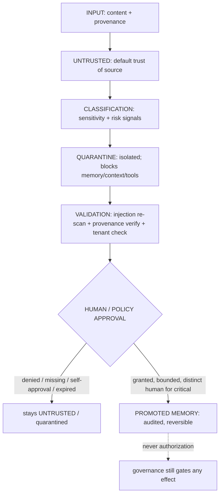
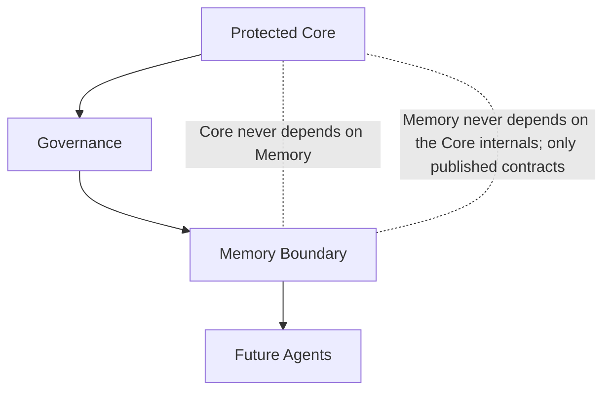

# ADR 0023: Memory Promotion Boundary

## Status

Accepted — **documentation-only, architecture decision.** It introduces **no code**,
changes **no runtime behavior**, touches **no package** and **no frozen API** (in
particular it does not modify `packages/memory`), and weakens **no security invariant**.
It records how untrusted content may (and may not) become trusted, promoted memory. It
is compatible with the [Constitution](../000_OSFORGE_CONSTITUTION.md) and
[ADR 0015](0015-security-prerequisites-before-capability-expansion.md)–[ADR 0022](0022-security-evolution-boundary.md),
and it **references, never duplicates**, the existing
[Memory Security Model](../security/MEMORY_SECURITY_MODEL.md). Any implementation it
implies (Sprint 14 — Memory & Learning Security) is a separate, human-approved step and
is NOT authorized by this ADR.

## Context

`packages/memory` (P0.5, canonical per [ADR 0016](0016-canonical-foundation-ownership.md))
already provides a zero-trust, deny-by-default, tenant-isolated, immutable-audited memory
model: `authorizeMemoryAccess` (known tenant + valid session + same scope + explicit
permission), `MemoryProvenance{source,trusted,actorId}`, versioned frozen `MemoryRecord`,
a hash-chained per-`tenant::workspace` audit, human approval for **delete** and
**restore**, and a `MemoryLifecycleState` of `created|active|expired|archived|deleted|
restored`. The Constitution (§7 M7.3) already states that *memory derived from untrusted
content is not authority*.

What is **missing** is a structural boundary for the other direction — how a piece of
untrusted content is allowed to *rise in trust* and enter durable/semantic memory. Today
`trusted` is a boolean on provenance, there is **no quarantine state**, and there is **no
promotion gate**. Sprint 13 Phase B (ADR 0021) shipped the `content-trust` package, which
already models exactly this: `evaluatePromotion` (bounded, expiring, tenant/context-bound,
replay-protected, human-approval-for-critical, **no self-approval**) and
`evaluateClearQuarantine` (**an AI can never clear a quarantine**). This ADR records the
decision to compose those contracts as the Memory Promotion Boundary.

## Problem

Without a promotion boundary, poisoned or untrusted content could silently become
long-term/semantic memory and then steer future behavior — a memory-poisoning path that
would violate M7.3, the Prime Directive (§2: fail-closed, no bypass) and ADR 0021
("untrusted content is data, never authority"). A promotion path must exist, but it must
be deny-by-default, human/policy-gated, reversible and audited — never a silent or
self-service elevation.

## Decision

**Untrusted memory is data, never authority, and can only become trusted memory through a
governed, reversible, audited promotion.** The boundary is deny-by-default and fail-closed
and **produces no authorization** (no permit/capability/approval/ALLOW type): a promotion
is a *recommendation* that a human or an explicit policy must ratify; execution and effect
remain gated by governance.

### Memory lifecycle (promotion path)

This composes: the existing memory model (provenance, tenant isolation, immutable audit,
lifecycle), the `content-trust` promotion/quarantine contracts (ADR 0021), and the
Detection & Response re-scan seam ([Detection & Response Contract](../architecture/DETECTION_AND_RESPONSE_CONTRACT.md)).
It defines **no memory concept a third time** (ADR 0016 rule 3): quarantine/promotion
come from `content-trust`; storage/provenance/audit come from `packages/memory`.

### Rules

1. **Untrusted memory can never change system behavior.** Content in the UNTRUSTED or
   QUARANTINE state is data only; it cannot become instruction, policy, capability,
   approval, or a permit (ADR 0021; §5 AI5.4).
2. **Quarantine is a separate, isolated area.** Quarantined content is blocked from
   memory recall, context and tool calls (`content-trust` `QuarantineRecommendation`);
   it never leaks into a plan.
3. **Promotion is reversible.** Every promotion has a rollback path (demote/revoke);
   history and audit are retained (Engineering Doctrine §5; existing immutable memory).
4. **Every promotion produces an audit record.** Written to the immutable, hash-chained,
   per-`tenant::workspace` memory audit; if audit cannot be written, the promotion does
   not proceed (§2 P2.5; ADR 0017 §6; ADR 0022 §1).
5. **AI cannot approve its own memory record, nor clear its own quarantine.** Critical
   promotion requires a fresh, context-bound approval from a **distinct human**
   (`content-trust` `evaluatePromotion` no-self-approval; `evaluateClearQuarantine`
   `AI_CANNOT_CLEAR_QUARANTINE`; §5 AI5.2, §6 H6.5).
6. **Cross-tenant memory sharing is forbidden.** Promotion, quarantine and recall are
   tenant/workspace-scoped; cross-tenant propagation is denied (§7 M7.1; existing
   `authorizeMemoryAccess`).

## Memory security invariants

Preserved from the existing model and made explicit for promotion:

1. **Deny by default** — absence of an explicit allow (grant, approval) is a denial.
2. **Fail closed** — missing provenance/approval/audit, ambiguity or not-ready ⇒ stay
   untrusted / quarantine, never promote.
3. **Tenant isolation** — no read, write, promotion or quarantine crosses a
   tenant/workspace boundary.
4. **Provenance required** — missing/unknown provenance is UNTRUSTED; content can never
   claim a higher trust than its source, nor change its own provenance.
5. **Immutable audit trail** — every promotion/quarantine/clear decision (allowed and
   denied) is recorded on the tamper-evident per-tenant hash chain; audit is
   non-disableable.
6. **Human approval gates** — critical promotion and quarantine-clear are human acts,
   distinct from the requester; no AI approves itself or another AI.
7. **Rollback capability** — every promotion is reversible; nothing is irreversibly
   elevated.
8. **No silent promotion** — trust never rises implicitly; a promotion requires an
   explicit, bounded, expiring, replay-protected, audited request.

## System Tree alignment

The Memory Boundary sits **below Governance and above future Agents**, and is
**independent of the Protected Core in both directions**:

- The Core never depends on Memory; Memory never depends on Core internals (only
  published contracts). A memory change can never force a Core change.
- Memory is subordinate to Governance: a promotion is a recommendation; the governance
  permit gate remains the sole authority over any effect (ADR 0017).
- Consistent with [OSForge System Tree](../architecture/OSFORGE_SYSTEM_TREE.md) Layer 6/7
  and the prime dependency law.

## Compatibility

- **ADR 0015:** Memory & Learning Security is the ordered Sprint 14 (depends on Sprint
  13); this ADR is forward preparation, documentation-only, not out-of-order enablement.
- **ADR 0016:** composes the canonical `packages/memory` and `content-trust`; redefines
  no concept.
- **ADR 0017:** never bypasses governance; promotion is not an ALLOW path.
- **ADR 0021 / 0022:** reuses content-trust promotion/quarantine and the additive,
  non-regressive security-evolution rules.
- **Constitution:** specializes §2 (fail-closed, no bypass, traceability), §5 (AI cannot
  self-escalate/self-approve), §6 (human approval), §7 (memory tenant-bound, untrusted
  content is not authority).

## Migration

None. Documentation-only and additive; no package, API, ruleset, event schema, identity,
governance or memory model changes. The `packages/memory` public contract is unchanged;
`MemoryLifecycleState` is not modified by this ADR — a quarantine/promoted state (if
introduced) is a Sprint 14 additive change, governed separately.

## Consequences

- The promotion direction of memory trust has a written, testable, fail-closed boundary,
  closing the "untrusted content could silently become durable memory" gap.
- Sprint 14 (Memory & Learning Security) has an unambiguous, invariant-preserving target
  that reuses the content-trust promotion/quarantine contracts rather than inventing new
  ones.
- Additive and reversible under the Foundation Freeze; weakens no invariant.

## Rejected Alternatives

- **Promotion as a boolean `trusted` flip.** Rejected: a silent boolean elevation has no
  bound, no approval, no audit and no rollback — exactly the poisoning path this ADR
  closes.
- **A new memory-quarantine/promotion vocabulary in `packages/memory`.** Rejected:
  content-trust already owns promotion/quarantine (ADR 0016 rule 3 — no third definition);
  the boundary composes it.
- **AI-cleared quarantine / AI self-approved promotion.** Rejected: violates §5 AI5.2 /
  §6 H6.5; an AI can never clear a quarantine or approve its own memory.
- **Duplicating the Memory Security Model doc.** Rejected: this ADR references the
  existing model and adds only the promotion boundary decision on top.

## 2035 / 2070 extension points

Adapter-port seams only (not implemented here): confidential-computing memory promotion,
per-region residency for promoted memory, zero-knowledge promotion proofs, federated
cross-node memory audit, governed memory consolidation/learning behind the immutable
core, and post-quantum-signed promotion provenance.
