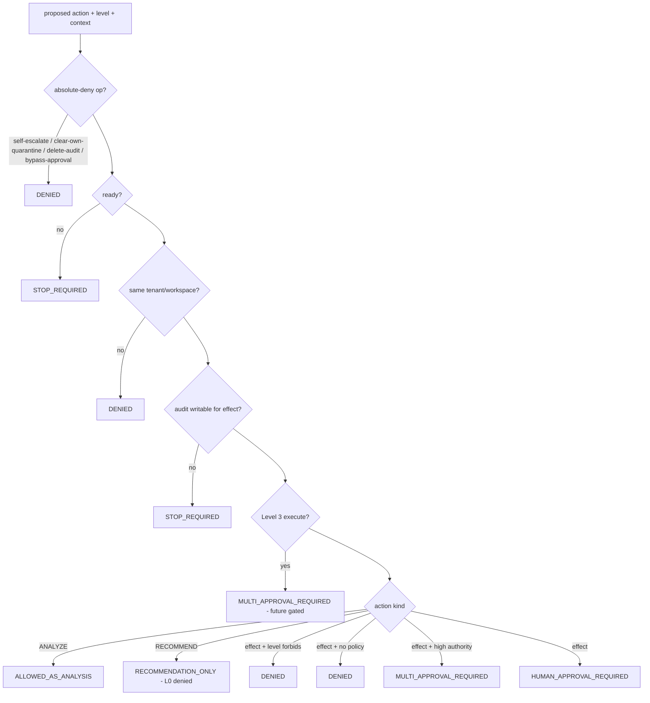

# AI Agent Safety Model (PR-D)

> Package: `packages/agent-safety` · Constitution §2/§5/§6/§7/§23 ·
> [ADR 0018](../adr/0018-agent-runtime-untrusted-planner-under-governance.md),
> [ADR 0021](../adr/0021-prompt-and-untrusted-content-security-boundary.md),
> [ADR 0023](../adr/0023-memory-promotion-boundary.md). **Architecture contract +
> documentation + testable invariants only.** It is **not wired into any runtime or
> agent-execution path**, binds no LLM/MCP/provider, changes no production behavior, and
> touches no frozen API. It **references — never duplicates** — the
> [Agent Runtime Security Model](../security/AGENT_RUNTIME_SECURITY_MODEL.md),
> [Agent and Workload Identity](../security/AGENT_AND_WORKLOAD_IDENTITY.md) and
> [Memory Security Model](../security/MEMORY_SECURITY_MODEL.md).

## Purpose & core stance

An agent is a **bounded principal** (ADR 0018): it proposes; governance disposes. This
model adds a **safety-classification boundary** that, for a proposed action, decides
*which controls are required* — analysis, recommendation, human approval, multi-approval,
stop, or deny. It **never authorizes**: the strongest outcome for anything with external
effect is `HUMAN_APPROVAL_REQUIRED` / `MULTI_APPROVAL_REQUIRED`; the governance permit
gate ([ADR 0017](../adr/0017-governance-enforcement-integration-seam.md)) remains the sole
authority over any effect. Default state is **DENY**.

## Agent Trust Level model

Levels only **narrow** what an agent may do; a level never grants authority and can never
be self-raised (`assertNoSelfRaise`).

| Level | What it may do | External effect | Required controls |
| --- | --- | --- | --- |
| **Level 0 — Observer** | passive analysis only | none | audit |
| **Level 1 — Advisor** | produce recommendations | none | human approval for any action; audit |
| **Level 2 — Controlled Executor** | prepare controlled actions | yes | **policy + human approval**; audit |
| **Level 3 — Autonomous Executor** *(future, gated)* | high-authority actions | yes | **multi-human approval + mandatory audit** |

Level 3 is explicitly a **future capability, not enabled today**; the contract returns
`MULTI_APPROVAL_REQUIRED` with a `level3_future_gated` reason for any Level-3 execution.

## Agent Permission Boundary

`evaluateAgentSafety(request)` is deny-by-default and fail-closed. Order:

**An agent can:** analyze; recommend (Level ≥ 1); prepare/execute controlled actions
(Level ≥ 2) *only* with policy present and human approval; escalate to a human.

**An agent cannot:** produce an external effect above its level; act without a required
policy; act without a required human approval; raise its own trust level; clear its own
(or any) quarantine; delete or alter audit; bypass a human-approval gate; cross a
tenant/workspace boundary.

**An agent must stop (STOP_REQUIRED) when:** the safety subsystem is not ready, or the
immutable audit sink is unwritable for an action that requires audit.

**An agent must request human approval when:** it proposes any external/mutating effect
(and multi-approval for high-authority / Level-3 actions).

## Failure Mode model

| Failure mode | Fail-closed containment |
| --- | --- |
| Wrong decision | require human review |
| Wrong tool use | stop agent |
| Wrong data read | require human review |
| Prompt injection | quarantine |
| Memory poisoning | quarantine |
| Privilege overreach | stop agent |
| Tenant isolation breach | lockdown recommended |
| Unknown | quarantine (most restrictive) |

Containment is a **recommendation** actuated only through existing governed controls
(kill-switch, lockdown, quarantine); it never authorizes. Ambiguity resolves to the most
restrictive containment.

## Security invariants (absolute)

1. **An AI cannot increase its own authority** (no self-escalation; §5 AI5.2) — `assertNoSelfEscalation`, `assertNoSelfRaise`.
2. **An AI cannot clear its own (or any) quarantine** — `assertCannotClearOwnQuarantine`.
3. **An AI cannot delete or alter audit records** — `assertCannotDeleteAudit`.
4. **An AI cannot bypass an action requiring human approval** — `assertCannotBypassHumanApproval`.
5. **Default is DENY** — absence of an explicit allow (grant/approval) is a denial (`DEFAULT_AGENT_SAFETY_DECISION`).
6. **Fail-closed** — not-ready or audit-unwritable ⇒ STOP; unknown action ⇒ DENY.
7. **Tenant isolation** — no action crosses a tenant/workspace boundary.
8. **No authorization** — a safety decision never carries a permit/capability/approval/allow field (`assertAgentSafetyGrantsNoAuthorization`); the strongest ALLOW is `ALLOWED_AS_ANALYSIS`.
9. **Level never self-raises** — level is assigned by human/policy only.

## System Tree alignment

`Core → Governance → Agent Safety Boundary → (future) Agents`. Agent safety is
subordinate to Governance (a classification, never an authority) and independent of the
Protected Core in both directions — a safety change can never force a Core change
([System Tree](../architecture/OSFORGE_SYSTEM_TREE.md)). It composes, and does not
redefine, the agent-runtime untrusted-planner model (ADR 0018) and the governance
capability/approval contracts (ADR 0016).

## What this is NOT

Not wired into the agent-execution path; not an authorization; binds no LLM/MCP/provider;
runs no new authority system; changes no production behavior; touches no frozen API. The
real classifier/policy/approval/audit are injected adapters — none are bound here. Live
wiring is a separate, human-approved step.

## 2035 / 2070 extension points

Adapter-port seams only: attested agent-level assignment, confidential-computing safety
evaluation, federated multi-agent trust negotiation, zero-knowledge approval proofs, and
sovereign-region agent-authority zones.
