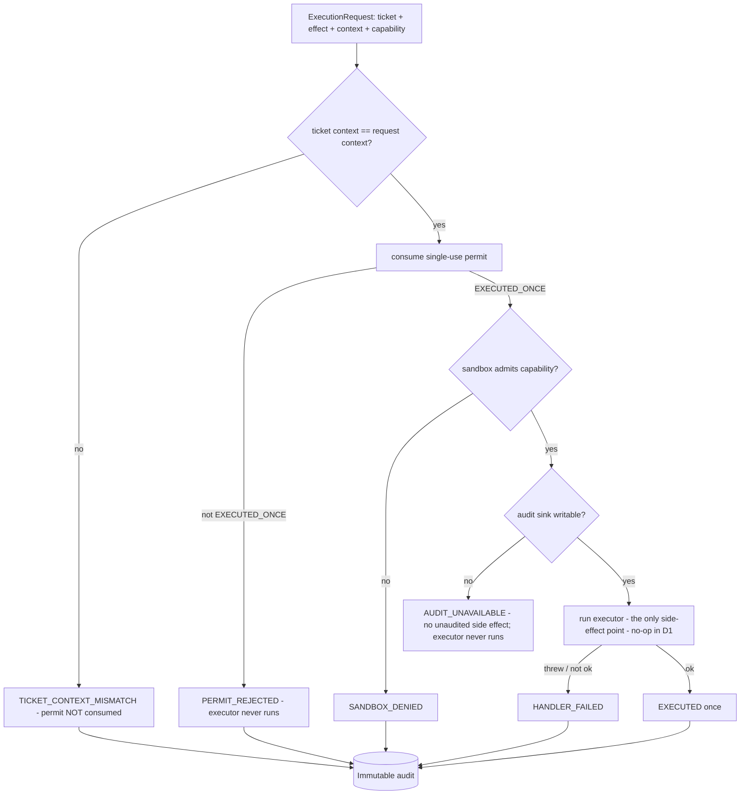

# Execution Engine Contracts (P0.8 Phase D1)

> Package: `packages/agent-execution` · Sprint P0.8 Phase D1 · Constitution §2 (fail closed) · [ADR 0017](../adr/0017-governance-enforcement-integration-seam.md), [ADR 0018](../adr/0018-agent-runtime-untrusted-planner-under-governance.md).

## Purpose
Contract-first, dependency-inverted, **fail-closed** contracts for the execution
engine — the layer that runs a governed action's effect, but **only after consuming
a valid, single-use ExecutionPermit** (via the agent-runtime seam), inside an
**admitted sandbox**, with an **immutable audit written first**. Phase D1 builds
**no production tool execution**, connects **no external service**, integrates **no
LLM**, and adds **no runtime dependency**. Reference implementations are `testOnly`
and refused in production.

## The fail-closed execution gate

## Invariants
- **Every execution requires a valid single-use ExecutionPermit.** `evaluateExecutionGate`
  refuses unless the permit was consumed with status `EXECUTED_ONCE`; the reference
  engine calls `consumeExecutionTicket` (agent-runtime) as the enforcement point, so
  the executor is never reached without a consumed permit.
- **First blocking stage decides.** Context → permit → sandbox → audit → handler. A
  rejected permit is never turned into an execution.
- **No unaudited side effect.** The audit sink must be writable before the executor
  runs; otherwise `AUDIT_UNAVAILABLE` and the executor is skipped.
- **Deny-by-default sandbox.** The reference sandbox admits only explicitly-allowed
  capabilities.
- **Fail-closed handler.** A thrown/failed executor is `HANDLER_FAILED`, never partial
  success.
- **Human approval unchanged.** A ticket exists only for a governed, permitted action
  (approval, if required, was completed upstream); the engine cannot manufacture
  authority, and a context mismatch does not burn the permit.
- **testOnly refused in production** (`assertProductionAdapter`,
  `assertNotTestReferenceInProduction`); NODE_ENV is never proof.

## Adapter boundaries (dependency-inverted, nothing real bound)
| Adapter | Contract | Reference (testOnly) |
| --- | --- | --- |
| Executor | `ExecutorAdapter.run(effect)` | `ReferenceEchoExecutor` (no-op echo), `ThrowingReferenceExecutor` |
| Sandbox | `ExecutionSandboxAdapter.admit(request)` | `ReferenceSandbox` (deny-by-default) |
| Audit | `ExecutionAuditSink.append/writable` | `InMemoryExecutionAuditSink` (hash-chained) |
| Permit | `PermitConsumer` (from `#agent-runtime`) | `ReferencePermitConsumer` |

## Backward compatibility / scope
No frozen public API changed (this package only consumes the agent-runtime seam via
its public exports). No concept redefined. No new npm dependency. Dependency graph
stays acyclic (`agent-execution` is a new top leaf → `#agent-runtime`). No production
tool execution, no external service, no LLM, no voice runtime, no deployment change.

## Next
A production executor (a real sandboxed tool/effect runner), a real sandbox provider,
and durable audit implement these interfaces behind the same contracts — a later
phase — and must be attested and READY or the engine fails closed.
