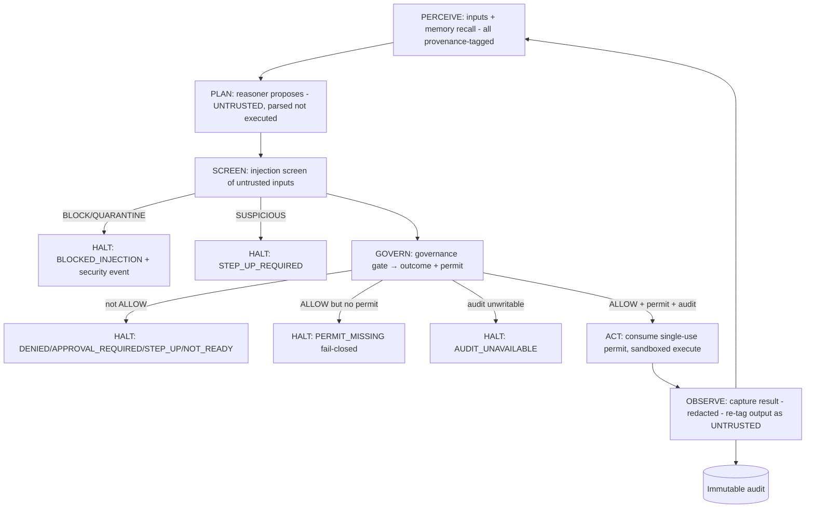

# Agent Execution Loop (P0.8 Phase A)

> Package: `packages/agent-runtime` (`loop.ts`, `action.ts`, `reasoner.ts`) · Sprint P0.8 Phase A · [ADR 0017](../adr/0017-governance-enforcement-integration-seam.md), [ADR 0018](../adr/0018-agent-runtime-untrusted-planner-under-governance.md).

## The loop
`PERCEIVE → PLAN → SCREEN → GOVERN → ACT → OBSERVE`. No phase is skipped; the
`GOVERN → ACT` boundary opens **only** on `READY_TO_EXECUTE`; any non-authorized
outcome halts the iteration fail-closed.

## The governed-action seam (`evaluateAgentAction`)
Order of checks (first blocking wins; nothing downstream flips a DENY):
1. **Injection screen** — `BLOCK`/`QUARANTINE` → `BLOCKED_INJECTION`; `STEP_UP` → `STEP_UP_REQUIRED`.
2. **Governance gate** — non-`ALLOW` is fail-closed and mapped (`DENY`→`DENIED`, `APPROVAL_REQUIRED`, `STEP_UP_REQUIRED`, `SYSTEM_NOT_READY`→`NOT_READY`, others→`DENIED`). Approval only completes an `APPROVAL_REQUIRED`; it never converts a `DENY`.
3. **Permit required** — `ALLOW` without a permit → `PERMIT_MISSING` (no permit ⇒ no execution). A permit whose context ≠ the action context → `DENIED`.
4. **Audit writable** — else `AUDIT_UNAVAILABLE`.
5. **Ready** — mint a single-use `ExecutionTicket` carrying the permit ref. **Phase A stops here** (no execution).

## Permit consumption
`consumeExecutionTicket` verifies the ticket is used at most once and the permit is
valid (single-use, context-bound, tenant-bound). **No permit cache for critical
actions** — a critical action must present a freshly-issued ticket (one decision per
execution; `assertNoPermitCacheForCritical`).

## The reasoner boundary
The `PromptFrame` structurally separates trusted `instructions` and `toolSchemas`
from untrusted `data`. A proposal is parsed by `parseProposedAction` into a typed,
discriminated `ProposedAction` — never `eval`'d; unsafe keys / unknown kinds are
rejected. `proposalHasAuthority()` is always `false`.
