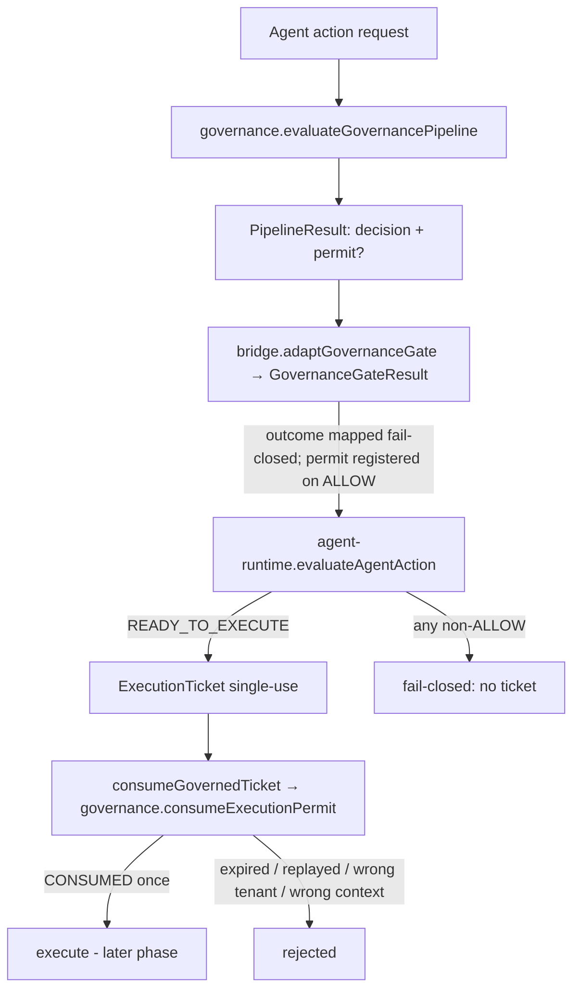

# Agent → Governance Wiring (P0.8 Phase B)

> Package: `packages/agent-governance` · Sprint P0.8 Phase B · Realizes [ADR 0017](../adr/0017-governance-enforcement-integration-seam.md) · Consumes canonical `governance` + `agent-runtime` ([ADR 0016](../adr/0016-canonical-foundation-ownership.md)).

## Purpose
Wire the Agent Runtime to the Governance Pipeline so governance becomes **enforced**,
not merely available: an agent action executes only on a clean governance `ALLOW`
with a valid, single-use execution permit. This phase adds a thin **bridge** and
re-implements neither package. No execution engine, external service, LLM or voice
runtime is involved.

## Why a bridge package
`packages/agent-runtime` remains **standalone and adapter-bound** (it imports no
other package). The concrete governance-backed adapter lives in a separate leaf
package, `packages/agent-governance`, which depends on both `#governance` and
`#agent-runtime`. This preserves the runtime's adapter boundary and keeps the
dependency graph acyclic (a new top leaf).

## Flow

## Fail-closed outcome mapping (`mapping.ts`)
Governance emits a wider outcome set than the agent runtime consumes. The mapping is
fail-closed: `CONDITIONALLY_ALLOWED`, `DEFERRED`, `EVIDENCE_MISSING` and any unknown
value map to `DENY`. **Only a governance `ALLOW` maps to an agent `ALLOW`.**
`evaluateAgentAction` further collapses gate outcomes such as `CAPABILITY_MISSING` /
`POLICY_CONFLICT` / `RISK_TOO_HIGH` to `DENIED` (the distinction is preserved in the
`reasonCode`) — the runtime only needs "do not execute."

## Permit lifecycle (`bridge.ts`)
- `adaptGovernanceGate` registers the governance permit (keyed by `permitId` used as
  the agent `PermitRef`) only on `ALLOW`; an `ALLOW` decision with no permit is
  fail-closed to `DENY` (no fabricated permit).
- `GovernancePermitStore` implements the agent-runtime `PermitConsumer`, verifying
  each permit via `governance.consumeExecutionPermit` and tracking spent nonces so a
  permit is honored **at most once** — no cache, no replay. Expiry, tenant mismatch
  and context mismatch are all refused.

## Enforced invariants (tests)
No `ALLOW` ⇒ no permit ⇒ no ticket ⇒ no execution · a governance `DENY`/conditional
never becomes an agent `ALLOW` · single-use permit (second consume rejected) · ticket
replay refused · expired permit rejected · cross-tenant permit rejected · context
mismatch rejected · injection block and unwritable audit still block even on a
governance `ALLOW` · no permit cache for critical actions. See
`tests/agent-governance-mapping.test.mjs`, `tests/agent-governance-wiring.test.mjs`.

## Scope boundaries preserved
No frozen public API changed (the bridge only reads governance/agent-runtime public
exports); no security invariant weakened; no new npm dependency; the only config
change is two additive `#governance` / `#agent-runtime` module aliases (the repo's
standard cross-package mechanism). No production execution engine, no external
service, no LLM, no voice runtime.

## Next
Phase C supersedes the old shims (ADR 0016); Phase D adds production adapters (real
sandbox / stores / LLM / ASR / TTS). Each is a separate reviewed PR.
