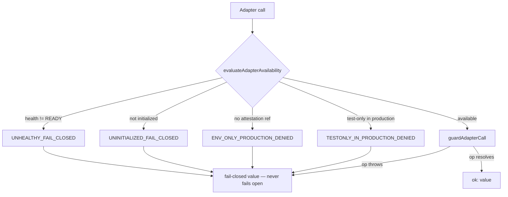

# Production Adapter Layer (P0.8 Phase C)

> Package: `packages/production-adapters` · Sprint P0.8 Phase C · Constitution §2 (fail closed) · [ADR 0016](../adr/0016-canonical-foundation-ownership.md), [ADR 0017](../adr/0017-governance-enforcement-integration-seam.md).

## Purpose
Interface-first, dependency-inverted, **fail-closed** production adapter contracts for
the six core dependencies — **Identity, Memory, Audit, Capability Registry, Approval
Store, Policy Repository**. Each production interface **extends its frozen base
interface** (from `#governance` / `#agent-runtime`), so it is backward compatible by
construction. This phase connects **no external service**, builds **no execution
engine**, integrates **no LLM**, implements **no voice runtime**, and adds **no
runtime dependency**. Reference implementations are `testOnly` and refused in
production.

## Contract shape
```
ProductionXAdapter  =  <frozen base interface>  +  AdapterLifecycle
AdapterLifecycle    =  initialize() · healthCheck() · close()
```
`AdapterLifecycle` deliberately does not re-declare `metadata` (each production
interface inherits it from its base); concrete adapters expose a
`ProductionAdapterMetadata` carrying a production attestation reference.

## Fail-closed availability

- `evaluateAdapterAvailability` — a test-only adapter in production, a missing
  attestation reference (NODE_ENV is never proof), an uninitialized adapter, or a
  non-`READY` adapter are all fail-closed.
- `guardAdapterCall` — runs the op only when available; on unavailability **or any
  thrown error**, returns the caller's fail-closed value. It never fails open.
- `evaluateAdapterSuiteReadiness` — the six adapters form the core dependency set; if
  **any** is unavailable, the whole suite is `ADAPTER_SUITE_NOT_READY` (no
  partial-availability fail-open).

## The six adapters
| Adapter | Extends (frozen) | Fail-closed default |
| --- | --- | --- |
| Identity | `IdentityTrustAdapter` (governance) | resolve → undefined (principal never trusted) |
| Memory | `MemoryGatewayAdapter` (agent-runtime) | read → not-found; write → not ok |
| Audit | `GovernanceAuditAdapter` (governance) | append **throws** (no unaudited drop) |
| Capability Registry | `CapabilityRegistryAdapter` (governance) | resolve → undefined (deny-by-default); isRevoked → true |
| Approval Store | `ApprovalStoreAdapter` (governance) | get → undefined (not granted) |
| Policy Repository | `PolicyRepositoryAdapter` (governance) | load → empty set (deny-by-default); activate → refused |

## Backward compatibility
Each `ProductionXAdapter` is a structural superset of its frozen base, so a
production adapter can be used anywhere the base contract is expected — verified by
type-security assertions (`tests/production-adapters-type-security.test.ts`) and
runtime behavior tests. No frozen public API changed; no concept is redefined
(ADR 0016).

## Scope boundaries
No external service · no execution engine · no LLM provider · no voice runtime · no
deployment change · no new npm dependency · dependency graph stays acyclic
(`production-adapters` is a new top leaf → `#governance` + `#agent-runtime`).

## Next
Real production implementations (a directory/identity provider, durable memory/audit
stores, a capability/approval/policy database) implement these interfaces behind the
same contracts — a later phase — and must be attested and READY, or the suite fails
closed.
