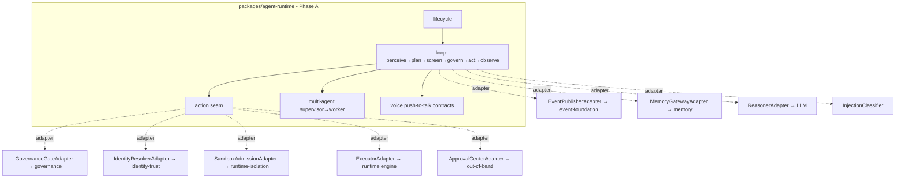

# Agent Runtime (P0.8 Phase A)

> Package: `packages/agent-runtime` · Sprint P0.8 Phase A · Constitution `docs/000_OSFORGE_CONSTITUTION.md` · [ADR 0018](../adr/0018-agent-runtime-untrusted-planner-under-governance.md), [ADR 0019](../adr/0019-p0-8-phase-a-baseline-decisions.md), [ADR 0017](../adr/0017-governance-enforcement-integration-seam.md), [ADR 0016](../adr/0016-canonical-foundation-ownership.md).

## Purpose
The permanent execution backbone: it turns "an actor wants to do X" into a governed,
permitted, sandboxed, audited execution. It is a **deterministic orchestrator around
an untrusted planner** (the reasoner proposes; governance disposes). **Phase A is
contracts, interfaces, reference implementations, tests and docs only** — no
execution engine, no external service, no voice runtime.

## Scope of Phase A
- **Does:** agent identity/lifecycle contracts, the governed-action seam, tool/
  reasoner/injection/approval/voice/multi-agent/worker/schedule/loop contracts,
  immutable audit + readiness, adapter boundaries, `testOnly` reference impls, tests.
- **Does not:** build the execution engine, connect governance/identity/sandbox/
  broker/memory/LLM/ASR/TTS, implement voice runtime, or wire into the live path.

## Composition (standalone; seams are adapters)

Adapters are **not wired** in Phase A (per the migration plan). Wiring to the
canonical foundations (ADR 0016) happens in Phase B.

## Core invariants
Deny-by-default · fail-closed · tenant/workspace isolation · reasoner is untrusted
(output is data, never code, never authority) · every action governed + permitted
(ADR 0017) · least-privilege just-in-time capabilities · no ambient authority across
messages · agents never present as human, never self-escalate, never approve, never
self-halt · immutable hash-chained audit · explainable decisions (never a bare
boolean).

## Package modules
`types` · `agent` · `lifecycle` · `provenance` · `injection` · `reasoner` · `tools`
· `action` (the seam) · `loop` · `conversation` · `multi-agent` · `voice` · `workers`
· `schedule` · `approval` · `audit` · `health` · `adapters` · `reference`.

## Related docs
[AGENT_EXECUTION_LOOP](AGENT_EXECUTION_LOOP.md) · [AGENT_RUNTIME_SECURITY_MODEL](../security/AGENT_RUNTIME_SECURITY_MODEL.md) · [PROMPT_INJECTION_DEFENSE](../security/PROMPT_INJECTION_DEFENSE.md) · [AGENT_RUNTIME_READINESS](../operations/AGENT_RUNTIME_READINESS.md).

## 2035 extension points
Multi-region agent federation · cross-company digital-employee collaboration ·
robotic/IoT/AV agents · confidential-computing execution · post-quantum permit/audit
signatures · zero-knowledge action proofs · agent-lineage causal graphs · full-duplex
voice · peer/blackboard multi-agent topologies. Contracts only.
