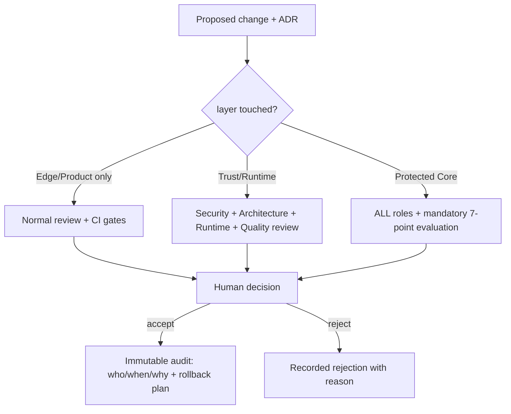

# Architecture Review Board (ARB / Council) Model

> Documentation-level review model that governs how changes approach the Protected Core.
> It records **who reviews what and how a decision is reached**; it grants no automated
> authority. Human decision is always final; **AI may review but never gives final
> acceptance** (Constitution §2 P2.1, §5 AI5.1–AI5.2). System Tree **Layer 4 —
> Standards**. See [OSForge System Tree](OSFORGE_SYSTEM_TREE.md),
> [Engineering Doctrine](ENGINEERING_DOCTRINE.md),
> [ADR 0016](../adr/0016-canonical-foundation-ownership.md).

## Principle

The closer a change gets to the Core, the more review it requires. "Core Changes
Deliberately." An AI agent or reviewer may analyze, critique and recommend; **final
acceptance of a Core-affecting change is a human act** and is recorded in immutable
audit.

## Review roles

| Role | Focus | AI may | Final acceptance |
| --- | --- | --- | --- |
| Architecture Review | layering, dependency direction, boundaries, complexity rent | analyze + recommend | Human |
| Security Review | invariants, fail-closed, tenant isolation, threat model | analyze + recommend | Human |
| Runtime Review | execution seam, permit gate, sandbox, performance | analyze + recommend | Human |
| Quality Review | tests, adversarial coverage, type-security, CI gates | analyze + recommend | Human |
| Operations Review | recoverability, backup/restore, rollback, audit, DR | analyze + recommend | Human |
| Human Decision | final ratification | — | **Human only** |

No single role's approval is sufficient for a Core change; the Human Decision integrates
all role inputs.

## Mandatory evaluation for every Core-affecting change

Each of the following MUST be assessed and recorded before a change that touches the
Protected Core (Layer 5) or the Trust & Security Platform (Layer 6):

1. **Core impact** — does it change a frozen contract/API? (default answer must be "no";
   if "yes", it needs the strongest review + a migration plan under ADR 0016.)
2. **Security impact** — does it touch or risk any invariant? Which? Fail-closed proven?
3. **Complexity impact** — what abstraction/dependency is added, and how does it "pay
   rent"? (Doctrine §6.)
4. **Recovery impact** — is the change reversible? What is the rollback path?
5. **Vendor impact** — does it bind any vendor/SDK/model/cloud? (Must be "no" in a
   contract; reality via adapter only. Doctrine §10.)
6. **20-year maintainability** — is it comprehensible and supportable over the long
   horizon, or is it speculative generality?
7. **Rollback readiness** — is there a concrete, tested way to undo it (revert, disable,
   bundle-restore)?

A change that cannot answer these is not accepted.

## Decision flow

## Relationship to CI and the security chain

ARB review is **in addition to**, not a replacement for, the automated gates: repository
guard, secret scan, constitution guard, focused-test guard, workflow validation, the
security-test suite, and `H · Final security gate` / `CORE_CI_READY`. Automated gates are
necessary but never sufficient for a Core change; the human decision closes it.

## Scope of this document

This is a review model, not an approval automation. It creates no new authority for any
AI, no bypass of the Constitution, and no change to the branch ruleset. It is additive
and compatible with the Foundation Freeze.
