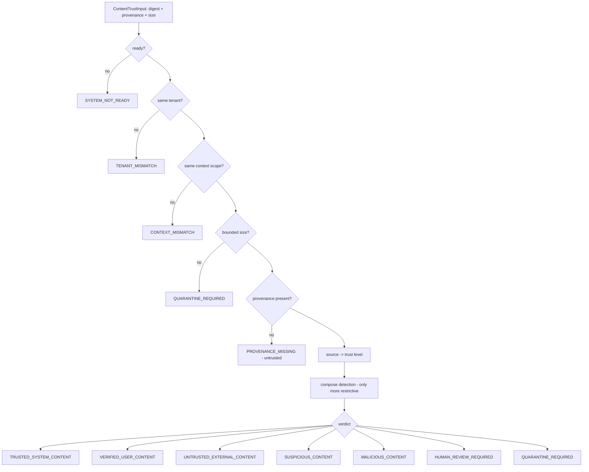
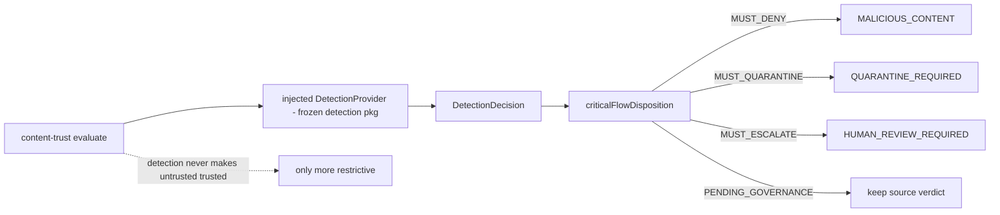
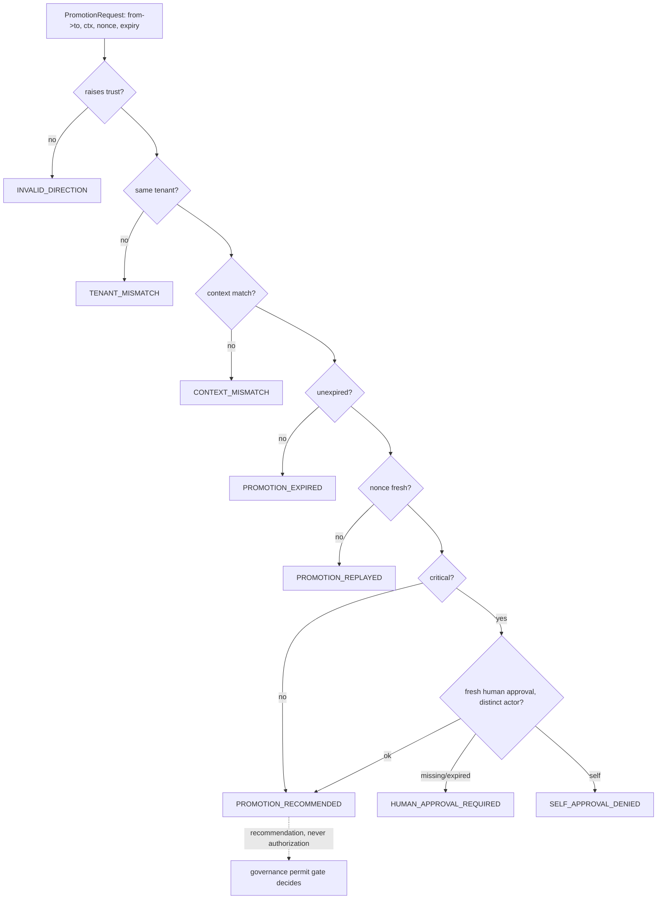
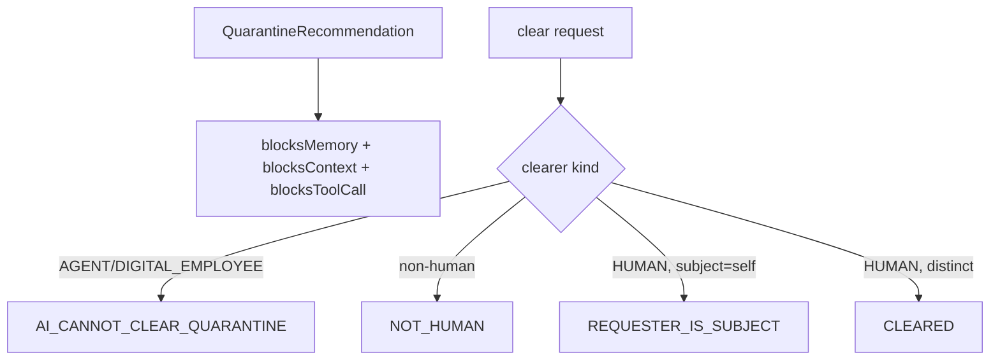
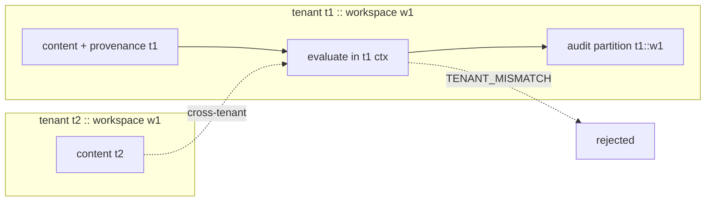

# Content Trust Architecture (P1 Sprint 13 Phase B)

> Package: `packages/content-trust` · Roadmap Sprint 13 · Constitution §2/§4/§5 ·
> [ADR 0021](../adr/0021-prompt-and-untrusted-content-security-boundary.md),
> [Detection & Response Contract](DETECTION_AND_RESPONSE_CONTRACT.md),
> [OSForge System Tree](OSFORGE_SYSTEM_TREE.md) Layer 6 (Trust & Security Platform).

## Purpose & core rule

**Untrusted content is data, never authority.** The content-trust layer decides the
*trust* of a piece of content (by source, provenance, classification and composed
detection) and whether it may be *promoted* — and it NEVER produces an authorization
(no permit/capability/approval/ALLOW type exists in the package). Execution always
remains gated by governance.

## Module DNA

| Module | Purpose | Threat it addresses | Future seam |
| --- | --- | --- | --- |
| `types` | content classes, sources, trust levels, verdicts, guards | source spoofing, self-elevation | new source classes |
| `provenance` | immutable, tenant-scoped, digest-only provenance | provenance forgery/stripping | signed provenance |
| `evidence` | redacted risk signals + trust evidence | evidence tampering | richer signal taxonomy |
| `context` | input/context, bounded size | oversized/malformed payloads | streaming inspection |
| `decision` | explainable verdict, restrictive conflict resolution | verdict downgrade | policy-scored verdicts |
| `quarantine` | isolation + human-only clearing | AI self-clearing, leakage to memory | durable quarantine store |
| `promotion` | bounded, expiring, human-approved promotion | silent trust elevation, replay, self-approval | governance-issued promotion |
| `audit` | hash-chained, per-tenant, secret-free ledger | audit tampering | durable immutable sink |
| `evaluate` | composing fail-closed gate + detection composition | fail-open, cross-tenant | multi-detector fusion |
| `health` | fail-closed readiness | env-only production claim | attested readiness |

## Content Trust Flow (diagram 1)

## Detection Composition (diagram 2)

## Promotion Flow (diagram 3)

## Quarantine Flow (diagram 4)

## Tenant Boundary (diagram 5)

## Production adapter requirements

A real deployment injects: a content classifier, a `DetectionProvider` (real detector),
a durable content-trust audit sink, a policy source, and a trusted clock. All are
adapter ports; the package binds none and adds no dependency. Test-only references are
refused in production (`assertNotTestReferenceInProduction`; `NODE_ENV` is never proof).

## Known risks

- The reference classification is shape-based only; a production classifier is required
  before enabling AI execution over untrusted content in production.
- Promotion is a recommendation; the governance permit issuance (Phase C / integration)
  must consume it — this package cannot and must not authorize.
- Homoglyph/normalization coverage is illustrative; the production normalizer must be
  comprehensive (Unicode confusables, NFKC).

## 2035 / 2070 extension points

Signed/post-quantum provenance, confidential-computing evaluation, zero-knowledge policy
proofs, federated trust exchange, sovereign-region policy zones — adapter seams only.
