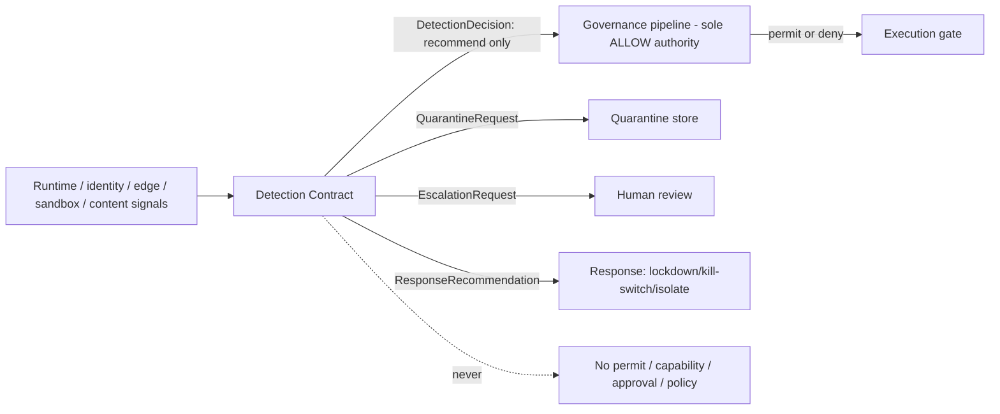
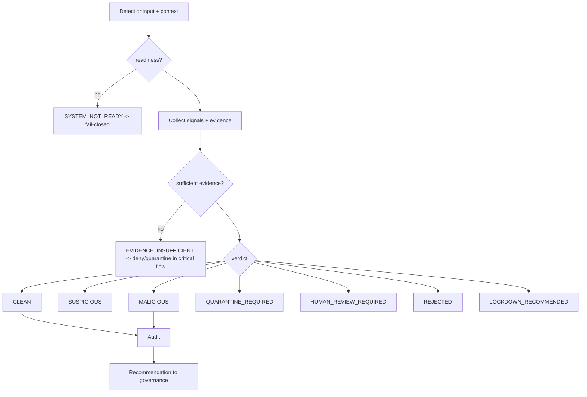

# Detection & Response Contract (Canonical Architecture Decision)

> Technology-neutral contract for the Detection and Response capability that Sprint 13
> (and later sprints) compose. This is an **architecture decision and contract sketch**,
> not an implementation: it defines the models and rules; it builds no detection engine,
> binds no vendor, and adds no dependency. System Tree **Layer 10 — Resilience &
> Knowledge** (observe/record, never authorize). References:
> [Constitution](../000_OSFORGE_CONSTITUTION.md) §2 (Prime Directive), §4 (Security);
> [ADR 0015](../adr/0015-security-prerequisites-before-capability-expansion.md) (Sprint 6
> Detection & Response, step 2); [ADR 0017](../adr/0017-governance-enforcement-integration-seam.md);
> [ADR 0021](../adr/0021-prompt-and-untrusted-content-security-boundary.md);
> [OSForge System Tree](OSFORGE_SYSTEM_TREE.md).

## Purpose

Provide a shared, technology-neutral vocabulary so that the Prompt Firewall (Sprint 13),
tool-firewall kill-switch, hardening/lockdown, edge abuse-detection and future detectors
emit **comparable, explainable, tenant-scoped signals** that route into response
recommendations — **without ever becoming an authorization path.** Detection observes
and recommends; governance decides.

## Position in the security chain

**Detection and Response are separate contracts.** Detection produces evidence and a
verdict; Response consumes a *recommendation* and is actuated only through existing
governed controls (kill-switch, lockdown, quarantine) — never by detection directly.

## Core models (technology-neutral)

- **DetectionInput** — the artifact under evaluation (content digest, tool-output
  envelope, event, signal) + declared provenance. Never carries a secret value.
- **DetectionContext** — tenant/workspace scope, actor, mode (test/production),
  trusted clock `now`, readiness state.
- **DetectionSignal** — a single observation (pattern match, anomaly, reputation, rate).
- **DetectionEvidence** — the immutable, redacted basis for a verdict (digests, rule
  refs, signal refs) — never raw secrets or plaintext.
- **DetectionCategory** — e.g. `PROMPT_INJECTION`, `TOOL_OUTPUT_POISONING`,
  `MCP_MANIPULATION`, `CONNECTOR_ABUSE`, `MEMORY_POISONING`, `RETRIEVAL_POISONING`,
  `CROSS_TENANT_SMUGGLING`, `SECRET_EXFILTRATION`, `ENCODING_EVASION`,
  `MULTIMODAL_INJECTION`, `VOICE_ATTACK`, `REPLAY`, `APPROVAL_BYPASS`,
  `MODEL_FALLBACK`, `SCHEMA_MANIPULATION`, `AGENT_PROPAGATION`, `AUDIT_TAMPERING`,
  `FAIL_OPEN_ATTEMPT`.
- **DetectionSeverity** — `INFO · LOW · MEDIUM · HIGH · CRITICAL`.
- **DetectionConfidence** — bounded score/level; **low confidence never means safe.**
- **DetectionVerdict** — the closed union below (never boolean).
- **DetectionReason** — reasonCode + humanReadableReason.
- **DetectionProvenance** — immutable origin of the input and the detector; travels with
  the decision; never stripped/forged.
- **DetectionDecision** — the explainable envelope: `{ verdict, category, severity,
  confidence, reason, evidence[], provenance, requiredAction, policyReference?,
  auditReference, evaluatedAt }`.
- **DetectionPolicyReference** — the policy under which the verdict was formed (detection
  reads policy; it never creates it).
- **DetectionAuditReference** — the append-only, hash-chained, per-`tenant::workspace`
  audit anchor.
- **QuarantineRequest** — request to isolate content/actor/runtime (actuated by the
  quarantine store; content cannot leave quarantine into memory/context).
- **EscalationRequest** — request for human review (routed to the approval boundary).
- **ResponseRecommendation** — a *recommendation* (e.g. `RECOMMEND_LOCKDOWN`,
  `RECOMMEND_KILL_SWITCH`, `RECOMMEND_ISOLATE`, `RECOMMEND_STEP_UP`) consumed by
  governed response controls; never self-actuating, never an ALLOW.

## Detection verdicts (never boolean)

`CLEAN · SUSPICIOUS · MALICIOUS · QUARANTINE_REQUIRED · HUMAN_REVIEW_REQUIRED ·
REJECTED · LOCKDOWN_RECOMMENDED · EVIDENCE_INSUFFICIENT · SYSTEM_NOT_READY`

`EVIDENCE_INSUFFICIENT` and `SYSTEM_NOT_READY` are **fail-closed** in a critical flow:
they deny or quarantine — never allow.

## Rules [binding]

1. Detection alone cannot grant authorization.
2. Detection is not a bypass that produces ALLOW.
3. UNKNOWN or insufficient evidence is never treated as safe in a critical operation.
4. AI may offer a detection recommendation; the final critical decision belongs to governance.
5. A detection result cannot produce policy, capability, approval or a permit.
6. Cross-tenant evidence is never used.
7. Provenance can never be lost.
8. Detection failure in a critical flow is fail-closed.
9. Detection and Response are separate contracts.
10. Quarantined content cannot enter memory or general context.
11. A detection verdict is an explainable, branded value — never a bare boolean.
12. Detection audit failure blocks the critical flow it observes.
13. An AI cannot clear its own quarantine or downgrade its own detection verdict.
14. Response actions are actuated only through existing governed controls (kill-switch,
    lockdown, quarantine), never by detection directly.

## Composition (compose, do not redefine — ADR 0016)

Existing primitives this contract unifies rather than replaces: `tool-firewall`
kill-switch and `output.ts` classification; `secret-access/exfil.ts` secret-egress scan;
`agent-runtime/injection.ts` verdicts; `event-foundation` security-events + provenance
envelope; `hardening` recovery/lockdown; `edge-security` abuse-detection contracts;
`governance` pipeline (sole ALLOW authority).

## Prerequisite note (roadmap)

Sprint 13's entry criteria list "detection … complete." No standalone Detection &
Response (Sprint 6) package exists today; only scattered primitives do. This contract is
the **architecture decision** that lets a human either (a) accept the scattered
primitives + this contract as satisfying the criterion, or (b) sequence a dedicated
`packages/detection` before Sprint 13 Phase A. That choice is a pre-implementation human
decision and is **out of scope for this documentation turn.**

## Extension points

Adapter ports (not implemented now): `DetectorAdapter` (real classifier/anomaly engine),
`ReputationAdapter`, `ResponseActuatorAdapter` (governed), `DetectionAuditSink`,
`TrustedClock`. Future: federated detection exchange, post-quantum signed evidence,
confidential-computing evaluation — seams only.
