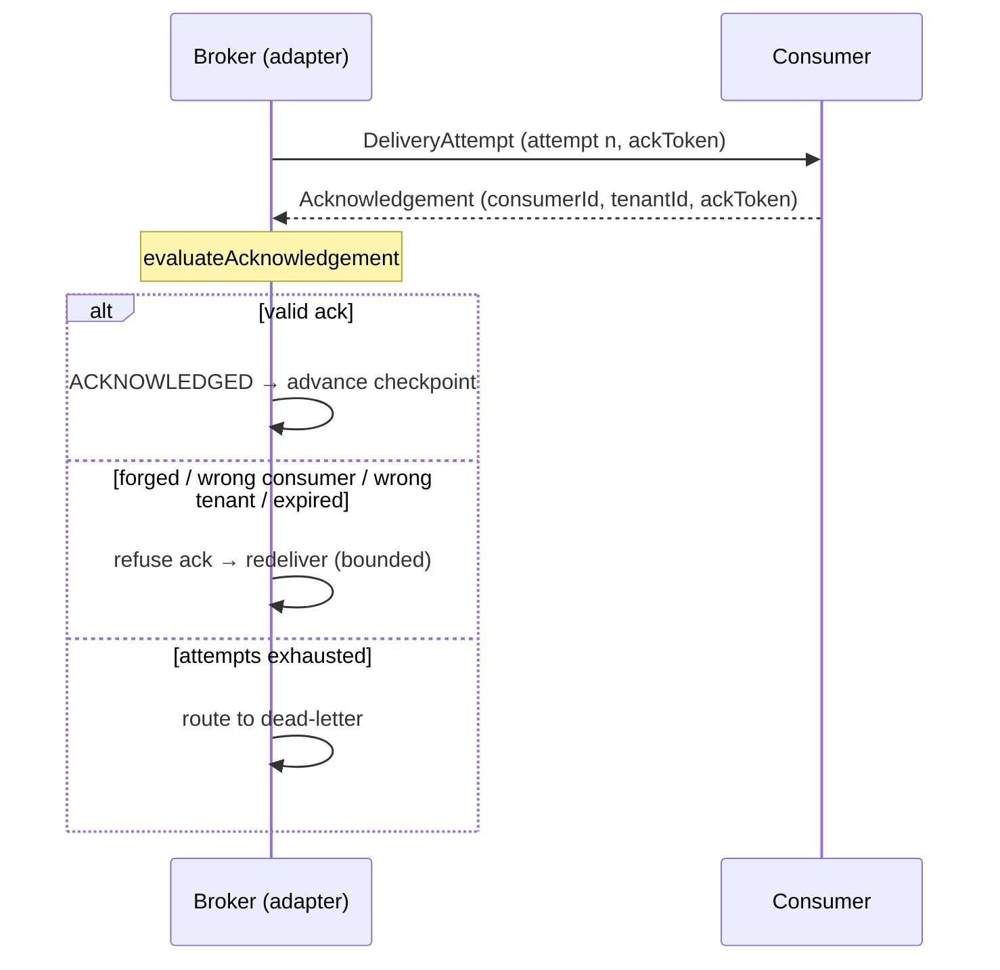
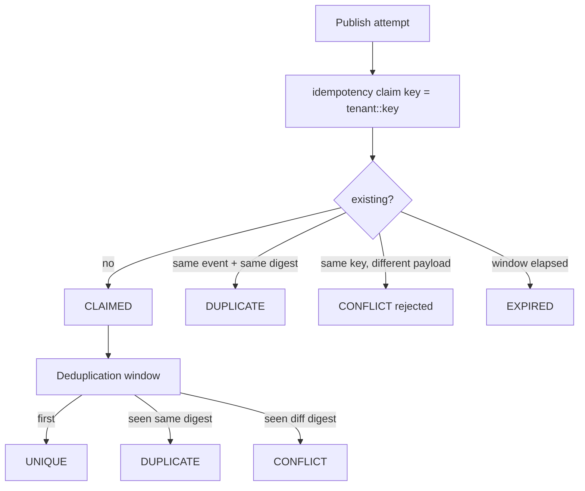
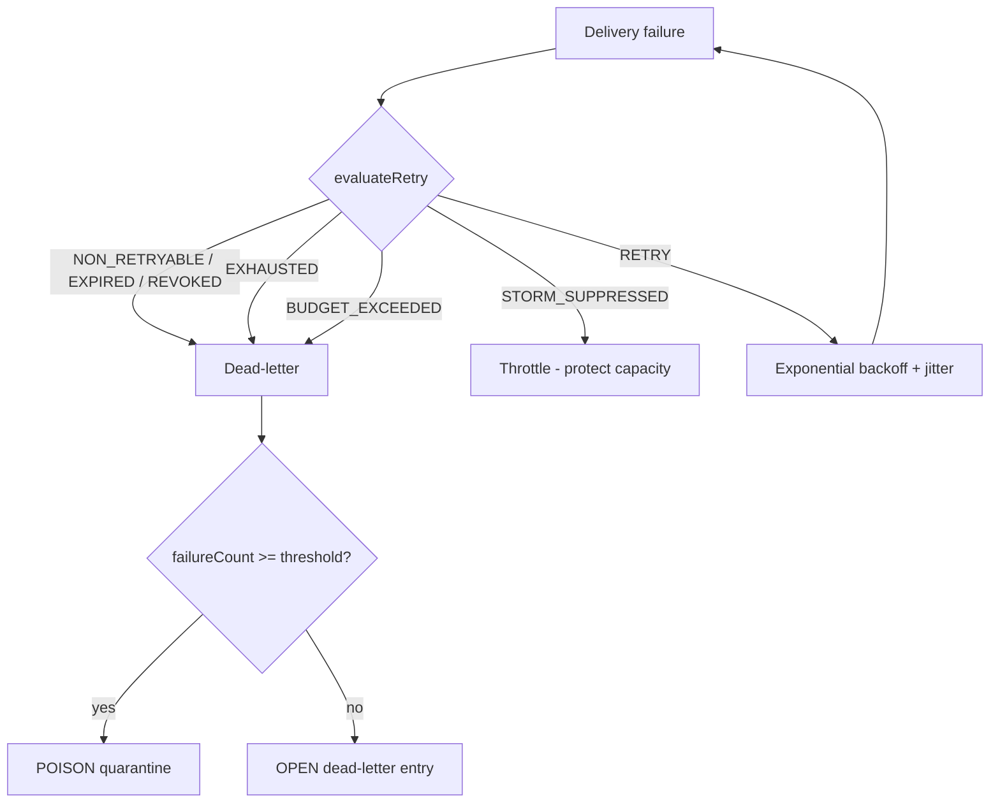
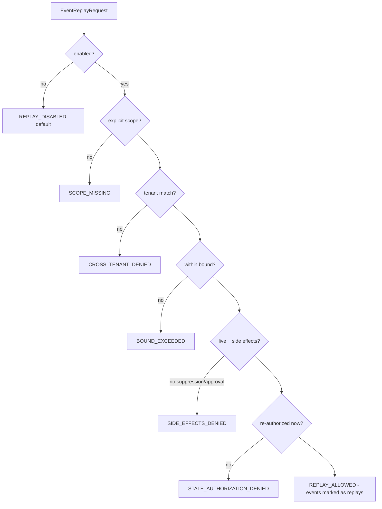

# Event Delivery and Replay

> Package: `packages/event-foundation` (`delivery.ts`, `idempotency.ts`, `retry.ts`, `deadletter.ts`, `replay.ts`) · Sprint P0.6.5 · Constitution §2 (fail closed), §5.

## Delivery guarantees
`AT_MOST_ONCE`, `AT_LEAST_ONCE`, `EFFECTIVELY_ONCE`. **Exactly-once is never
claimed by the core** (`assertNoExactlyOnceClaim`). Effectively-once is valid only
when idempotency + deduplication + atomic claim + checkpoint + audit are all
present (`isEffectivelyOnceValid`).

## Acknowledgement rules
Success requires a genuine ack from the delivering consumer. Refused:
forged token (`ACK_FORGED`), wrong consumer (`ACK_WRONG_CONSUMER`), wrong tenant
(`ACK_WRONG_TENANT`), expired window (`ACK_EXPIRED`), inactive subscription. A
handler exception is isolated (`HANDLER_FAILED`) and never breaks the publisher.
Delivery attempts are bounded (`ATTEMPTS_EXHAUSTED` → dead-letter).

## Subscription and delivery (diagram 5)

## Idempotency and deduplication (diagram 6)

A cache restart must not silently drop protection — an in-memory store is
`testOnly` and refused in production (`assertDurableIdempotencyInProduction`).

## Retry and dead-letter flow (diagram 7)

Retries are bounded (no infinite loop); a tenant budget cannot starve other
tenants; retry storms are suppressed; causation/trace links are preserved.

## Replay approval flow (diagram 8)

Replay never revives stale authorization, never disguises replays as live events,
keeps duplicate protection, and is bounded. Dead-letter replay adds: cross-tenant
denied, poison quarantined, AI self-replay denied, critical replay needs approval,
new event id / explicit replay reference, original never mutated.

## 2035 extension points
Federated replay across regions, offline/edge redelivery, deterministic simulation
replays, privacy-preserving delivery routing.
