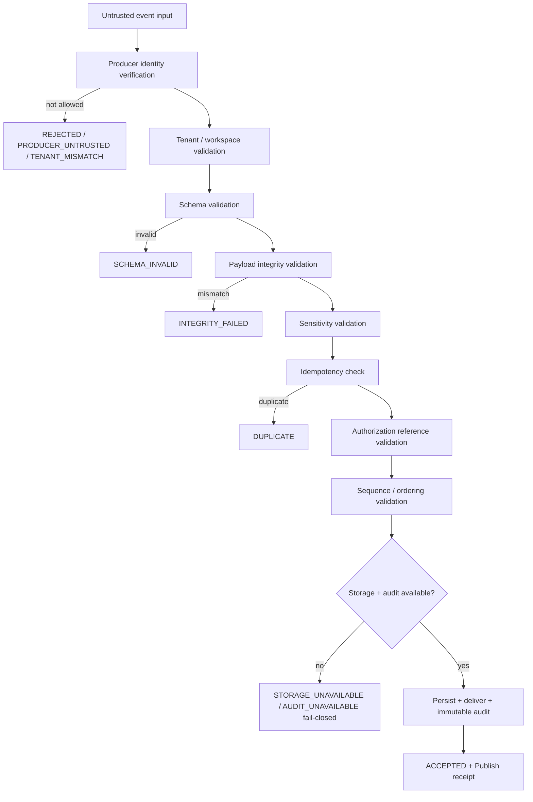
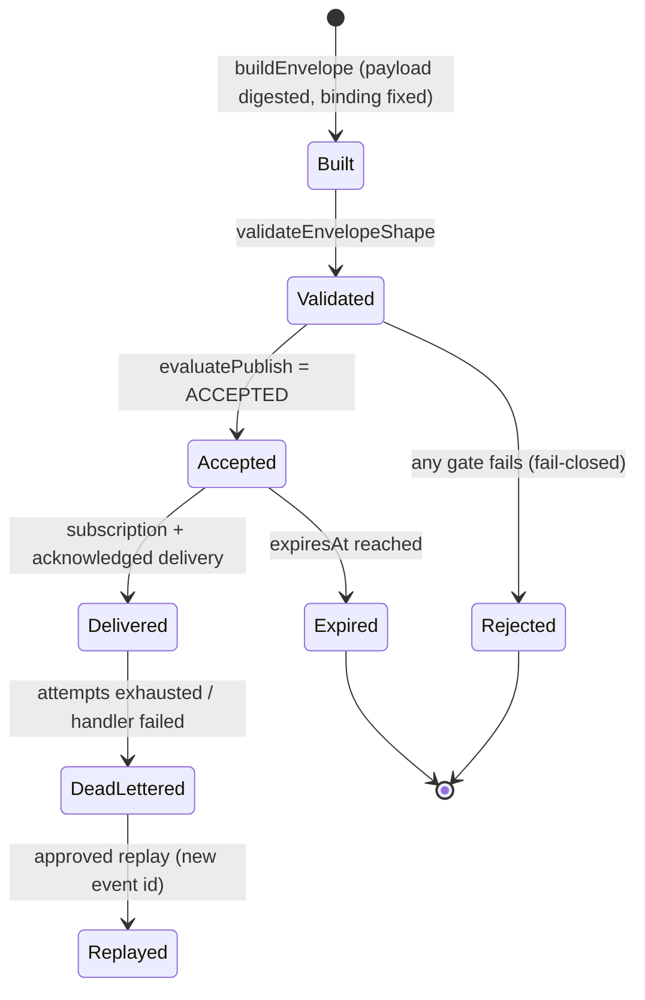
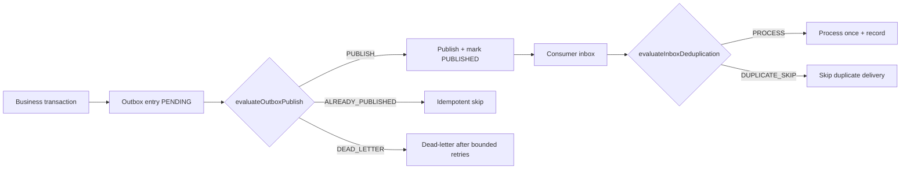

# Event Foundation

> Package: `packages/event-foundation` · Sprint P0.6.5 · Constitution §000 (supreme). Technology-neutral, contract-first, fail-closed, tenant-isolated, explainable, replayable.

## Purpose
A shared, secure event spine for the whole platform — Kernel, Runtime, Identity &
Trust, Policy, Memory, Knowledge, Capability OS, Agent Runtime, Workflow,
Plugin/MCP, Distributed Cloud and products. It defines **contracts only**: no
Kafka/RabbitMQ/NATS/Redis/Supabase is bound here. It **identifies, validates,
orders, audits and delivers** events; it makes **no business decision**, runs
**no workflow** and is **not** a policy engine.

## Layer boundary
- **Does:** event contracts, envelope/metadata, schema/version model, publish/
  subscribe/delivery contracts, idempotency/dedup, replay/ordering/retry/
  dead-letter, tenant/workspace isolation, provenance/audit, health/readiness,
  adapter boundaries.
- **Does not:** business rules, policy decisions, workflow execution, agent
  planning, tool execution, UI, real broker wiring, application-specific domain
  events, product features.

## Event taxonomy (§5)
`DOMAIN_EVENT, INTEGRATION_EVENT, SYSTEM_EVENT, SECURITY_EVENT, AUDIT_EVENT,
WORKFLOW_EVENT, COMMAND_RESULT_EVENT, LIFECYCLE_EVENT, HEALTH_EVENT,
TELEMETRY_EVENT, DEAD_LETTER_EVENT, COMPENSATION_EVENT, APPROVAL_EVENT,
IDENTITY_EVENT, MEMORY_EVENT, CAPABILITY_EVENT, AGENT_EVENT`.

An event is an **immutable past fact**, never a command and never mutable state.
Unknown types are rejected; telemetry can never stand in for a business event; an
audit event can never be converted or deleted.

## Core invariants
- Deny-by-default, fail-closed, least-privilege, tenant/workspace isolation.
- No silent event loss; no unaudited mutation; no hidden privilege escalation.
- Every decision is explainable (reason code, human reason, next action) — never a
  bare boolean.
- Producer identity is verified before an event is accepted; tenant/producer
  binding is immutable; cross-tenant publish is refused.
- Immutable, hash-chained audit per tenant/workspace.
- No new dependency; adapters are replaceable; contracts are backward-compatible.

## Secure publish flow (diagram 1)

## Event envelope lifecycle (diagram 2)

## Transactional outbox / inbox (diagram 10)

## Envelope fields (§6)
`eventId, eventName, eventType, schemaName, schemaVersion, occurredAt, recordedAt,
tenantId, workspaceId, organizationId, producerPrincipalId, producerIdentityId,
correlationId, causationId, traceId, idempotencyKey, payloadDigest, metadataDigest,
provenance, securityContext, sensitivity, dataClassification, retentionClass,
integrityReference, expiresAt, sequence, partitionKey`. The payload is referenced
and digested — never inlined, never a secret.

## 2035 extension points (§30)
Multi-region federation, edge/offline logs, sovereign zones, confidential-computing
processing, privacy-preserving routing, post-quantum signatures, zero-knowledge
proofs, AI-agent lineage, robotic/IoT streams, deterministic simulation/digital
twins, federated replay, global causal graphs, civilization-scale immutable
archives — contracts only, not implemented.
