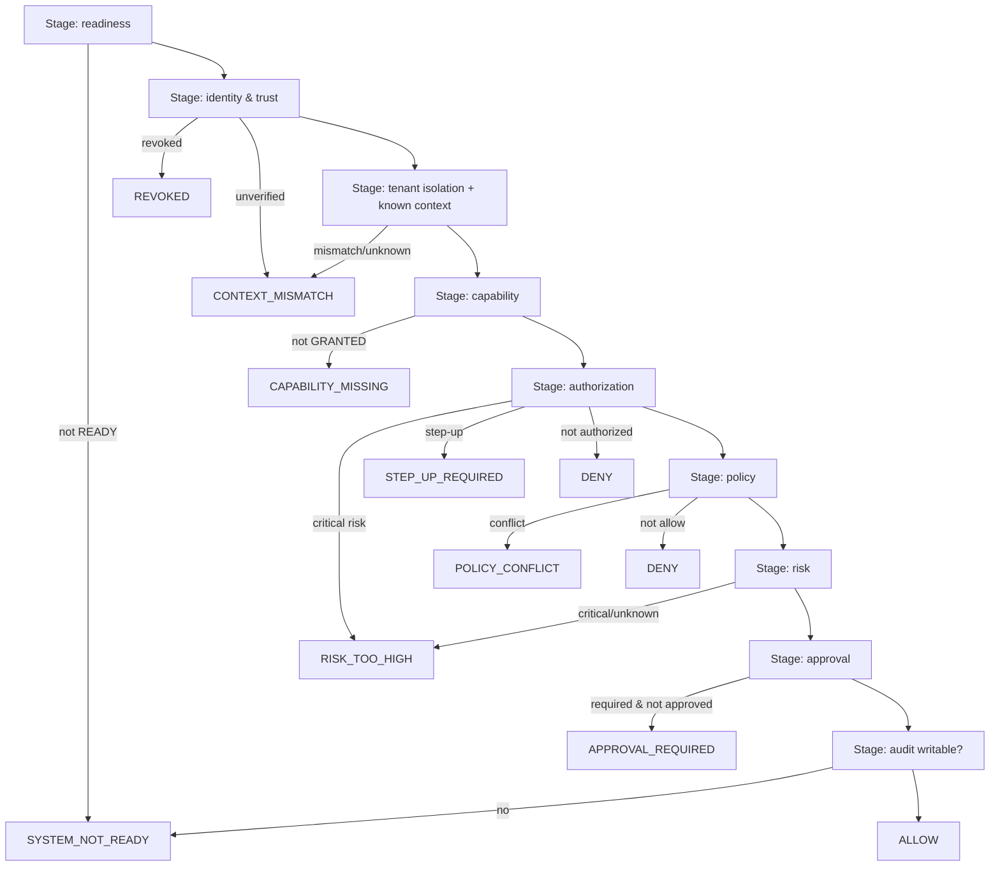
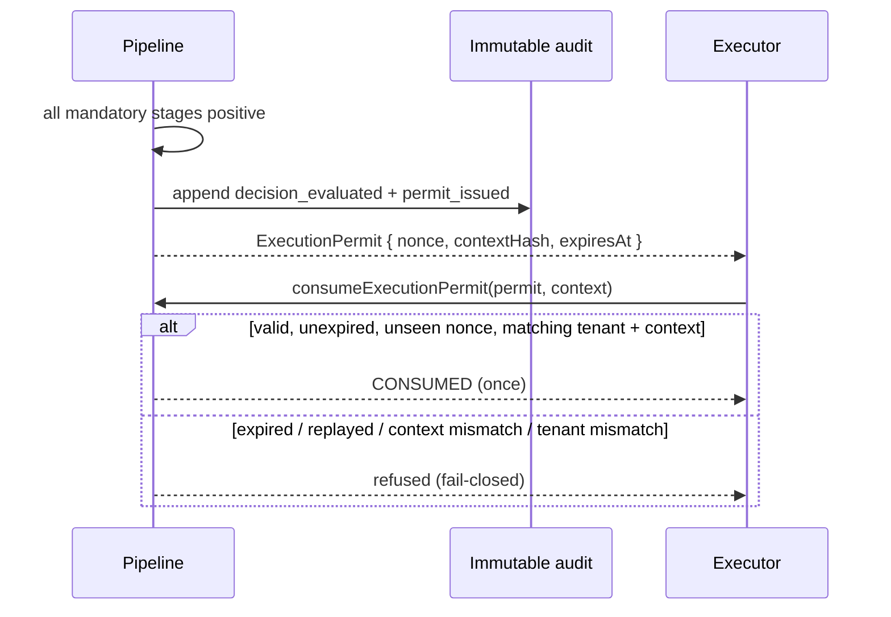

# Governance Decision Pipeline

> Package: `packages/governance` (`pipeline.ts`) · Sprint P0.7, §9 · Constitution §2 (fail closed).

## Immutable chain
Identity context → Tenant isolation → Capability → Authorization → Policy → Risk →
Approval → Final decision → Immutable audit. **No stage is skipped.** The first
blocking stage decides; nothing downstream can flip a DENY to ALLOW.

## Invariants
1. No layer is skipped.
2. ALLOW requires every mandatory stage positive.
3. A DENY at any stage is never converted to ALLOW later.
4. Approval never converts a DENY — it only completes an `APPROVAL_REQUIRED`.
5. A missing capability blocks execution even if authorization allowed.
6. A policy conflict or unknown context blocks execution.
7. If the immutable audit record cannot be written, a critical execution never starts.
8. Every decision carries `correlationId` and `traceId`.
9. The Execution Permit is minted only at the pipeline end — single-use,
   time-limited, and context-bound.

## End-to-end pipeline (diagram 7)

## Execution permit issuance (diagram 8)

The permit binds `tenant + workspace + principal + action + resource` via a
`contextHash`; any altered context, wrong tenant, expiry, or reused nonce is
refused. A permit is minted for no other outcome than ALLOW.

## References
[GOVERNANCE_SPINE](GOVERNANCE_SPINE.md) · [P0_7_SECURITY_INVARIANTS](../security/P0_7_SECURITY_INVARIANTS.md) · Constitution `docs/000_OSFORGE_CONSTITUTION.md`.
