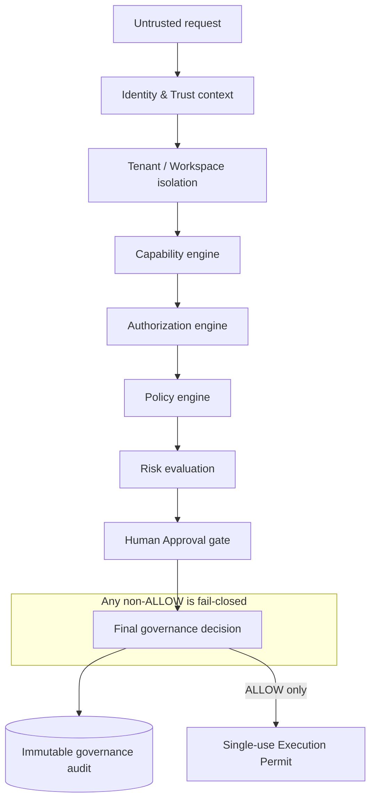
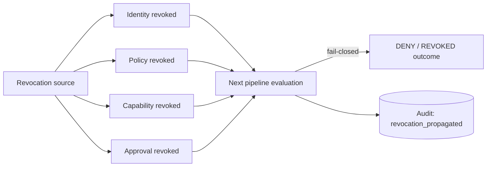

# Governance Spine

> Package: `packages/governance` · Sprint P0.7 · Constitution `docs/000_OSFORGE_CONSTITUTION.md` (supreme). Technology-neutral, contract-first, fail-closed, tenant-isolated, explainable.

## Purpose
The decision-making and governance backbone of OSForge Core. It composes five
concerns — **Policy**, **Authorization**, **Capability**, **Risk**, and
**Human Approval** — into a single immutable **Governance Decision Pipeline** that
ends in an explainable decision and, only on ALLOW, a single-use **Execution
Permit**. It answers *"may this exact request execute, right now, in this context?"*
It does not run business logic, workflows, or agents, and binds no external policy
engine, database, or LLM.

## Why one package (§10)
The five engines share one branded decision model and must compose as one
fail-closed chain. Five separate packages would duplicate the shared types and
introduce heavy cross-package coupling, enlarging the audit surface. A single
`packages/governance` package with internal module boundaries keeps the public API
small and the security review tractable — no unnecessary fragmentation.

## Layer boundary
- **Does:** decision contracts, policy/authorization/capability/risk/approval
  evaluation, the end-to-end pipeline, execution-permit issuance, immutable
  governance audit, readiness, adapter boundaries.
- **Does not:** business rules, workflow execution, agent planning, tool
  execution, UI, deployment, real policy-engine/broker/DB wiring, or rewriting the
  identity / memory / event / audit / runtime contracts (bound via adapters).

## General governance architecture (diagram 1)

## Core principles (Constitution-aligned)
Security first · fail closed · deny by default · tenant/workspace isolation ·
immutable audit · human approval for critical actions · explicit identity &
provenance · no hidden privilege escalation · no AI self-escalation · explainability ·
least privilege · technology neutrality · adapter replaceability.

## Revocation propagation (diagram 10)

Revocation is authoritative and re-checked on the next decision; a revoked
identity/policy/capability/approval can never yield ALLOW, and issued permits are
single-use and short-lived so revocation is quickly effective.

## Documents
- Policy: [POLICY_ENGINE_FOUNDATION](../security/POLICY_ENGINE_FOUNDATION.md)
- Authorization: [AUTHORIZATION_MODEL](../security/AUTHORIZATION_MODEL.md)
- Capability: [CAPABILITY_SECURITY_MODEL](../security/CAPABILITY_SECURITY_MODEL.md)
- Approval: [HUMAN_APPROVAL_MODEL](../security/HUMAN_APPROVAL_MODEL.md)
- Risk: [RISK_EVALUATION_MODEL](../security/RISK_EVALUATION_MODEL.md)
- Pipeline: [GOVERNANCE_DECISION_PIPELINE](GOVERNANCE_DECISION_PIPELINE.md)
- Invariants: [P0_7_SECURITY_INVARIANTS](../security/P0_7_SECURITY_INVARIANTS.md)

## 2035 extension points
Relationship-based (ReBAC) authorization graphs, verifiable-credential-backed
capabilities, federated cross-org policy, confidential-computing decision
attestation, zero-knowledge policy proofs, autonomous-agent workforce governance —
contracts only, not implemented in P0.7.
