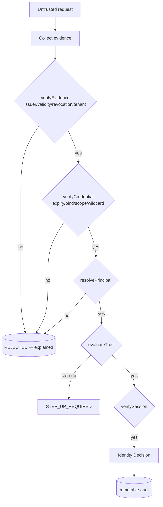
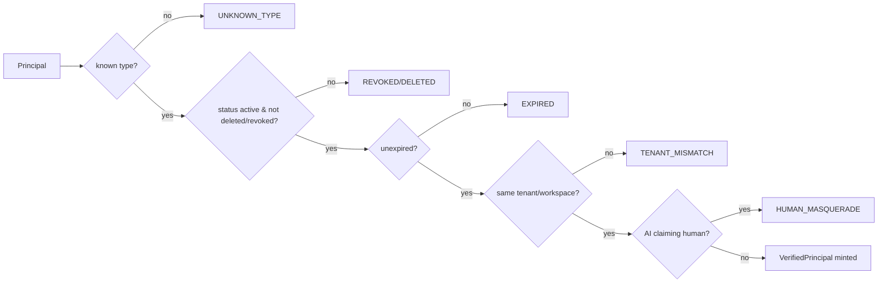
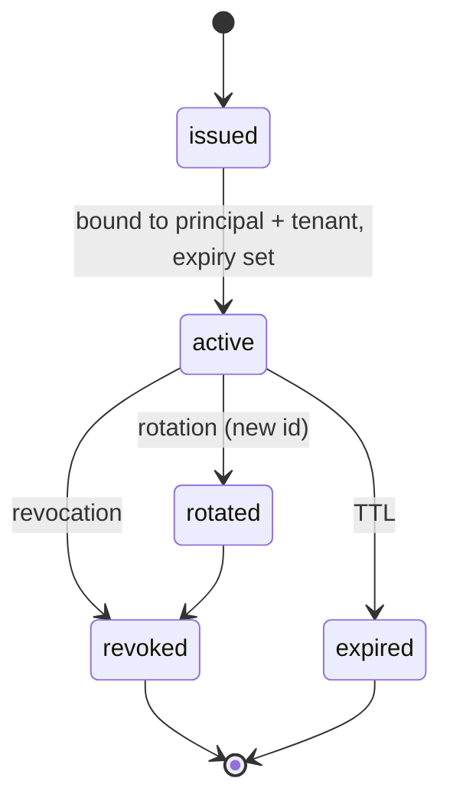
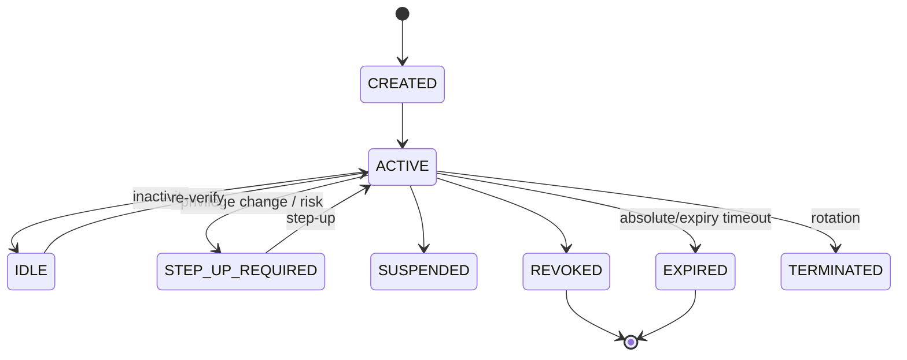
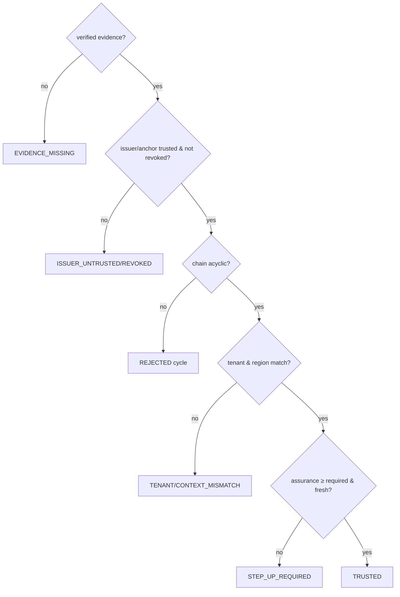
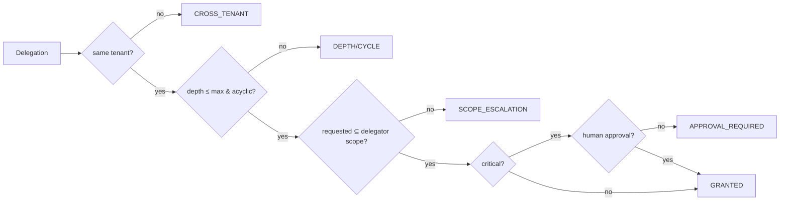
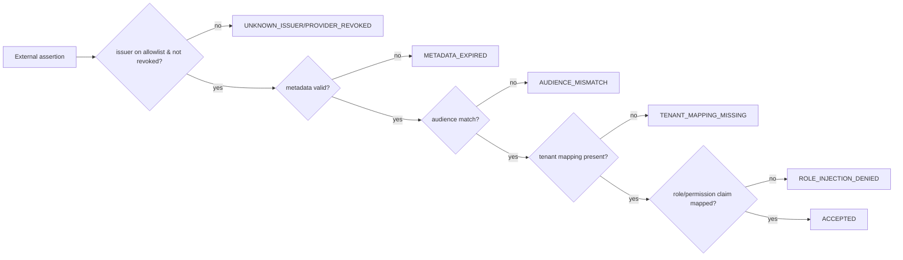
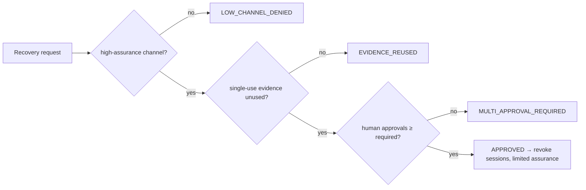
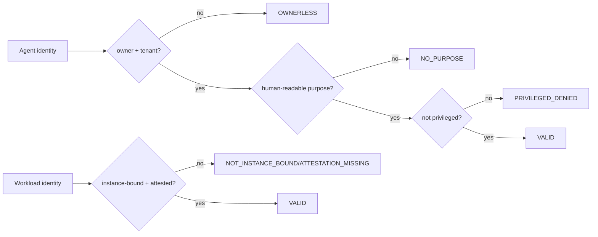

# Identity & Trust Foundation

> Package: `packages/identity-trust` · Sprint P0.6 · Technology-neutral, contract-first, branded, fail-closed.
> Constitution: §2, §4, §5 (no AI self-escalation), §7, §22 (explainability), §23 (audit), §24. No vendor (Auth0/Keycloak/Firebase/Okta) dependency.

The common identity & trust spine for humans, admins, AI agents, digital
employees, services, devices, runtimes, connectors, plugins, MCP servers,
capabilities, edge nodes, robots and federated cloud identities. This layer
**identifies, verifies, evaluates trust and audits** — it does NOT make
business/authorization decisions (that is P0.7).

## Identity vs Principal
- **Identity**: the record of an entity.
- **Principal**: a verified actor in an operation context.
One identity may hold multiple controlled principal contexts, recorded and
audited via `IdentityBinding`. Authentication success alone is neither trust nor
authorization — the three are separate.

## Layer flow
```
Untrusted Request → Identity Context → Evidence Collection → Credential Verification
→ Principal Resolution → Tenant/Workspace Binding → Trust Evaluation → Session Validation
→ Identity Decision → Audit → (P0.7 Policy Engine)
```

## 1. Identity verification flow


## 2. Principal resolution flow


## 3. Credential lifecycle

No plaintext is stored; expiry, rotation and revocation are mandatory; scope
cannot self-widen; wildcard is denied in production.

## 4. Session lifecycle

Fixation and copy are denied; a tenant swap requires a new session; revoked/expired
sessions cannot be reused; session data holds no secrets.

## 5. Trust evaluation flow

`TrustScore`/`TrustLevel` are never an authorization result.

## 6. Delegation flow

Delegation is not impersonation; an agent cannot delegate unbounded authority.

## 7. Federation flow

External claims are never internal roles; account linking needs human verification.

## 8. Recovery flow

Recovery is not authentication; an AI cannot approve it.

## 9. Break-glass flow
```mermaid
flowchart LR
  B[Break-glass request] --> AI{human initiator?}
  AI -- no --> XA[AI_DENIED]
  AI -- yes --> RE{reason present?}
  RE -- no --> XR[NO_REASON]
  RE -- yes --> MA{human approvals ≥ (global:3/other:2)?}
  MA -- no --> XM[MULTI_APPROVAL_REQUIRED]
  MA -- yes --> EX{bounded & short-lived?}
  EX -- no --> XE[MUST_EXPIRE/TOO_LONG]
  EX -- yes --> G[GRANTED → post-use review, no delegation]
```
Break-glass is separate from normal credentials and from impersonation.

## 10. Agent / workload identity flow

An agent can never change its owner, widen scope, raise trust, approve, or present
as human. Model identity is separate from agent identity (identity continuity
across model/provider changes).

## Trust boundaries
Untrusted request → verified evidence → verified credential → resolved principal
→ trust decision → active session. Each boundary is fail-closed and explainable.
Nothing is implicitly trusted; no hidden privilege inheritance; no unaudited
impersonation; no permanent unrestricted credential.

## Threat model / failure modes
Every adversarial vector (cross-tenant access, credential/token misuse, replay,
session fixation/copy, assurance/agent self-escalation, unauthorized/looping
delegation, hidden impersonation, federation role injection, recovery/break-glass
abuse, audit tamper, test adapter in production) maps to a specific explained
rejection — see the security docs.

## Audit requirements
Immutable, hash-chained, per tenant/workspace, no secrets; impersonation is
dual-actor audited. ~19 event types.

## Production adapter requirements
Directory, credential verifier/issuer, session store, revocation store, federation
provider, device/workload attestation, passkey, CA, hardware-trust, human-
verification, audit adapters — all `assertProductionAdapter`-gated; reference
in-memory components are `testOnly`.

## 2035 extension points
Decentralized identity / verifiable credentials / passkeys / biometric proof refs
/ post-quantum credential signatures / TPM & secure-enclave attestation / robot &
autonomous-vehicle identity / federated AI-workforce identity / multi-cloud
workload identity / edge & offline verification / confidential-computing identity
/ sovereign identity zones / privacy-preserving & zero-knowledge credentials /
identity continuity across model/provider changes — all behind contracts, no core
change.

## Rollback plan
Additive: new `packages/identity-trust` + `tests/identity-*` + type-test include
+ `test:security` entries. The existing `packages/identity` gate and all public
APIs are untouched. Rollback = delete the new package, the new tests, and the two
config references.
