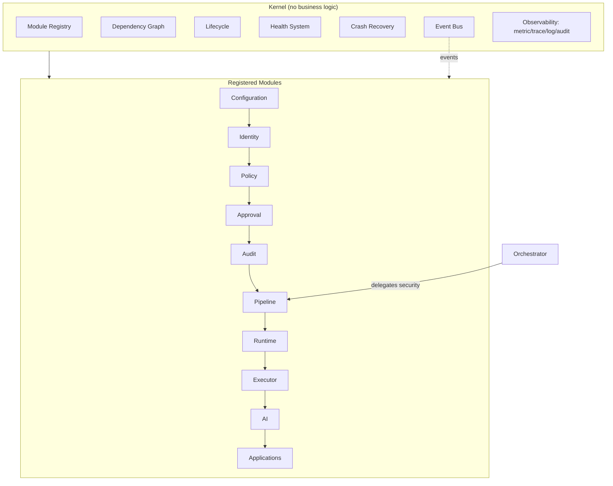
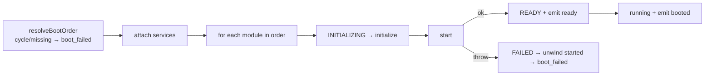
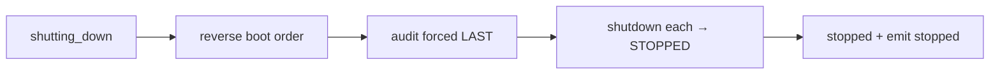
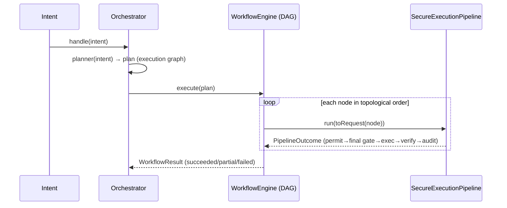
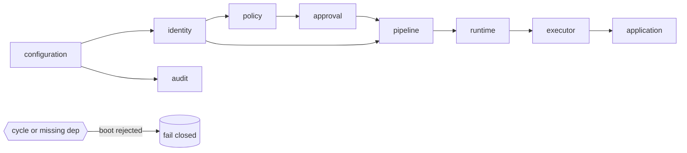
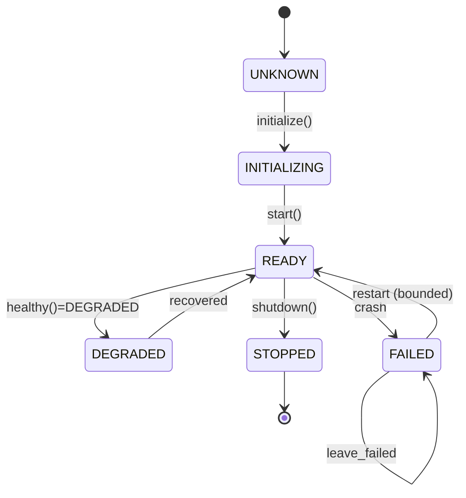

# Kernel and Orchestrator Foundation

> Packages: `packages/kernel`, `packages/orchestrator` · Sprint P0.2
> Constitution references: §2 Prime Directive, §3 Architecture, §7 Final Gate, §20 Digital Employees, §22 Explainability, §23 Audit.

The kernel is OSForge's shared execution engine: every product, agent and SaaS
built on OSForge boots, runs, and shuts down through the same lifecycle. The
kernel knows **no business logic** — only registry, lifecycle, boot/shutdown
sequencing, health, crash recovery, and event dispatch. The orchestrator
sequences intents through the SecureExecutionPipeline and produces **no security
decisions of its own**.

## Immutable execution chain

```
Intent → Planner → Orchestrator → Secure Pipeline → Execution Permit →
Runtime → Executor → Verification → Immutable Audit
```

Nothing executes outside this chain.

## 1. Architecture



## 2. Boot sequence



Order: Configuration → (Observability, Event Bus) → Identity → Policy → Approval
→ Audit → Pipeline → Runtime → Model Gateway → Connector → Memory → Executor →
Digital Workforce → AI → Applications. Explicit `dependsOn` edges always win;
kind priority only breaks ties.

## 3. Shutdown sequence



Audit always shuts down last so shutdown steps remain auditable.

## 4. Execution (Orchestrator → Pipeline)



A node that fails skips its transitive dependents; independent nodes still run.

## 5. Module graph



## 6. Lifecycle (per module)



Lifecycle interface: `initialize() · start() · healthy() · pause() · resume() · shutdown()`.

## 7. Pipeline (delegated security spine)

```mermaid
flowchart LR
  IN[Untrusted Input] --> ED[Edge] --> ID[Identity] --> TC[Tenant/Workspace] --> AZ[Authorization] --> PO[Policy] --> AP[Approval] --> RP[Replay] --> PM[Permit] --> RI[Runtime Isolation] --> FG[Final Gate] --> EX[Execution] --> VF[Verification] --> AU[Immutable Audit]
```



See `docs/architecture/SECURE_EXECUTION_PIPELINE.md` for the full spine.

## Invariants

- **K1** The kernel contains no business logic; modules carry all domain behavior.
- **K2** Boot is fail-closed: a cycle, missing dependency, or module start failure aborts boot and unwinds started modules.
- **K3** Shutdown is reverse-order with audit last.
- **K4** Crash recovery is bounded and policy-driven — never an infinite restart.
- **K5** The orchestrator produces no security decisions; every execution is decided by the pipeline.
- **K6** Planning is separated from execution; an intent is never an execution authority.
- **K7** The event bus never breaks lifecycle: a failing handler is dead-lettered.

## Failure modes

| Condition | Outcome |
| --- | --- |
| Dependency cycle / missing dependency | `boot_failed` |
| Module `start()` throws | module FAILED, started modules unwound, `boot_failed` |
| Module crash at runtime | FAILED → restart (bounded) or leave failed |
| Event handler throws | event dead-lettered; publisher unaffected |
| Invalid execution graph | workflow `invalid` |
| Pipeline denies a node | workflow step `failed`, dependents skipped |

## Production adapters / remaining work

- UUID-based `IdFactory` and an attested `KernelClock` for production.
- Durable event bus (persistent queue + real dead-letter store) behind the `EventBus` contract.
- Real observability exporters (metrics/traces/logs) behind the sinks.
- Concrete modules implementing the contract-only domains (memory, connector, model gateway, plugin, digital employee).
- Configuration module and a real crash-detection hook wired to `reportCrash`.

## Rollback plan

Additive: new `packages/kernel` code, new `packages/orchestrator` code, new
`tests/kernel-*` and `tests/orchestrator-*`, and one-line type-test include.
The only edits to existing files alias legacy protocol re-exports (no removals).
Rollback = delete the new files and revert the two index aliases; no existing
contract, export, or test changes behavior.
