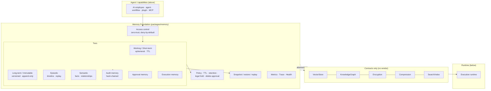
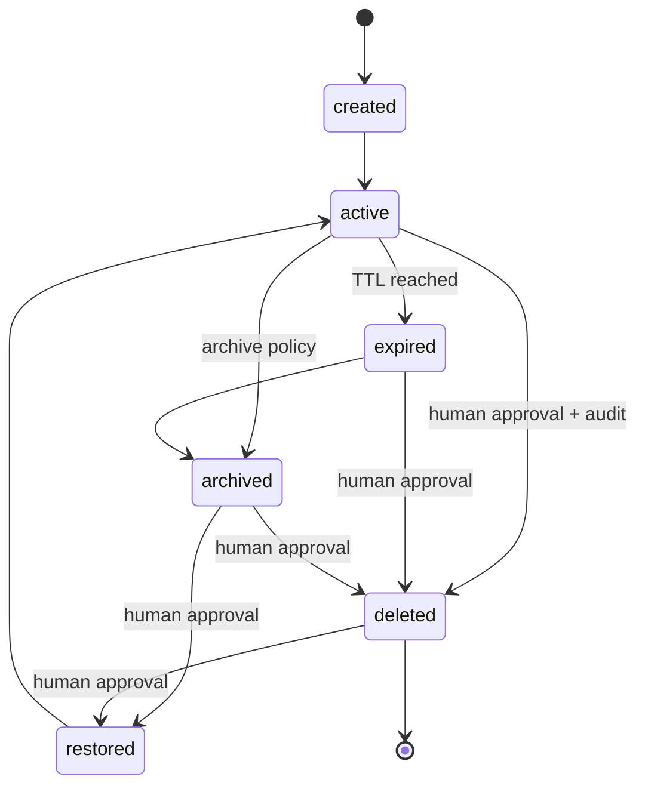
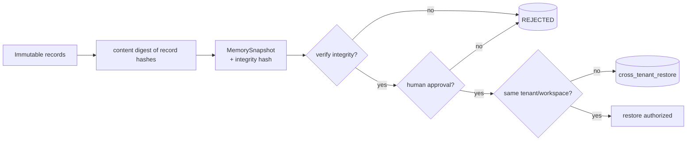
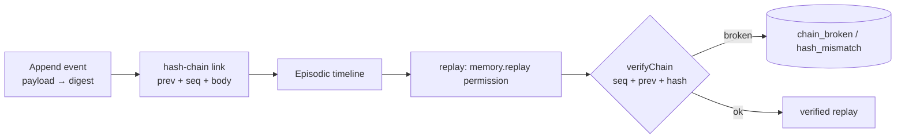
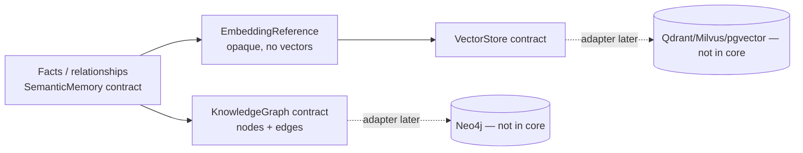

# Memory Foundation

> Package: `packages/memory` · Sprint P0.5
> Position: above Runtime, below Agent. Technology-neutral — no LLM, vector DB, graph DB, KMS, or vendor.
> Constitution: §2 (fail closed), §4 (security), §7 (memory rules), §22 (explainability), §23 (audit), §24 (privacy).

The shared, persistent memory substrate for every 2035 capability (AI employees,
agents, voice/vision, workflow, planning, plugins, MCP, connectors, knowledge,
approval, audit). Memory defines **contracts**; all real systems (vector stores,
graph DBs, KMS) are **adapters** written later. Memory never depends on a vendor.

## Priority order
`Security → Reproducibility → Correctness → Auditability → Tenant Isolation → Recoverability → Performance → Features.`

## 1. Memory architecture

**Trust boundaries:** every operation crosses the access-control boundary
(known tenant, valid session, same-tenant scope, explicit permission). Memory is
immutable by default; the only mutable tier is working/short-term. Adapters
(vector/graph/KMS) sit behind interfaces and never enter the core.

## 2. Memory lifecycle

Deletion and restore are the human-approved transitions. A legal hold blocks
deletion entirely. History is retained through tombstoning (immutable).

## 3. Snapshot flow

Snapshots (execution / memory / tenant) are integrity-hashed. Restore requires
integrity + human approval + same-tenant targeting.

## 4. Replay flow

Episodic memory stores payload digests (not raw payloads, which may hold
secrets). Replay is verified against the hash chain — never trusted.

## 5. Knowledge flow

Semantic knowledge is expressed as facts, relationships, and **opaque embedding
references** — no embeddings are computed and no vector/graph database is a
dependency. Real stores are adapters.

## Invariants
- **M1** Memory is immutable by default; writes append a new version, never mutate.
- **M2** No cross-tenant access, ever (structurally partitioned + authorized).
- **M3** Delete requires human approval; a legal hold blocks deletion.
- **M4** Every operation is audited on a tamper-evident hash chain; audit cannot be disabled.
- **M5** Working memory auto-expires on TTL; long-term persists and versions.
- **M6** Snapshot restore requires integrity + human approval + same tenant.
- **M7** Replay is verified against a hash chain; episodic stores digests, not raw payloads.
- **M8** No vendor/LLM/vector/graph/KMS dependency; all are adapters behind contracts.

## Failure modes (fail closed)
Unknown tenant → `unknown_tenant`; expired session → `session_expired`;
cross-tenant → `cross_tenant_denied` / `cross_tenant_restore`; missing permission
→ `permission_denied`; delete without approval → `delete_requires_human_approval`;
legal hold → `legal_hold_active`; test-only audit in production →
`audit_not_production_safe`; broken chain → `chain_broken` / `hash_mismatch`.

## Production adapters (not built here)
Durable long-term store; distributed audit chain; real KMS behind `MemoryEncryption`;
vector store behind `VectorStore`; graph DB behind `KnowledgeGraph`; compression
behind `MemoryCompression`; trace exporter behind `MemoryTrace`; embedding provider
behind `EmbeddingReference`.

## 2035 extension points
Multi-region tenant-scoped memory; federated episodic timelines; provider-
independent embeddings; memory learning/consolidation behind the immutable core;
knowledge-graph reasoning; encrypted-at-rest confidential memory.

## Known limits
- Reference stores are in-memory (`testOnly`) — durability is an adapter concern.
- Search/index reference is naive predicate filtering; real ranking is an adapter.
- Semantic/vector/knowledge/encryption/compression/trace are contracts only.

## Rollback plan
Additive: new `packages/memory` + `tests/memory-*` + type-test include + a
`test:security` list entry. No existing package, kernel, runtime, or public API is
changed. Rollback = delete `packages/memory`, the memory tests, and the two
config references.
