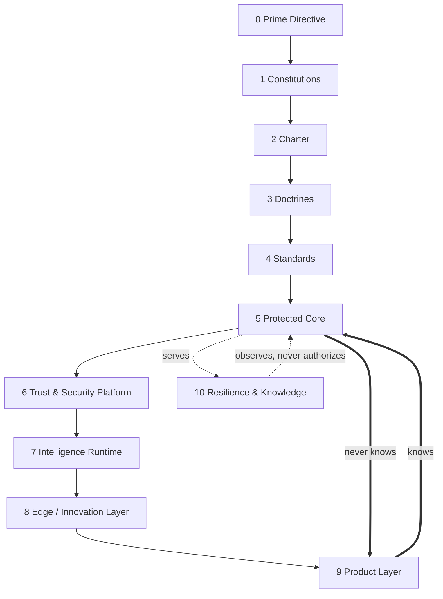

# OSForge System Tree (Canonical)

> Canonical layering of the OSForge system. This document records **structure and
> dependency direction only**. It defines no new rule that conflicts with any higher
> document; where it interprets, the [Constitution](../000_OSFORGE_CONSTITUTION.md)
> and the ADRs prevail. References: Constitution §2 (Prime Directive), §3
> (Architecture), §4 (Security); [ADR 0015](../adr/0015-security-prerequisites-before-capability-expansion.md),
> [ADR 0016](../adr/0016-canonical-foundation-ownership.md),
> [ADR 0017](../adr/0017-governance-enforcement-integration-seam.md);
> [Engineering Doctrine](ENGINEERING_DOCTRINE.md); [Architecture Review Board](ARCHITECTURE_REVIEW_BOARD.md).

## Prime dependency law [IMMUTABLE INTENT]

```
Products know the Core.        The Core never knows Products.
Innovation begins at the Edge. Only verified capabilities may approach the Core.
```

Dependencies point **inward and downward** only. A lower/inner layer MUST NOT import,
reference, or depend on a higher/outer layer. A cyclic dependency between layers is a
defect. New capability is proven at the Edge and migrates inward only after
verification and an [ARB](ARCHITECTURE_REVIEW_BOARD.md) decision.

## Layer overview



The arrows are **governance/derivation** (upper constrains lower). **Runtime
dependency** flows the opposite way: outer layers depend on inner layers; inner layers
never depend on outer ones.

---

## Layer 0 — Prime Directive
- **Purpose:** the five root directives (human authority, security precedes
  capability, fail closed, no bypass, traceability). Constitution §2 [IMMUTABLE].
- **Owner:** humans only (amendment is a human act; AI may never amend).
- **Change frequency:** effectively never; strengthen-only.
- **Security level:** maximum (root of trust).
- **Core dependency:** none — it is the root every layer specializes.
- **May depend on:** nothing.
- **Must not know:** any implementation, package, product, or vendor.
- **Change approval:** multi-human, out-of-band, immutable audit.
- **Extension points:** none (specializations live in lower layers).

## Layer 1 — Constitutions
- **Purpose:** the technical Constitution — binding articles for identity, security,
  approval, memory, agents, audit ([`000_OSFORGE_CONSTITUTION.md`](../000_OSFORGE_CONSTITUTION.md)).
- **Owner:** humans (maintainers); AI may propose, never ratify.
- **Change frequency:** rare; strengthen-only for `[IMMUTABLE]` articles.
- **Security level:** maximum.
- **Core dependency:** none; the Core derives from it.
- **May depend on:** Layer 0.
- **Must not know:** packages, products, vendors, runtime detail.
- **Change approval:** human ratification + immutable audit.
- **Extension points:** new articles that specialize (never weaken) the Prime Directive.

## Layer 2 — Charter
- **Purpose:** mission, 2035 vision, horizons, roadmap ordering ([`001_VISION.md`](../001_VISION.md),
  [`005_ROADMAP.md`](../005_ROADMAP.md), [ADR 0015](../adr/0015-security-prerequisites-before-capability-expansion.md)).
- **Owner:** humans (product + architecture leadership).
- **Change frequency:** low (per horizon / major sprint).
- **Security level:** high.
- **Core dependency:** none.
- **May depend on:** Layers 0–1.
- **Must not know:** package internals, product specifics.
- **Change approval:** human, ARB-reviewed.
- **Extension points:** new sprint definitions in the ordered roadmap.

## Layer 3 — Doctrines
- **Purpose:** durable engineering principles that guide how the Core evolves
  ([Engineering Doctrine](ENGINEERING_DOCTRINE.md)).
- **Owner:** architecture stewards.
- **Change frequency:** low.
- **Security level:** high.
- **Core dependency:** none.
- **May depend on:** Layers 0–2.
- **Must not know:** vendor/product/package internals.
- **Change approval:** ARB + human sign-off.
- **Extension points:** additional doctrines (additive, non-conflicting).

## Layer 4 — Standards
- **Purpose:** cross-cutting standards — ADRs, security models, naming, contract-first
  conventions, testing/CI gates ([`docs/adr/`](../adr), [`docs/security/`](../security)).
- **Owner:** architecture + security stewards.
- **Change frequency:** medium (per sprint/ADR).
- **Security level:** high.
- **Core dependency:** none (constrains the Core).
- **May depend on:** Layers 0–3.
- **Must not know:** product features, vendor SDKs.
- **Change approval:** ADR + ARB review + CI guards.
- **Extension points:** new ADRs, new security-model docs, new guards.

## Layer 5 — Protected Core
- **Purpose:** the frozen contract kernel — `protocol` (dependency sink), `kernel`,
  `pipeline` (Secure Execution Pipeline), `runtime`. Contract-first, technology-neutral.
- **Owner:** core maintainers; changes are governed under the Foundation Freeze
  ([ADR 0016](../adr/0016-canonical-foundation-ownership.md)).
- **Change frequency:** deliberately very low ("Core Changes Deliberately").
- **Security level:** maximum.
- **Core dependency:** is the Core.
- **May depend on:** Layers 0–4 (as constraints) and, at runtime, only `protocol`.
- **Must not know:** Trust Platform specifics, Intelligence Runtime, Edge, Products, vendors.
- **Change approval:** full ARB (all roles) + human decision + rollback plan.
- **Extension points:** adapter interfaces on `protocol`; additive contracts only.

## Layer 6 — Trust & Security Platform
- **Purpose:** the security boundaries — `governance`, `identity-trust`,
  `event-foundation`, `runtime-isolation`, `tool-firewall` (Sprint 11),
  `secret-access` (Sprint 12), and the forthcoming **content-trust / prompt-firewall**
  (Sprint 13) and **detection** contracts. Fail-closed, deny-by-default, tenant-isolated.
- **Owner:** security stewards.
- **Change frequency:** medium (per security sprint, ADR-ordered).
- **Security level:** maximum.
- **Core dependency:** composes the Protected Core via published APIs / adapters (ADR 0016).
- **May depend on:** Layers 0–5.
- **Must not know:** Products, Edge experiments, vendors (bound only via adapter ports).
- **Change approval:** Security + Architecture review + human sign-off; ADR per boundary.
- **Extension points:** adapter ports (KMS/Vault, classifier, detector, connector verifier).

## Layer 7 — Intelligence Runtime
- **Purpose:** governed autonomy — `agent-runtime`, `agent-governance`,
  `agent-execution`, `orchestrator`, `workflow`, `digital-workforce`, `intent`,
  `memory`. The **untrusted planner under governance** ([ADR 0018](../adr/0018-agent-runtime-untrusted-planner-under-governance.md)).
- **Owner:** runtime + architecture stewards.
- **Change frequency:** medium/high (feature sprints), always under the security platform.
- **Security level:** high (never above the Trust Platform).
- **Core dependency:** consumes Core + Trust Platform via published APIs; no permit → no execution.
- **May depend on:** Layers 0–6.
- **Must not know:** Product specifics; vendor model identities (bound via adapters).
- **Change approval:** Runtime + Security review + human sign-off for governed paths.
- **Extension points:** reasoner/executor/sandbox/tool/memory adapter seams.

## Layer 8 — Edge / Innovation Layer
- **Purpose:** where new capability is born and proven in controlled tests before it
  may approach the Core — `edge-security`, experimental connectors, new detectors,
  new classifiers, prototypes. "Innovation begins at the Edge."
- **Owner:** feature teams / researchers.
- **Change frequency:** high.
- **Security level:** contained (fail-closed; cannot touch Core without verification).
- **Core dependency:** consumes inward layers through published, adapter-bound APIs only.
- **May depend on:** Layers 0–7.
- **Must not know:** internal Core implementation detail; it sees only published contracts.
- **Change approval:** normal review; **migration inward requires ARB + verification.**
- **Extension points:** new adapters, new leaf packages, experimental ports.

## Layer 9 — Product Layer
- **Purpose:** customer-facing products and digital-employee verticals built on verified
  capabilities. "Products know the Core; the Core never knows Products."
- **Owner:** product teams.
- **Change frequency:** highest.
- **Security level:** governed by all inner layers; holds no ambient authority.
- **Core dependency:** depends on Core + Trust Platform + Intelligence Runtime via published APIs.
- **May depend on:** Layers 0–8.
- **Must not know:** nothing inward may know it; a product change can never force a Core change.
- **Change approval:** product review; a Core-affecting request escalates to ARB.
- **Extension points:** product modules, vertical adapters, UI/experience layers.

## Layer 10 — Resilience & Knowledge
- **Purpose:** cross-cutting operations that **observe and preserve** but never
  authorize — `audit`, backup/recovery ops, `hardening`, detection/response signal
  routing, disaster-recovery, repository integrity, knowledge/ADR corpus
  ([`docs/operations/`](../operations)).
- **Owner:** operations + security stewards.
- **Change frequency:** medium.
- **Security level:** high; **read/observe/record only — never an ALLOW path.**
- **Core dependency:** serves every layer; depends on published APIs only.
- **May depend on:** published contracts of all layers for observation.
- **Must not know:** it must never become an authorization or bypass path (detection/audit
  cannot mint permits or approvals).
- **Change approval:** Operations + Security review; immutable-audit changes need human sign-off.
- **Extension points:** audit sinks, backup targets, detection/response adapters, DR runbooks.

---

## Dependency-direction rules (summary)

1. Outer layers depend on inner layers; **inner layers never depend on outer layers.**
2. The Protected Core (Layer 5) depends, at runtime, on `protocol` only.
3. Security (Layer 6) is **above** Intelligence (Layer 7): a runtime action is always
   subordinate to a governance decision and a consumed permit (ADR 0017).
4. Resilience & Knowledge (Layer 10) **observes and records** across layers but is never
   an authorization path — detection/audit cannot produce ALLOW, capability, approval or permit.
5. New capability enters at the Edge (Layer 8) and migrates inward only after
   verification + an ARB decision.
6. No layer may weaken a `[IMMUTABLE]` directive of Layers 0–1.
