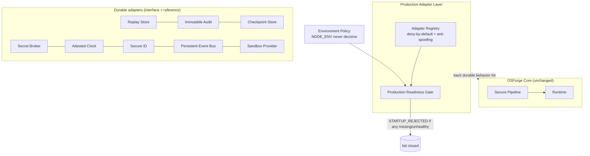
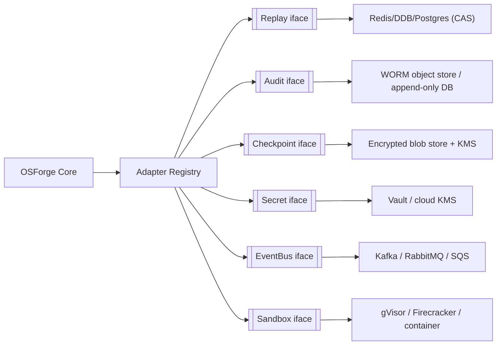

# Production Adapter Layer

> Package: `packages/adapters` · Sprint P0.4
> Constitution references: §4 Security, §14 Production, §15 Disaster Recovery, §16 Supply Chain, §23 Audit, §24 Privacy.

The adapter layer turns the test/in-memory foundations of P0.1–P0.3 into a
technology-neutral, production-shaped boundary. Every durable concern is an
interface with a reference adapter; test adapters are explicitly `testOnly` and
are refused in production. Nothing here locks a storage/queue/container
technology into the core.

## Priority order

`Security → Correctness → Durability → Tenant Isolation → Auditability → Recoverability → Performance → Features.`

## Trust boundaries

**Boundaries:** (1) the core depends on adapter *interfaces*, never a vendor; (2) test adapters can never cross into production (registry env-compat + readiness gate); (3) production is decided by an explicit, attested environment policy, never `NODE_ENV` alone.

## Adapter contracts (summary)

| Adapter | Interface | Reference (test) | Production requirement |
| --- | --- | --- | --- |
| Replay store | `DurableReplayStore` / `AtomicClaimBackend` | `InMemoryAtomicClaimBackend` | Distributed atomic CAS store (Redis/DB) |
| Immutable audit | `DurableImmutableAuditSink` / `AuditStorageBackend` | `InMemoryAuditStorageBackend` | Append-only, tamper-evident WORM store |
| Checkpoint | `DurableCheckpointStore` / `CheckpointStorageBackend` + `EncryptionContract` | `InMemory…` + `RefOnlyEncryption` | Encrypted, tenant-scoped durable store + KMS |
| Secret broker | `SecretBroker` / `SecretProvider` | `InMemorySecretBroker` | KMS/Vault-backed provider |
| Clock | `AttestedClock` / `DriftDetector` | `FakeAttestedClock` | Attested/NTP-disciplined time source |
| ID factory | `IdFactoryAdapter` | `SequentialTestIdFactory` | `SecureRandomIdFactory` (crypto UUID) |
| Event bus | `PersistentEventBus` | `InMemoryPersistentEventBus` | Durable broker (Kafka/RabbitMQ/SQS) |
| Sandbox | `ProductionSandboxProvider` | `NullSandboxProvider` | Attested process/container isolation |

## Lifecycle

`UNKNOWN → INITIALIZING → READY → (DEGRADED/FAILED) → STOPPED`. Each adapter
reports `health()`. The registry aggregates; the readiness gate blocks a
production start until every critical adapter is present, production-usable and
READY. Kernel readiness is false whenever any present critical adapter is not
READY.

## Failure modes (fail closed)

| Condition | Outcome |
| --- | --- |
| Any critical adapter missing in production | `STARTUP_REJECTED` |
| Test-only adapter presented for production | rejected (env-compat / not production-usable) |
| Metadata claims productionReady without TRUSTED attestation | registration `metadata_spoofing` |
| Duplicate adapter kind | registration `duplicate_adapter` |
| Degraded/failed critical adapter | readiness lowered → `STARTUP_REJECTED` |
| Audit unwritable | consumer fails closed (audit cannot be disabled) |
| Clock drift beyond tolerance | critical action rejected |

## Failover expectations

- **Replay/audit/checkpoint** back onto distributed durable stores; a node loss must not lose single-use guarantees or audit continuity (durable backend responsibility).
- **Event bus** delivers at-least-once with idempotency dedup; consumers must be idempotent.
- **Clock** failover to a secondary attested source; drift beyond tolerance fails closed rather than trusting a bad clock.

## Tenant isolation

Replay bindings, audit partitions, checkpoint records and secret leases are all
tenant/workspace-scoped. No adapter shares state across tenants by default. Audit
chains are partitioned per `tenant::workspace`.

## Data classification & encryption

- Snapshots/logs/traces/audit are redacted (`DefaultRedactor`, reused from runtime).
- Checkpoint payloads are encrypted by reference via `EncryptionContract` — plaintext is never persisted.
- Secrets are never serialized; `SecretHandle` exposes values only inside `use()` and redacts `toString`/`toJSON`.
- Production encryption expectation: envelope encryption with a KMS-managed key per tenant, key rotation, and no plaintext at rest.

## Recovery

- **Backups/restore** ride on the durable checkpoint + audit stores; restore requires a fresh permit + authorization and matching tenant/workspace (never an old/foreign permit).
- **Break-glass** and delete operations require human approval and are audited.

## Migration strategy

1. Implement one durable backend at a time behind its interface; the core is unchanged.
2. Register the durable adapter; keep the in-memory one for tests only.
3. Flip the environment policy to trusted-production only when all eight critical adapters pass the readiness gate.
4. Roll forward tenant-by-tenant; the registry supports region/environment compatibility gating.

## Rollback plan

Additive: new `packages/adapters` + new `tests/adapter-*` + one-line type-test
include. No existing package source (pipeline/runtime/kernel/orchestrator) is
modified; no public API changes. Rollback = delete `packages/adapters`, the
adapter tests, and the include line.

## Technology-neutral reference architecture

The core only knows the left column. The right column is swappable per
deployment/region without touching the security spine.
