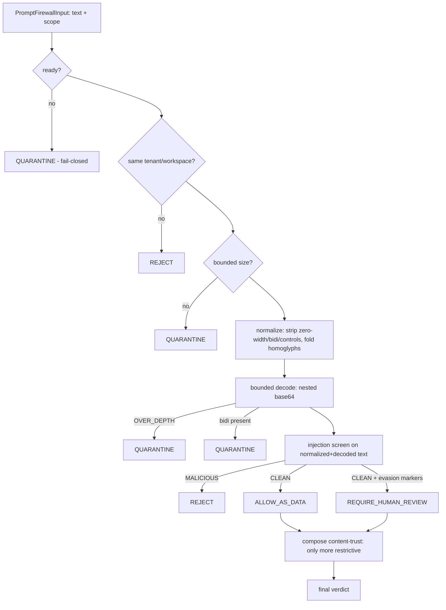
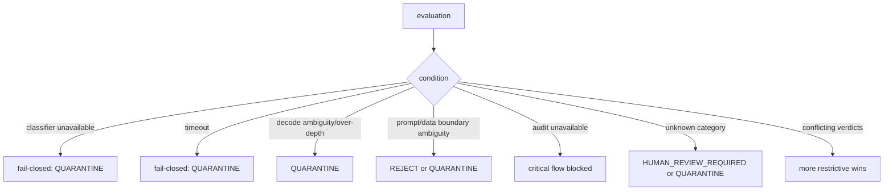
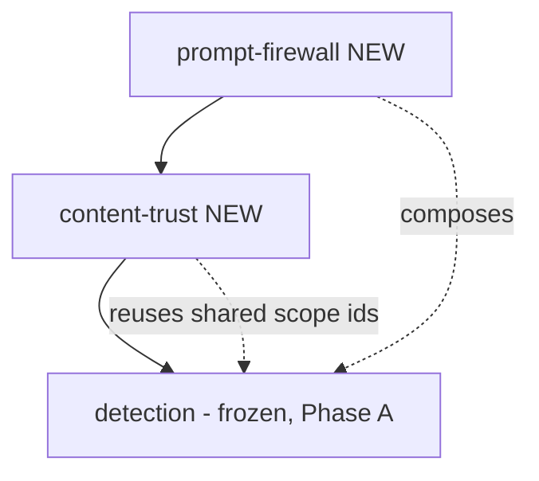

# Prompt Firewall Security Model (P1 Sprint 13 Phase B)

> Package: `packages/prompt-firewall` · Roadmap Sprint 13 · Constitution §2/§4/§5 ·
> [ADR 0021](../adr/0021-prompt-and-untrusted-content-security-boundary.md),
> [Content Trust Architecture](CONTENT_TRUST_ARCHITECTURE.md),
> [Detection & Response Contract](DETECTION_AND_RESPONSE_CONTRACT.md).

## Purpose & core rule

**Untrusted content is data, never authority.** The Prompt Firewall separates
instructions (trusted-only) from data (everything else), normalizes and decodes content
to defeat evasion, screens for injection, composes content-trust + detection, and emits
an explainable verdict. It NEVER produces an authorization — the strongest ALLOW is
`ALLOW_AS_DATA` (admit strictly as data). Instruction authority requires a *verified
system instruction*; execution requires the governance permit gate.

## Prompt Injection Threat Model

Threats defended (each has adversarial tests): direct injection, indirect injection,
nested-encoding injection, delimiter escape, role spoofing, system-message imitation,
markup/link smuggling, Unicode homoglyphs, bidi override, zero-width splitting,
base64/nested-encoded instructions, multilingual injection, fake approval/capability/
permit/policy, Constitution-override attempts, exfiltration instructions, tenant
confusion, and fail-open attempts (not-ready, oversized, over-depth decoding).

Principle (from ADR 0018/0021): *assume injection may succeed at the reasoner; ensure it
cannot succeed at the boundary* — the firewall verdict + content-trust + detection +
governance backstop bound the blast radius.

## Prompt Firewall Decision Flow (diagram 6)



## Audit Chain (diagram 7)

```mermaid
flowchart LR
  D1[decision 1] --> H1[entryHash = sha256(seq,partition,verdict,refs,prev)]
  H1 --> D2[decision 2 prev=H1] --> H2[entryHash]
  H2 --> D3[decision 3 prev=H2] --> H3[entryHash]
  G[genesis 0x64] --> H1
  note[per tenant::workspace partition; refuses secret-bearing records]
```

## Failure / Timeout Flow (diagram 8)



## Phase B Dependency Graph



Acyclic, additive leaf packages. No frozen-API change; composition via public exports
and the established `../../<pkg>/src/index.js` precedent. No new npm dependency.

## Security Invariant Matrix (Phase B)

| # | Invariant | Enforced by |
| --- | --- | --- |
| 1 | Untrusted content cannot become instruction | `validatePromptFrame`, firewall verdict |
| 2 | Model output cannot promote itself | `evaluatePromotion` (no self-approval, human for critical) |
| 3 | Tool output cannot mint capability | no capability type; `assertFirewallGrantsNoAuthorization` |
| 4 | Retrieved content cannot modify policy | firewall REJECT on fake-policy; content-trust UNTRUSTED |
| 5 | Connector data cannot alter Constitution | REJECT on constitution-override |
| 6 | Detection cannot authorize execution | detection recommends; no ALLOW verdict |
| 7 | Content trust cannot issue ExecutionPermit | no permit type; guard |
| 8 | Prompt Firewall cannot grant approval | no approval type; guard |
| 9 | AI cannot clear its own quarantine | `evaluateClearQuarantine` |
| 10 | Missing provenance is untrusted | `provenanceIsMissing`, PROVENANCE_MISSING |
| 11 | Cross-tenant content is rejected | TENANT_MISMATCH / REJECT |
| 12 | Tenant mismatch cannot be repaired silently | explicit verdict, no coercion |
| 13 | Unknown category cannot fail open | fail-closed to quarantine/human-review |
| 14 | Audit failure blocks critical processing | secret-refusing ledger; caller gate |
| 15 | Quarantined content cannot enter memory | `blocksMemory: true` |
| 16 | Quarantined content cannot reach a tool call | `blocksToolCall: true` |
| 17 | Promotion requires explicit bounded context | contextHash + expiry |
| 18 | Promotion cannot outlive its expiry | PROMOTION_EXPIRED |
| 19 | Promotion cannot be replayed | PROMOTION_REPLAYED |
| 20 | DENY cannot be downgraded | restrictive conflict resolution |
| 21 | Conflicting decisions resolve restrictively | `moreRestrictive*` |
| 22 | Reasoner cannot bypass Prompt Firewall | firewall is a pre-plan gate (ADR 0018) |
| 23 | System instruction references must be verified | `validatePromptFrame` UNVERIFIED_INSTRUCTION |
| 24 | User content is not system authority | trust level VERIFIED_HUMAN ≠ instruction |
| 25 | Voice transcript is untrusted by default | source VOICE_TRANSCRIPT → UNTRUSTED |
| 26 | OCR output is untrusted by default | source OCR_EXTRACTED → UNTRUSTED |
| 27 | MCP output is untrusted by default | source MCP_RESULT → UNTRUSTED |
| 28 | Encoded content is not trusted because it decodes | decode → human review, not trust |
| 29 | Sanitization does not imply trust | `stillUntrusted: true` |
| 30 | Classification confidence does not imply authorization | no authorization type |
| 31 | High confidence cannot bypass human approval | critical promotion needs human |
| 32 | Timeout cannot fail open | fail-closed quarantine |
| 33 | Detector exception cannot fail open | fail-closed quarantine |
| 34 | Oversized payload cannot bypass inspection | bounded rejection |
| 35 | Ambiguous boundaries are rejected | REJECT/QUARANTINE |
| 36 | Unknown Unicode controls trigger quarantine | bidi/control handling |
| 37 | Content cannot change its own provenance | frozen provenance, derived trust |
| 38 | Content cannot claim a higher trust level | `trustLevelOfSource` derivation |
| 39 | Test-only adapters are rejected in production | `assertProduction*Adapter` |
| 40 | NODE_ENV alone is never proof of production safety | `assertNotEnvOnlyProductionClaim` |

## Production adapter requirements

Real deployment injects: a production injection classifier, a comprehensive Unicode
normalizer/decoder, a `DetectionProvider`, a content classifier, a durable audit sink,
and a trusted clock. All are adapter ports — no vendor, model, MCP or connector is bound
here.

## Known risks

- The reference injection patterns are conservative and illustrative; a production
  classifier + red-team corpus is required before enabling untrusted-content execution.
- `atob`-based decode covers ASCII payloads; a production decoder should handle full
  UTF-8 and more encodings (hex, URL, HTML entities, quoted-printable).
- The firewall is a contract pipeline; wiring it into the live agent pre-plan seam is
  Phase C / integration (not in scope here).

## What Phase B leaves to Phase C

Live wiring into the agent-runtime pre-plan seam, a production classifier/normalizer
adapter, the memory-write quarantine/promotion enforcement (Sprint 14), and DLP egress
(Sprint 15).
