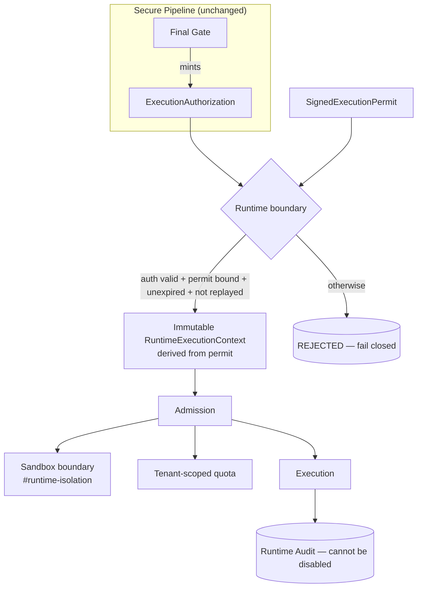
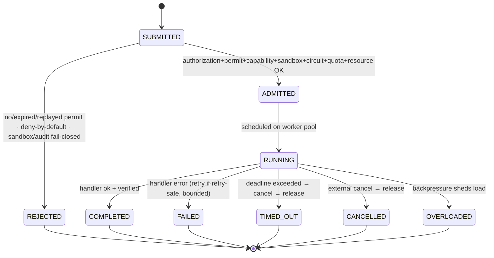
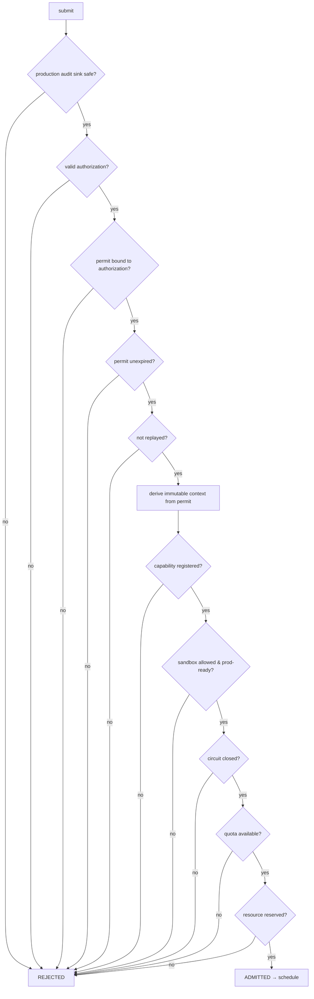
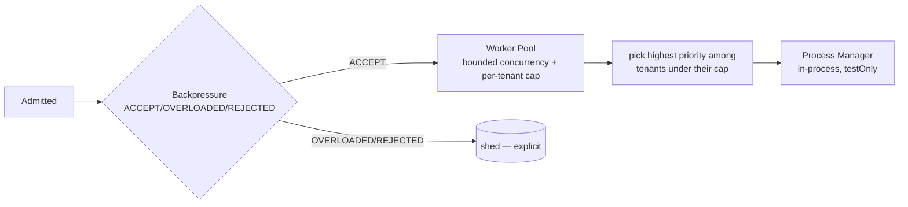
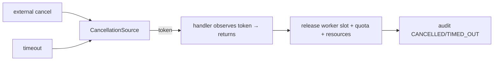
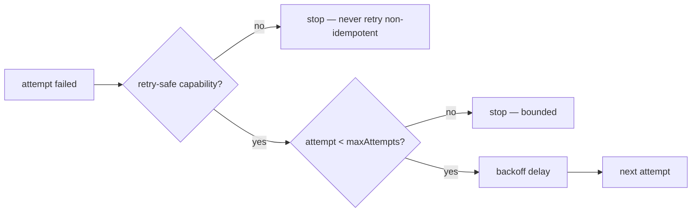
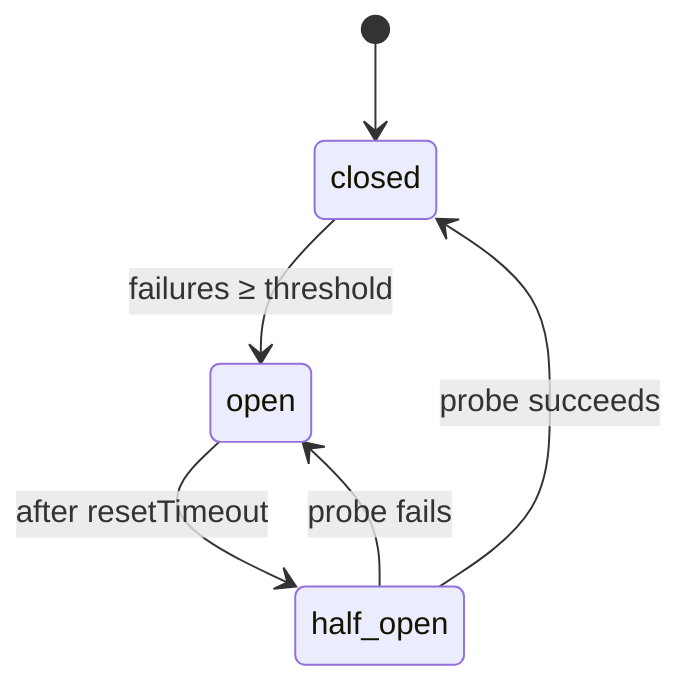

# Runtime Foundation

> Package: `packages/runtime` · Sprint P0.3
> Position in the chain: `… → Final Gate → Runtime → Executor → Verification → Immutable Audit`
> Constitution references: §2, §4, §7, §10, §14, §20, §22, §23.

The runtime is OSForge's execution engine. It runs work ONLY behind the Secure
Execution Pipeline — a verified `ExecutionAuthorization` + `SignedExecution
Permit` are required — and it produces NO authority, policy or approval of its
own. The Secure Pipeline is unchanged; the runtime is wired in as the pipeline's
`SecureExecutor` backend.

## Priority order

`Security → Correctness → Tenant Isolation → Reliability → Explainability → Auditability → Performance → Features.`

## Trust boundaries

1. **Pipeline → Runtime**: only a final-gate-minted `ExecutionAuthorization` bound to the permit crosses in. No permit/authorization → nothing runs.
2. **Runtime → Sandbox**: real execution requires an attested sandbox in production; without one it is rejected and never "production-ready".
3. **Tenant boundary**: every worker slot, quota counter, snapshot and checkpoint is tenant-keyed; nothing is shared across tenants by default.

## Runtime state machine

## Admission flow (fail-closed, in order)

## Scheduling flow

## Cancellation flow

## Timeout flow

`TimeoutManager.arm(source, maxExecutionTimeMs)` starts a timer that cancels the
source with reason `timeout`; on completion the caller disarms it. A timed-out
execution is cancelled cooperatively, its slot/quota/resources are released
(no zombies), and the outcome is `TIMED_OUT` and audited.

## Retry flow

Retry is bounded, never infinite, and only for explicitly retry-safe
(idempotent) capabilities. Timeouts and cancellations are never auto-retried.

## Circuit breaker flow

The breaker key is `(tenantId, capability)` — tenants and capabilities never
share a circuit. Half-open probes are strictly limited.

## Backpressure flow

The `DefaultBackpressurePolicy` returns an explicit decision from the pool state:
tenant fairness first (`REJECTED` if a tenant is at its inflight cap), then
`OVERLOADED` when total inflight and queue are both saturated, then `REJECTED`
when the queue is full. The queue never grows silently.

## Tenant isolation model

- Context tenant/organization/workspace/actor are DERIVED from the permit — never guessed.
- Every quota counter is tenant-prefixed (`t:<tenant>[…]`); tenant A cannot consume tenant B's quota.
- Worker pool enforces a per-tenant inflight cap (fairness + no starvation).
- Snapshots and checkpoints are tenant-bound; a checkpoint cannot be restored under a different tenant/workspace.
- `deriveExecutionIdentity` reuses the `#runtime-isolation` execution-identity chain for the sandbox boundary.

## Snapshot / checkpoint security model

- **Snapshot**: immutable metadata only (status, timings, identity refs). It has no field for payload/secret/raw content, and is frozen (cannot be mutated to another tenant).
- **Checkpoint**: progress is redacted (secrets/tokens/token-like values removed) before persistence. Restore does NOT auto-grant re-execution; it requires a fresh, valid `ExecutionAuthorization` + permit, the permit must be unexpired, and its tenant/workspace MUST match the checkpoint. An old (expired) or foreign-tenant permit cannot restore.

## Production adapter requirements

| Concern | Foundation (this sprint) | Production requirement |
| --- | --- | --- |
| Process isolation | `InProcessProcessManager` (`testOnly: true`) | Attested process/container sandbox provider (`#runtime-isolation`) |
| Sandbox | test bypass / policy-only allowed, `productionReady: false` | Trusted, attested `SandboxProvider` matching environment |
| Runtime audit | `InMemoryRuntimeAuditSink` (`testOnly: true`) | Durable, tamper-evident sink (`testOnly: false`) — refused in production otherwise |
| Checkpoint store | `InMemoryCheckpointStore` (`testOnly: true`) | Durable, encrypted, tenant-scoped store |
| Clock / ids | `FixedKernelClock` / `SequentialIdFactory` | Attested clock / UUID id factory |
| Metrics/traces | in-memory / no-op sinks | Real exporters behind the sinks |

## 2035 extension points

The runtime defines boundaries — not implementations — for the future:

- **Multi-product / multi-tenant / multi-region**: tenant-scoped quota keys and isolation keys already carry tenant/org/workspace; region is an additive dimension.
- **Distributed / edge / federated workers**: `ProcessManager`, `WorkerPool` and `Scheduler` are interfaces; a distributed dispatcher is a drop-in behind them.
- **AI agent / voice-intent / connector / plugin-MCP runtimes**: `CapabilityRegistry` + `CapabilityDescriptor` + `SandboxRuntime` contract are the extension surface — capabilities carry required sandbox capabilities and retry-safety; authority still comes only from the pipeline.
- **Provider-independent model runtime**: model execution is a capability behind a sandbox, never special-cased.
- **Offline-resilient execution**: `Checkpoint` contract is the resumption surface (with re-verification on restore).
- **Robotics / IoT adapters**: additional `ProcessKind` values and sandbox providers, no core change.

No heavy microservice/Kubernetes/distributed system is built now — only the seams.

## Known risks

- **In-process manager is foundation/test only** — no real preemption; a handler that ignores its cancellation token can hold a slot until it returns (documented; real isolation needs an attested provider).
- **In-memory adapters** (audit, checkpoint, replay ledger) are non-durable and are refused in production; durable adapters are required.
- **Runtime replay ledger is per-engine-instance** (in-memory `Set`); a distributed deployment needs a shared, atomic ledger.
- **Cooperative cancellation** depends on handlers honoring the token; enforced hard-kill needs process/container isolation.

## Rollback plan

Additive: new `packages/runtime` and new `tests/runtime-*`, plus one-line
type-test include. The Secure Pipeline, kernel, orchestrator and every existing
contract are unchanged. Rollback = delete `packages/runtime`, the runtime tests,
and the type-test include line. No existing public API, export or test changes
behavior; nothing yet consumes the runtime in production.
