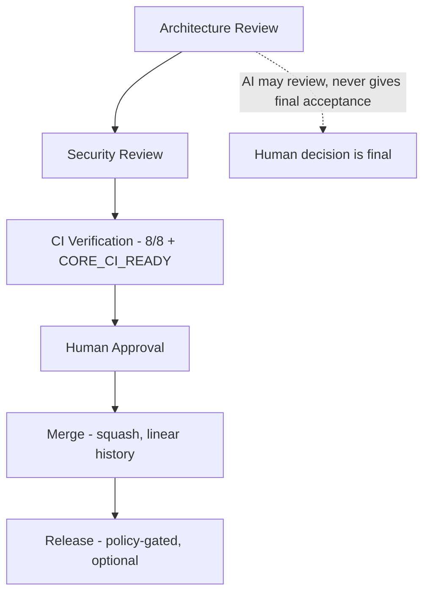
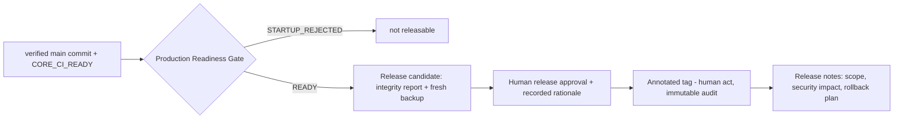
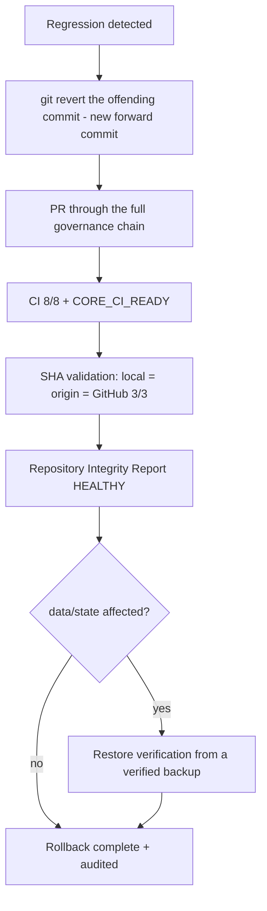

# Release Governance (Canonical)

> Governance policy for how a change becomes a release in OSForge Core. **Policy
> document — it creates no tag, no release, and no deployment, and changes no runtime
> behavior or frozen API.** It *references* the existing operational docs rather than
> restating them (no duplication). System Tree **Layer 4 — Standards**. References:
> [Constitution](../000_OSFORGE_CONSTITUTION.md) §2 (Prime Directive), §12
> (Repository), §13 (Release); [ADR 0015](../adr/0015-security-prerequisites-before-capability-expansion.md),
> [ADR 0016](../adr/0016-canonical-foundation-ownership.md),
> [ADR 0017](../adr/0017-governance-enforcement-integration-seam.md),
> [ADR 0022](../adr/0022-security-evolution-boundary.md);
> [OSForge System Tree](../architecture/OSFORGE_SYSTEM_TREE.md),
> [Engineering Doctrine](../architecture/ENGINEERING_DOCTRINE.md),
> [Architecture Review Board](../architecture/ARCHITECTURE_REVIEW_BOARD.md).

## Purpose

Record the governed path every change follows from proposal to release, so security is
never traded for speed. **Protect the Core, Evolve at the Edges:** the closer a change
gets to the Protected Core, the more governance it requires. Priority order (from
[Secure CI Foundation](../operations/SECURE_CI_FOUNDATION.md)):
`Security → Reliability → Explainability → Scalability → Extensibility → Performance.`

## Governance model (the mandatory chain)

Every merge to protected `main` passes this chain in order; no stage may be skipped,
reordered, or bypassed (§2 P2.4, no backdoor).

| Stage | What it checks | Owner | AI may |
| --- | --- | --- | --- |
| Architecture Review | layering, dependency direction, boundaries, complexity rent | architecture stewards | analyze + recommend |
| Security Review | invariants, fail-closed, tenant isolation, threat-model coverage | security stewards | analyze + recommend |
| CI Verification | 8 mandatory jobs + `H · Final security gate` → `CORE_CI_READY` | automated | n/a |
| Human Approval | final acceptance, per [ARB](../architecture/ARCHITECTURE_REVIEW_BOARD.md) 7-point Core-impact eval | human | **never** final |
| Merge | GitHub squash to `main`; no admin/ruleset bypass, no force/rebase/amend | maintainer | n/a |
| Release | version + gate below; **optional and separate from merge** | release owner | n/a |

CI stages compose the existing pipeline — see [Secure CI Foundation](../operations/SECURE_CI_FOUNDATION.md)
and [Branch Protection and CI](../operations/BRANCH_PROTECTION_AND_CI.md); this document
does not restate the job list.

## Release lifecycle

A release is a **deliberate, human-owned promotion of a verified `main` commit** — never
an automatic consequence of a merge. Current state: `package.json` is `0.0.0`, **0 tags,
0 releases** (contract-first phase; nothing is production-released yet).

- **Readiness gate:** a release requires the eight critical production adapters to be
  `READY` per [Production Readiness Gate](../operations/PRODUCTION_READINESS_GATE.md);
  `NODE_ENV` alone is never proof (ADR 0022 §4).
- **Preconditions:** latest `main` is CORE_CI_READY, a current Repository Integrity Report
  is HEALTHY ([cadence](../operations/REPOSITORY_INTEGRITY_CADENCE.md)), and a **verified,
  fresh git-bundle backup** exists ([OPS scheduling](../operations/OPS_SCHEDULING.md)).
- **Tags/releases are human acts** and are recorded in immutable audit; no AI, and no
  automated process, may cut a release (§2 P2.1; §13).

## Versioning policy

- **Semantic versioning** for released artifacts: `MAJOR.MINOR.PATCH`. A breaking change
  to a published contract requires a **new MAJOR** and an ADR; this mirrors the event
  schema rule in [Schema Versioning and Compatibility](../operations/SCHEMA_VERSIONING_AND_COMPATIBILITY.md)
  (immutable versions; breaking change ⇒ new major).
- **Frozen APIs** (canonical foundations, ADR 0016) do not change under the Foundation
  Freeze except through a governed, ADR-backed, test-backed change; such a change is at
  least a MINOR and is called out in release notes.
- **Additive-only by default:** new leaf packages and adapters are MINOR; documentation
  and tests are PATCH-level and never alter a public contract.
- Pre-1.0 (`0.x`) remains contract-first: no production release is cut until the ADR 0015
  security order and the readiness gate are satisfied.

## Approval gates (summary)

| Gate | Requirement |
| --- | --- |
| Merge to `main` | PR required, CI 8/8 + `CORE_CI_READY`, ≥1 human approval, no bypass |
| Core-affecting change | full ARB (all roles) + 7-point Core-impact evaluation |
| Critical / irreversible action | explicit human approval, distinct from requester (§6 H6.1/H6.5) |
| Release / tag | Production Readiness Gate READY + HEALTHY integrity + fresh verified backup + human release approval |
| Emergency change | break-glass (not bypass) — §5 / [Disaster Recovery Foundation](../operations/DISASTER_RECOVERY_FOUNDATION.md) |

## Change ownership

- Every change has a **named human owner** accountable for it through review, merge and
  (if applicable) release; AI may author and review but never owns final acceptance.
- Ownership per System Tree layer and canonical concept is recorded in the
  [System Tree](../architecture/OSFORGE_SYSTEM_TREE.md) and [ADR 0016](../adr/0016-canonical-foundation-ownership.md);
  a change to a canonical concept is owned by that concept's stewards.
- "No orphan knowledge" (Engineering Doctrine §9): every decision is recorded (ADR),
  every artifact has an owner, provenance is never lost.

## Architecture review requirement

Any change touching the Protected Core (Layer 5) or the Trust & Security Platform
(Layer 6) MUST complete the [ARB](../architecture/ARCHITECTURE_REVIEW_BOARD.md) review
and its mandatory evaluation (core / security / complexity / recovery / vendor /
20-year maintainability / rollback readiness) before human approval. Automated CI gates
are necessary but never sufficient for a Core change.

## Security-first release rules

1. **Security precedes capability (§2 P2.2, ADR 0015):** a capability that depends on an
   incomplete security layer is not releasable, regardless of pressure.
2. **Fail-closed (§2 P2.3):** if any required gate is unavailable, ambiguous, or
   incomplete, the release does not proceed.
3. **No bypass (§2 P2.4, IMMUTABLE):** founders/admins/operators/AI cannot bypass the
   chain; there is no backdoor.
4. **Traceability (§2 P2.5):** every release records who approved, when, why, the scope,
   the security impact, and the rollback plan, in immutable audit.
5. **No secret in a release artifact** (secret-scan gate; ADR 0022 §1 audit rules).
6. **Additive & reversible (Engineering Doctrine §5):** every release ships with a
   concrete, tested rollback path (below).
7. **Security evolution is additive (ADR 0022):** a release may never regress an existing
   invariant.

## Rollback standard

Rollback is **forward-only history** — never a rewrite of `main`. The ruleset blocks
force-push, deletion and non-fast-forward on `main`, and requires linear history; those
protections are never disabled for a rollback.

1. **`git revert`** the offending commit(s) to produce a new forward commit; never
   `reset`/`rebase`/`amend`/force-push on `main` (no history rewrite).
2. **Restore verification** (only if state/data is affected): use
   `scripts/backup/restore-verify.mjs` against a verified git-bundle backup into a
   temporary clean location — non-destructive; presence is not success, verification is
   mandatory ([Disaster Recovery Foundation](../operations/DISASTER_RECOVERY_FOUNDATION.md),
   [Recovery Drill](../operations/RECOVERY_DRILL.md)). Tenant A's backup can never
   restore into tenant B.
3. **Integrity check:** run the read-only Repository Integrity Report
   ([cadence](../operations/REPOSITORY_INTEGRITY_CADENCE.md)); proceed only if HEALTHY.
4. **SHA validation:** verify `local HEAD = origin/main = GitHub main` (3/3) after the
   revert lands, and confirm the ruleset is unchanged.
5. **Audit:** the rollback and its rationale are recorded; an emergency rollback uses
   break-glass (not bypass), never a disabled gate.

## Emergency rollback procedure

For an active incident: engage **break-glass recovery** (§5, separate identity,
phishing-resistant MFA, short-lived, reason + ticket, immutable audit, auto-expiry) and
emergency lockdown (§4.6, prefer availability loss over integrity/tenant-boundary loss).
An AI cannot declare an emergency, hold recovery authority, or clear its own lockdown.
Recovery follows the same `git revert` → verify → integrity → SHA → audit standard
above; the ruleset and branch protection remain in force throughout.

## What this document is NOT

It is policy, not automation: it creates no tag, release, deployment, schedule, CI job,
ruleset change, or runtime behavior. It binds no vendor. It duplicates none of the
operational docs it references; where operations detail exists, this document points to
it and adds only the governance policy on top.
