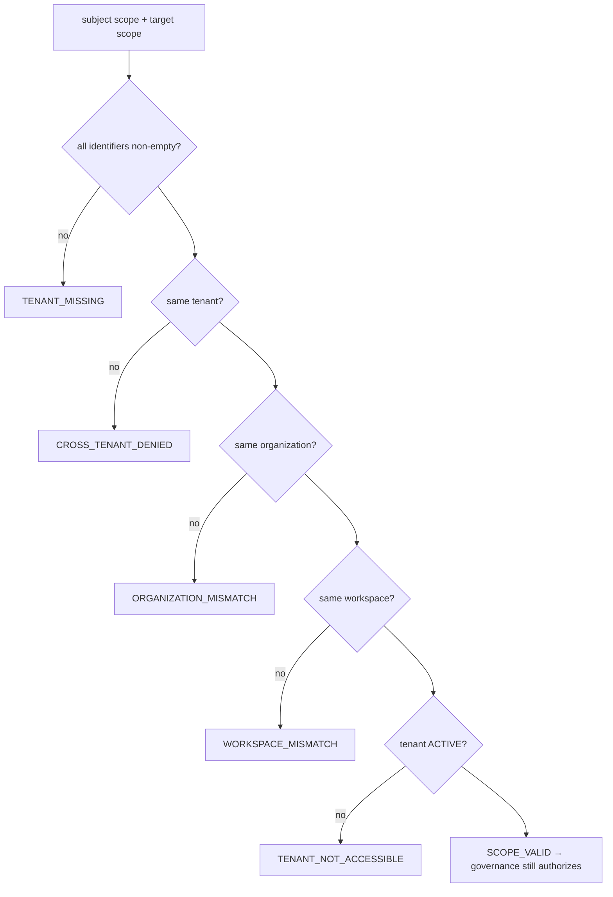

# Multi-Tenant Security Model (PR-E)

> Package: `packages/tenant-boundary` · Constitution §2 (Prime Directive), §3 A3.3
> (boundaries are explicit), §4, §7 M7.1 · [ADR 0016](../adr/0016-canonical-foundation-ownership.md),
> [ADR 0017](../adr/0017-governance-enforcement-integration-seam.md),
> [ADR 0022](../adr/0022-security-evolution-boundary.md). **Contract + architecture only:
> no runtime change, no database, no migration, no production tenant logic.** It
> **references — never duplicates** — [Context Isolation](../security/001_CONTEXT_ISOLATION.md)
> (canonical `validateOSForgeContext` / `TenantBoundary` in `packages/protocol`),
> the [Memory Security Model](../security/MEMORY_SECURITY_MODEL.md) and
> [Zero-Trust Identity Model](../security/ZERO_TRUST_IDENTITY_MODEL.md).

## Purpose

Define the multi-tenant SaaS security boundary as an explainable, fail-closed **decision
layer** on top of the canonical context-isolation invariants. It never authorizes: the
governance permit gate remains the sole authority over any effect.

## Tenant isolation model

The tenancy coordinate is `TenantScope { tenantId, organizationId, workspaceId }`.
`evaluateTenantIsolation` denies at the first violated invariant:

## Workspace boundary

A workspace is nested inside an organization, inside a tenant. Matching a tenant is
necessary but **not sufficient**: the organization and workspace must also match. A
workspace boundary is never widened implicitly.

## Cross-tenant access prevention

`evaluateCrossTenantAccess` / `assertNoCrossTenant` deny unconditionally. A cross-tenant
access is:
- **never repairable** — it is refused, never silently coerced into the caller's tenant;
- **never lifted by a role** — no operator, admin, founder, service or AI may override it
  (§2 P2.4 — no backdoor; `assertTenantBoundaryNotOverridable`).

## Tenant-scoped identity rules

An actor is bound to exactly one `TenantScope`. `evaluateTenantIdentityBinding` refuses a
request whose scope differs from the actor's bound scope (`ACTOR_TENANT_MISMATCH` /
`ACTOR_WORKSPACE_MISMATCH`), and `assertNoSelfRebind` forbids an actor — least of all an
agent/digital employee — from re-binding its own identity to another tenant. Identity
never spans tenants.

## Audit separation

Every tenant's audit is an append-only, hash-chained partition keyed
`tenant::organization::workspace` (genesis `0×64`). A record can never be written into
another tenant's partition (`assertAuditPartitionMatchesScope`), and partitions are never
merged across tenants (`assertNoAuditPartitionMerge`). This composes the immutable-audit
lifecycle rules of [ADR 0022](../adr/0022-security-evolution-boundary.md) §1.

## Future SaaS expansion rules

- **Tenant lifecycle:** `PROVISIONING | ACTIVE | SUSPENDED | OFFBOARDING | OFFBOARDED`.
  Only **ACTIVE** permits access; an offboarded tenant's data is never re-served.
- **Data residency / regional policy zones:** `evaluateDataResidency` is fail-closed — an
  unknown region, or a cross-region operation **without an explicit policy**, is a
  violation. Data never moves region implicitly.
- **Declared extension seams (not implemented):** regional key custody, sovereign policy
  zone, tenant quota, tenant migration proof, federated tenant directory — each an
  adapter port bound by a deployment.

## Invariants

1. Cross-tenant access is denied unconditionally and is never repairable.
2. No role, elevation or override lifts the tenant boundary (no backdoor).
3. A tenant match alone is insufficient — organization and workspace must match too.
4. Missing/empty tenancy identifiers fail closed.
5. Only an ACTIVE tenant is accessible; offboarded data is never re-served.
6. Identity is bound to one tenant; an actor can never self-rebind across tenants.
7. Audit is partitioned per tenant; records never cross partitions and partitions never merge.
8. Data never changes region without an explicit cross-region policy.
9. The boundary never authorizes — no permit/capability/approval/ALLOW type exists here.
10. Test-only adapters are refused in production; `NODE_ENV` alone is never proof.

## System Tree alignment

`Core → Governance → Tenant Boundary → (future SaaS)`. The boundary is subordinate to
Governance (a decision layer, never an authority) and independent of the Protected Core
in both directions. See [OSForge System Tree](../architecture/OSFORGE_SYSTEM_TREE.md).

## What this is NOT

Not wired into any runtime; no database, migration or production tenant logic; binds no
vendor. The tenant directory, region-policy source, audit sink and trusted clock are
injected adapter ports — none are bound here.
