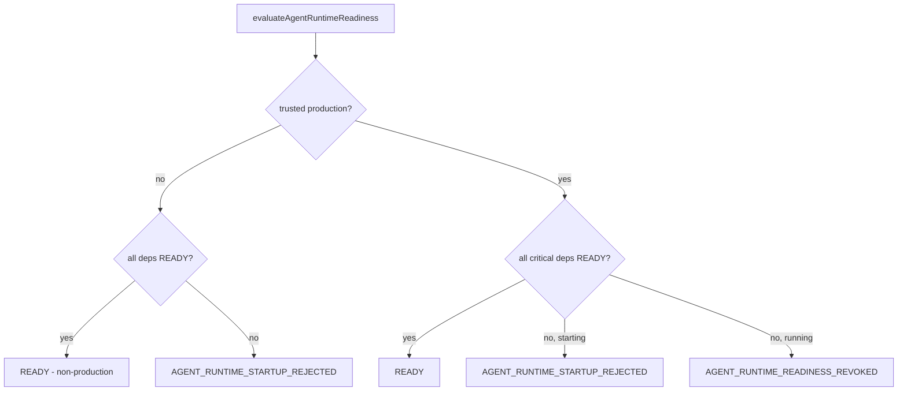

# Agent Runtime Readiness (P0.8 Phase A)

> Package: `packages/agent-runtime` (`health.ts`, `adapters.ts`, `reference.ts`) · Sprint P0.8 Phase A · Constitution §2 (fail closed).

## Trust boundaries
The agent runtime refuses to run agents without its critical dependencies. Test-only
reference components are refused in production. A production readiness claim is never
proven by NODE_ENV alone — an attested signal is required.

## Health states
`UNKNOWN / INITIALIZING / READY / DEGRADED / FAILED / REVOKED / STOPPED`.

## Critical dependencies (readiness gate)
`governance_gate, identity_resolver, sandbox_provider, event_bus, memory_gateway,
reasoner_adapter, injection_classifier, approval_center, audit_sink, trusted_clock`.

## Readiness flow

- All critical deps READY → `READY`.
- Any missing/unhealthy at startup → `AGENT_RUNTIME_STARTUP_REJECTED` (fail closed).
- Any missing/unhealthy while running → `AGENT_RUNTIME_READINESS_REVOKED`.

## Production adapters required (fail-closed, none bound in Phase A)
`GovernanceGateAdapter` (→ governance), `IdentityResolverAdapter` (→ identity-trust),
`SandboxAdmissionAdapter` (→ runtime-isolation), `ExecutorAdapter` (→ runtime engine),
`EventPublisherAdapter` (→ event-foundation), `MemoryGatewayAdapter` (→ memory),
`ReasonerAdapter` (LLM), `InjectionClassifier`, `ApprovalCenterAdapter` (out-of-band
web/mobile/voice), `SpeechToTextAdapter`, `TextToSpeechAdapter`, trusted clock.
Reference components (`InMemoryAgentRegistry`, `InMemoryToolRegistry`,
`ReferenceGovernanceGate`, `ReferencePermitConsumer`, `ReferenceInjectionClassifier`,
`DeterministicAgentClock`, `InMemoryAgentAuditSink`) are `testOnly` and refused in
production.

## External services required for production (later phases)
An LLM/reasoner, ASR + TTS (voice), a real sandbox (gVisor/Firecracker/WASM/
container), durable stores (audit, permit/replay, memory, schedule), a message
broker, and the wired governance/identity foundations. **None** are connected in
Phase A.

## Phasing (migration)
Phase A (this): contracts + reference + tests, no wiring. Phase B: wire the
governance-enforcement seam to `packages/governance` (ADR 0017). Phase C: supersede
the old shims (ADR 0016). Phase D: production adapters. Each phase is a separate
reviewed PR, feature-flagged, additive and reversible.
