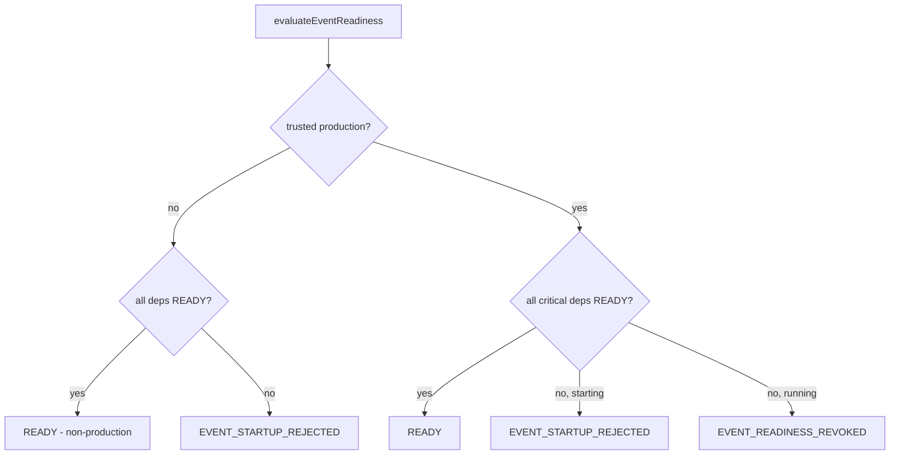

# Event Readiness and Recovery

> Package: `packages/event-foundation` (`health.ts`, `reference.ts`, `adapters.ts`) · Sprint P0.6.5 · Constitution §2 (fail closed), §14.

## Trust boundaries
The event layer refuses to start (or revokes readiness while running) without its
critical dependencies. Test-only reference components are refused in production.
Production decisions use a trusted, attested production signal — never NODE_ENV
alone.

## Health states
`UNKNOWN / INITIALIZING / READY / DEGRADED / FAILED / REVOKED / STOPPED`.

## Critical dependencies (readiness gate)
`event_store, idempotency_store, schema_registry, producer_registry,
consumer_registry, dead_letter_store, checkpoint_store, audit_sink, trusted_clock,
identity_trust, integrity_verifier`.

## Event readiness flow (diagram 12)

## Readiness decisions
- All critical dependencies READY → `READY`.
- Any missing/unhealthy at startup → `EVENT_STARTUP_REJECTED` (fail closed).
- Any missing/unhealthy while running → `EVENT_READINESS_REVOKED`.
- A production claim resting on NODE_ENV alone is refused
  (`assertNotEnvOnlyProductionClaim`).

## Recovery & failure modes
Event-store failure, idempotency-store failure, schema-registry failure,
trusted-clock failure, audit-sink failure, identity dependency failure, readiness
spoofing, in-memory adapter in production → all fail closed. Dead-letter and
replay provide bounded, audited recovery paths; poison events are quarantined;
critical replay/recovery requires human approval.

## Production adapter requirements (§25)
`EventBrokerAdapter, EventStoreAdapter, SchemaRegistryAdapter,
IdempotencyStoreAdapter, ConsumerCheckpointAdapter, DeadLetterStoreAdapter,
EventAuditAdapter, EventIntegrityAdapter, EventEncryptionAdapter,
EventCompressionAdapter, EventTelemetryAdapter, EventClockAdapter,
EventIdentityResolverAdapter`. Reference components (`InMemoryEventStore,
InMemorySchemaRegistry, InMemoryIdempotencyStore, InMemoryCheckpointStore,
InMemoryDeadLetterStore, ReferenceEventBus, DeterministicEventClock,
ReferenceIntegrityVerifier`) are `testOnly: true`, `productionReady: false` and
refused in production.

## External services required for production
A durable event store (e.g. PostgreSQL/DynamoDB), a message broker (e.g.
Kafka/RabbitMQ/NATS/Redis Streams/SQS-SNS/PubSub/Service Bus/Supabase Realtime), a
durable idempotency/dedup store, a schema registry, a durable dead-letter store, a
checkpoint store, an immutable audit sink, an attested trusted clock, and an
identity/trust resolver. **None** are bound in this sprint.

## 2035 extension points
Cross-region readiness, confidential-computing health attestation, federated
revocation feeds, short-lived credentials that expire instead of needing
revocation — contracts only.
