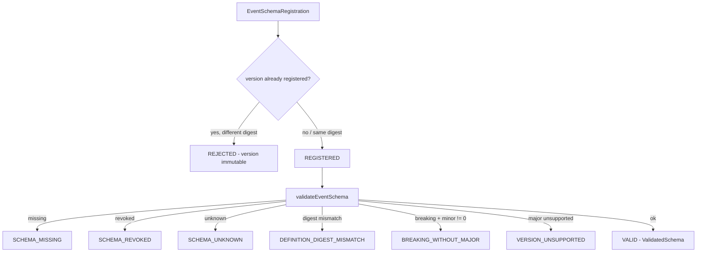

# Schema Versioning and Compatibility

> Package: `packages/event-foundation` (`schema.ts`, `reference.ts`) · Sprint P0.6.5 · Constitution §4, §17.

## Model
Every event references a named, versioned, registered schema. Schema-less and
unknown-schema events are rejected. A schema version is immutable; a revoked
schema can never mint new events; breaking changes require a new major version.
The registry verifies provenance/integrity so a spoofed entry is rejected.

## Compatibility levels
`NONE, BACKWARD, FORWARD, FULL, BREAKING, REVOKED`.

## Rules (§7)
- Schema-less event → `SCHEMA_MISSING`.
- Unknown schema → `SCHEMA_UNKNOWN`.
- Revoked schema → `SCHEMA_REVOKED`.
- Breaking change under a non-zero minor → `BREAKING_WITHOUT_MAJOR`.
- Declared definition digest ≠ registered digest → `DEFINITION_DIGEST_MISMATCH`
  (spoofing defence).
- Consumer without support for the major version → `VERSION_UNSUPPORTED`
  (fail-closed).
- Existing version cannot be silently redefined (`InMemorySchemaRegistry.register`
  → `REJECTED`).
- Migrations must be deterministic and verifiable (`isMigrationAcceptable`).

## Schema registration and validation (diagram 3)

## Migration, deprecation, revocation
- `EventSchemaMigration` — deterministic, verifiable, optionally reversible.
- `EventSchemaDeprecation` — deprecatedAt, optional sunsetAt + replacement.
- `EventSchemaRevocation` — revokedAt + reason; revoked versions cannot mint
  events, and downgrade attacks are refused via version/compatibility checks.

## Backward compatibility
Contracts are additive: new fields are optional; consumers negotiate supported
majors; the reference registry enforces version immutability. A `ValidatedSchema`
is a branded handle so an unvalidated schema can never masquerade as validated.

## 2035 extension points
Cross-organization schema federation, privacy-preserving schema assertions,
signed/attested schema provenance — contracts only.
