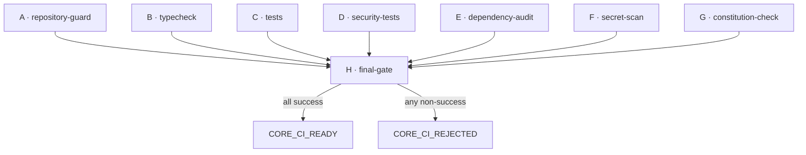

# Secure CI Foundation

> Workflow: `.github/workflows/core-ci.yml` · Guards: `scripts/ci/*` · Sprint P0.4.6
> Constitution references: §2 (fail closed), §12 (Repository), §13 (Release), §16 (Supply Chain), §23 (Audit).

A fail-closed, reproducible GitHub Actions verification pipeline. Every pull
request, every push to `main`, and manual dispatch must pass all mandatory checks
before the final gate declares `CORE_CI_READY`. This sprint is verification only —
no deployment.

## Priority order
`Security → Reproducibility → Correctness → Auditability → Supply-chain integrity → Performance.`

## Workflow graph

`final-gate` runs with `if: always()` and requires every mandatory job's result
to be exactly `success`; `skipped`, `cancelled`, or `failure` → `CORE_CI_REJECTED`.

## Required checks
- **A repository-guard** — merge-conflict markers, forbidden tracked files (dist/, node_modules/, .env, IDE/temp/Claude), large binaries, trailing whitespace, plus a focused/skipped-test guard.
- **B typecheck** — `npm ci` + `npm run typecheck` (includes the type-security type tests).
- **C tests** — full `npm test`.
- **D security-tests** — type-security (`tsc -p tsconfig.type-tests.json`) + the adversarial / tenant-isolation / replay / approval / runtime / production-readiness / hardening subset (`npm run test:security`).
- **E dependency-audit** — full audit to the job summary + `npm audit --audit-level=high` (fails on high/critical; moderate/low reported, never silently ignored).
- **F secret-scan** — technology-neutral, dependency-free scan with a controlled per-value allowlist.
- **G constitution-check** — constitution exists, is referenced from README + CLAUDE, and its core principle markers survive.
- **H final-gate** — depends on A–G; emits CORE_CI_READY / CORE_CI_REJECTED.

## Trust boundaries
- The workflow trusts only the repository's own code at the checked-out ref.
- Fork/PR runs never receive secrets and never gain write permission.
- Third-party actions are pinned to a fixed major (`@v4`), not a floating branch.

## Permission model
Least privilege: top-level `permissions: contents: read`, and each job re-declares
`contents: read`. No job requests write. There is no token with elevated scope.

## Untrusted pull request model
- `pull_request` (not `pull_request_target`) runs in the fork's context with a
  read-only token and no repository secrets.
- No step consumes a secret or executes fork-controlled release logic.
- `concurrency` cancels superseded PR runs but never cancels a `main` validation.

## Supply-chain risks & mitigations
- **Dependency cache** keyed by the lockfile hash (`cache: npm` via `package-lock.json`).
- **Reproducible install** with `npm ci` (never `npm install`) against the committed lockfile.
- **Action pinning** to `@v4` majors; SHA-pinning is the documented hardening step.
- **Lifecycle scripts**: the project has no install/postinstall scripts of its own; `ignore-scripts` can be enabled once no dependency requires them (documented, not yet enforced).
- **No artifacts** are uploaded; if added later they must be verified free of sensitive data.

## Secret handling
No secrets are defined or consumed by this workflow. The secret-scan never prints a
matched value — only `file:line: rule`. The allowlist is per-value (known test
fixtures), never a path-based bypass.

## Failure modes (all fail closed)
| Condition | Result |
| --- | --- |
| Conflict marker / forbidden file / focused test | repository-guard fails |
| Type error | typecheck fails |
| Any test failure / silent skip | tests / security-tests fail |
| High/critical vulnerability | dependency-audit fails |
| Detected secret | secret-scan fails |
| Constitution deleted/renamed or principle removed | constitution-check fails |
| Any mandatory job not `success` | final-gate → CORE_CI_REJECTED |

## Local / CI parity
Every gate is an `npm run ci:*` script backed by `scripts/ci/*.mjs`, runnable
locally and in CI identically: `ci:guard`, `ci:focused-guard`, `ci:secret-scan`,
`ci:constitution`, `ci:validate-workflow`, `test:security`, `typecheck`, `test`.
The detection logic lives in `scripts/ci/lib.mjs` and is unit-tested by
`tests/ci-guards.test.mjs`.

## Rollback plan
The pipeline is additive: a workflow file, guard scripts, npm scripts, a guard
test, and docs. To roll back, delete `.github/workflows/core-ci.yml`,
`scripts/ci/`, the `ci:*` / `test:security` npm scripts, and
`tests/ci-guards.test.mjs`. No product code is affected.

## Future: release signing & provenance
Extension points (not built here): SLSA build provenance attestation on tagged
releases, SBOM generation, artifact signing (cosign/sigstore), and a
`build-provenance` job feeding the artifact-verifier contracts in
`packages/hardening`.
