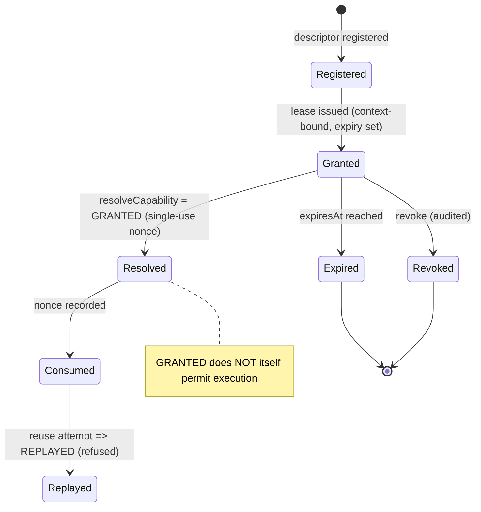

# Capability Security Model

> Package: `packages/governance` (`capability.ts`) · Sprint P0.7, §6 · Constitution §4, §5.

## Model
A capability is a **bound, time-limited, revocable, replay-protected lease** — not a
bare permission string. It binds tenant, workspace, principal, action, resource,
environment, issuer, issued/expiry times, scope, limits, a context hash, and a
revocation status. Tools, connectors, MCP servers, agents and APIs all bind to this
one model.

## Invariants
1. Deny-by-default; 2. unregistered capability refused; 3. wildcard denied by
default; 4. leases expire; 5. revoked cannot be reused; 6. cannot cross tenants;
7. no transfer without explicit delegation; 8. replay-protected (single-use nonce);
9. cannot self-widen; 10. one model for tool/connector/MCP/agent/API; 11. never
bypasses authorization/policy; 12. a capability alone is not an execution grant.

## Capability lifecycle (diagram 4)

## Threat model → mitigation
| Threat | Mitigation |
| --- | --- |
| Missing / unknown capability | `UNREGISTERED` |
| Wildcard capability | `WILDCARD_DENIED` |
| Expired lease | `EXPIRED` |
| Revoked reuse | `REVOKED` |
| Replay | single-use nonce → `REPLAYED` |
| Altered binding / context | `CONTEXT_HASH_MISMATCH` |
| Cross-tenant use | `TENANT_MISMATCH` |
| Capability escalation | `ESCALATION_DENIED` |
| Transfer without delegation | `TRANSFER_DENIED` |
| Use-limit / region abuse | `USES_EXHAUSTED` / `REGION_DENIED` |
| Capability as sole grant | `assertCapabilityNotSufficientAlone` |

## References
[GOVERNANCE_SPINE](../architecture/GOVERNANCE_SPINE.md) · Constitution `docs/000_OSFORGE_CONSTITUTION.md`.
