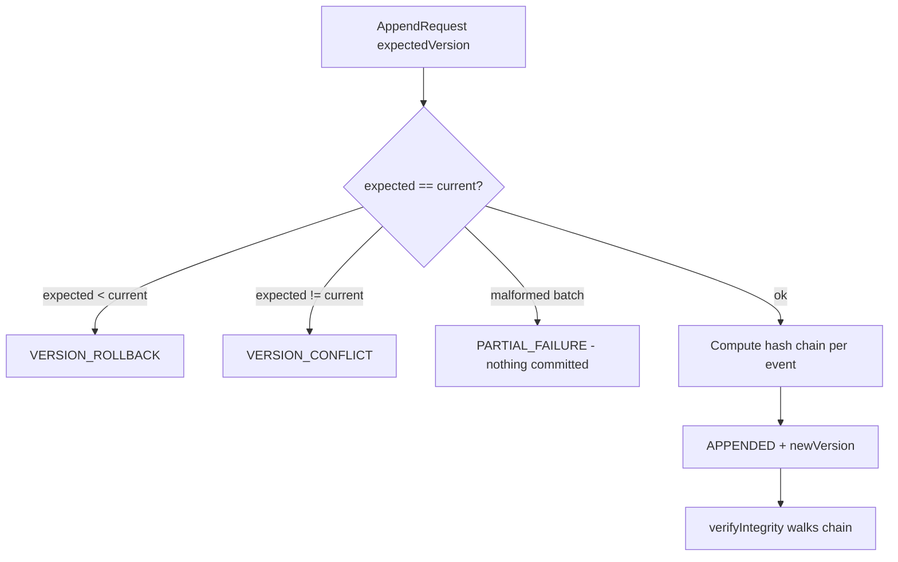

# Event Integrity and Provenance

> Package: `packages/event-foundation` (`envelope.ts`, `store.ts`, `outbox.ts`, `audit.ts`) · Sprint P0.6.5 · Constitution §4, §14.

## Integrity model
Every envelope carries a `payloadDigest` and `metadataDigest` (SHA-256 over
canonical JSON). The payload body is referenced, never inlined, and never a
secret. `verifyEnvelopeIntegrity` recomputes both digests to detect tampering.
The event store hash-chains stored events; the audit sink hash-chains audit
records per tenant/workspace.

## Event store contract (§17)
Append-only — `update`/`delete` are structurally denied (`assertAppendOnly`).
Optimistic concurrency: an expected-version mismatch (`VERSION_CONFLICT`) or a
rollback (`VERSION_ROLLBACK`) is refused. Streams are tenant-scoped; versions
never roll back; a malformed batch aborts the whole append atomically
(`PARTIAL_FAILURE`); an in-memory store is refused in production.

## Event store append flow (diagram 9)

## Transactional outbox / inbox (§19)
Extension points only — no real DB transaction is implemented. The outbox is
resilient to duplicate publishing (`ALREADY_PUBLISHED`); a poison entry is
dead-lettered after bounded retries; the inbox blocks duplicate delivery
(`DUPLICATE_SKIP`); a processed inbox entry is never silently deleted
(`assertInboxNotSilentlyDeleted`); tenant bindings are preserved.

## Event sourcing boundary (§18)
Optional, never mandatory. Extension contracts: `AggregateId/Version/Event`,
`AggregateSnapshotReference`, `ProjectionReference`, `ProjectionRebuildRequest`.
A projection is a read model, never the source of truth; a snapshot never erases
history (`snapshotErasesHistory() === false`); an aggregate can never span tenants
(`assertAggregateSingleTenant`).

## Audit & provenance (§21)
Immutable, hash-chained audit records; no secret or raw credential is recorded;
the chain is verifiable (`verifyChain`); records are frozen. Provenance/lineage is
explicit so replayed and derived events are never disguised as originals. A
lineage/causation cycle is detected (`hasLineageCycle`). Audit event types include
producer registered/revoked, event accepted/rejected/duplicated/delivered,
delivery failed, retry scheduled/exhausted, dead-letter created, replay
requested/approved/rejected/completed, schema registered/deprecated/revoked,
subscription created/revoked, checkpoint advanced, integrity failure detected.

## Threat model → mitigation (selected)
| Threat | Mitigation |
| --- | --- |
| Payload / metadata tamper | digest mismatch → `INTEGRITY_FAILED` |
| Event store update/delete | `assertAppendOnly` |
| Stream version rollback | `VERSION_ROLLBACK` |
| Partial append | atomic `PARTIAL_FAILURE` |
| Integrity chain tamper | `verifyIntegrity` / `verifyChain` |
| Aggregate cross-tenant event | `assertAggregateSingleTenant` |
| Projection as source of truth | `sourceOfTruth: false` |
| Lineage / causation cycle | `hasLineageCycle` |
| Silent inbox deletion | `assertInboxNotSilentlyDeleted` |

## 2035 extension points
Post-quantum event signatures, zero-knowledge integrity proofs, global causal
graphs, disaster-resilient distributed archives — contracts only.
