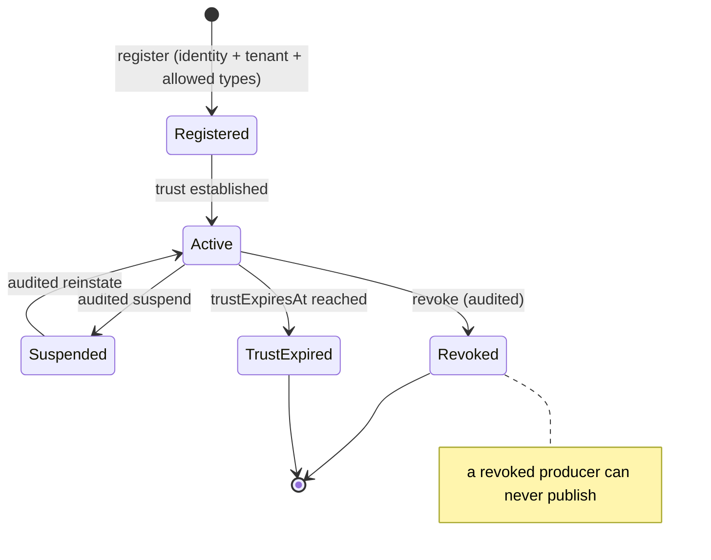
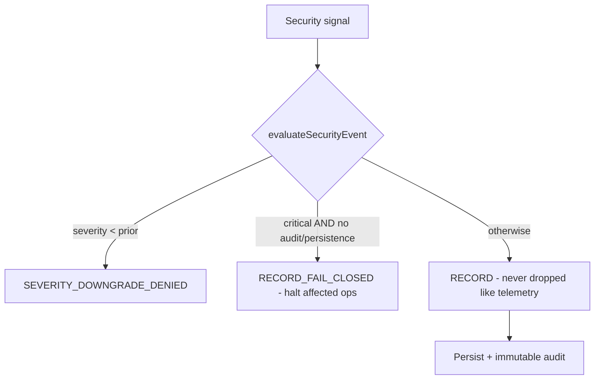

# Event Security Model

> Package: `packages/event-foundation` (`producer.ts`, `consumer.ts`, `security-events.ts`, `ratelimit.ts`) · Sprint P0.6.5 · Constitution §2, §4, §5.

## Trust boundaries
Every event crosses: known tenant → verified producer → validated schema →
integrity-checked payload → sensitivity check → idempotency → authorization
reference → ordering → durable persistence + audit. Nothing is implicitly
trusted; authentication ≠ trust ≠ authorization (this layer stops before
authorization).

## Producer invariants (§8)
- Unregistered producer cannot publish; revoked/suspended producer refused.
- A producer may only emit its allowed event types/names.
- A producer cannot cross its tenant/workspace.
- An agent/digital-employee/plugin/MCP producer cannot present as HUMAN
  (`HUMAN_MASQUERADE`).
- Plugin/MCP producers are never implicitly trusted (`UNTRUSTED_PLUGIN`).
- Producer trust can expire (`TRUST_EXPIRED`); sequence forgery is refused.

## Consumer invariants (§9)
- Only registered event types are readable; a tenant filter is mandatory.
- Wildcard subscriptions are denied in production by default.
- Cross-tenant / cross-workspace reads are refused.
- Sensitive events require extra assurance; checkpoint rollback (unauthorized
  replay) is denied; capability escalation is refused.

## Producer registration and revocation (diagram 4)

## Security event flow (diagram 11)

Security event types: credential revoked, trust degraded, identity rejected,
policy bypass attempt, replay attack, tenant boundary violation, plugin signature
failure, event integrity failure, audit tamper detected, emergency lockdown,
break-glass activation, suspicious event storm, schema spoofing, producer
impersonation. A critical security event is never dropped by rate limiting and
never silently downgraded; missing persistence/audit forces fail-closed.

## Rate limit, quota & backpressure (§23)
Per-tenant, per-producer, per-type limits. Critical events bypass rate limiting
(`CRITICAL_BYPASS`) and are never dropped. Overload returns an explicit result
(`RATE_LIMITED` / `QUOTA_EXCEEDED` / `BACKPRESSURE`) — silent drops are forbidden
(`assertNoSilentDrop`). One tenant cannot consume another's capacity; retry
traffic cannot seize all normal capacity.

## Threat model → mitigation (selected)
| Threat | Mitigation |
| --- | --- |
| Cross-tenant publish/subscribe | `TENANT_MISMATCH` at every gate |
| Agent as human producer | `HUMAN_MASQUERADE` |
| Untrusted plugin/MCP event | `UNTRUSTED_PLUGIN` |
| Producer impersonation / sequence forgery | producer verification + `SEQUENCE_FORGERY` |
| Wildcard prod subscription | `WILDCARD_DENIED` |
| Forged / foreign ack | `ACK_FORGED` / `ACK_WRONG_*` |
| Critical security event drop | `RECORD_FAIL_CLOSED`, `CRITICAL_BYPASS` |
| Silent backpressure drop | explicit `BACKPRESSURE`, `assertNoSilentDrop` |

## 2035 extension points
Sovereign event zones, confidential-computing processing, post-quantum event
signatures, zero-knowledge event proofs — contracts only.
