# Human Approval Model

> Package: `packages/governance` (`approval.ts`) · Sprint P0.7, §7 · Constitution §5 (human approval for critical actions).

## Model
Human oversight of critical operations. Approval never creates authority — it only
opens the **final gate** of an already-conditional grant. It is bound to
tenant/workspace/action/resource and a context hash.

## Invariants
1. AI can never approve; 2. the requester cannot self-approve; 3. agents/bots/
services/devices are never human approvers; 4. critical approvals are single-use;
5. bound to tenant/workspace/action/resource/context-hash; 6. a context change
invalidates it; 7. never open-ended; 8. expired cannot be used; 9. revoked cannot be
used; 10. replay is refused; 11. very critical actions support quorum; 12. break-glass
needs multiple humans; 13. no bypass without an audit record; 14. approval creates no
authority; 15. approver assurance and step-up are verified.

## Approval lifecycle (diagram 5)

```mermaid
stateDiagram-v2
  [*] --> Pending: approval requested (context-bound)
  Pending --> ContextChanged: bound context mutates => invalid
  Pending --> Expired: expiresAt reached
  Pending --> Revoked: revoked
  Pending --> Rejected: human rejects
  Pending --> Approved: distinct human quorum, assurance + step-up met
  Approved --> Consumed: single-use consumption
  Consumed --> AlreadyConsumed: replay => refused
  note right of Pending: AI / requester / non-human approver => denied
  note right of Approved: opens the APPROVAL_REQUIRED gate only; creates no authority
```

## Threat model → mitigation
| Threat | Mitigation |
| --- | --- |
| Self-approval | `SELF_APPROVAL_DENIED` |
| AI approval | `AI_APPROVAL_DENIED` |
| Service/bot approver | `NON_HUMAN_APPROVER_DENIED` |
| Expired / revoked | `EXPIRED` / `REVOKED` |
| Replay | `ALREADY_CONSUMED` |
| Wrong action/resource/tenant | context-hash binding → `CONTEXT_CHANGED` |
| Context mutation after approval | `CONTEXT_CHANGED` |
| Insufficient quorum | `QUORUM_NOT_MET` |
| Approval after risk change | context hash re-binds → invalid |
| Unaudited bypass | `assertApprovalBypassAudited` |

## References
[GOVERNANCE_SPINE](../architecture/GOVERNANCE_SPINE.md) · [RISK_EVALUATION_MODEL](RISK_EVALUATION_MODEL.md) · Constitution `docs/000_OSFORGE_CONSTITUTION.md`.
