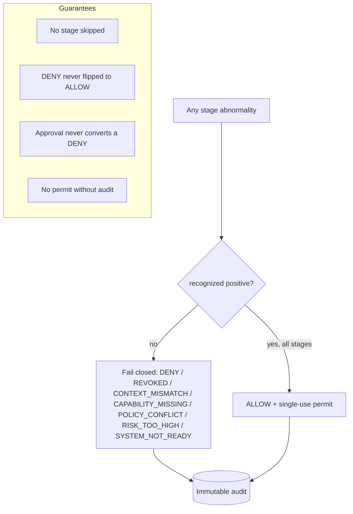

# P0.7 Security Invariants

> Package: `packages/governance` · Sprint P0.7, §12 · Constitution `docs/000_OSFORGE_CONSTITUTION.md` (supreme).

## Hard prohibitions (enforced by design, not convention)
No `eval`; no `Function` constructor; no dynamic code execution; no arbitrary
module loading; no shell execution; no network access; no secret logging; no
plaintext secret persistence; no global mutable authorization state; no tenantless
production decision; no boolean-only security decisions; no AI-issued human
approval; no silent policy-conflict resolution; no default-allow; no bypass flag;
no acceptance of a `testOnly` adapter in production. Every production adapter
boundary is fail-closed (`assertProductionAdapter`).

## Deny / fail-closed flow (diagram 9)

## Invariant map (where enforced)
| Invariant | Enforcement |
| --- | --- |
| Deny-by-default | `evaluatePolicySet` `NO_MATCH_DENY`; empty set denies |
| No AI self-escalation | policy `AI_CANNOT_ACTIVATE`; approval `AI_APPROVAL_DENIED`; authz self-grant denied |
| Tenant isolation | scope checks in every engine + pipeline `CONTEXT_MISMATCH` |
| No code execution | pure data AST condition evaluator |
| Prototype pollution | `hasUnsafeKeys` → `MALFORMED` |
| Bounded evaluation | `MAX_CONDITION_DEPTH` |
| Explainable decisions | `EngineResult` / `GovernanceDecision` (reason + next action) |
| Immutable audit | `InMemoryGovernanceAuditSink` hash chain; permit needs writable audit |
| No testOnly in prod | `assertProductionAdapter`, `assertNotTestReferenceInProduction` |
| NODE_ENV not proof | `assertNotEnvOnlyProductionClaim` |
| Single-use permit | `consumeExecutionPermit` nonce + expiry + context + tenant |

## Production adapters required (fail-closed)
`IdentityTrustAdapter, PolicyRepositoryAdapter, AuthorizationSourceAdapter,
CapabilityRegistryAdapter, ApprovalStoreAdapter, RiskSourceAdapter,
GovernanceAuditAdapter, RevocationSourceAdapter, TrustedClockAdapter`. Reference
in-memory components are `testOnly: true` and refused in production. **No external
policy engine / broker / database / LLM is bound in P0.7.**

## References
[GOVERNANCE_SPINE](../architecture/GOVERNANCE_SPINE.md) · [GOVERNANCE_DECISION_PIPELINE](../architecture/GOVERNANCE_DECISION_PIPELINE.md) · Constitution `docs/000_OSFORGE_CONSTITUTION.md`.
