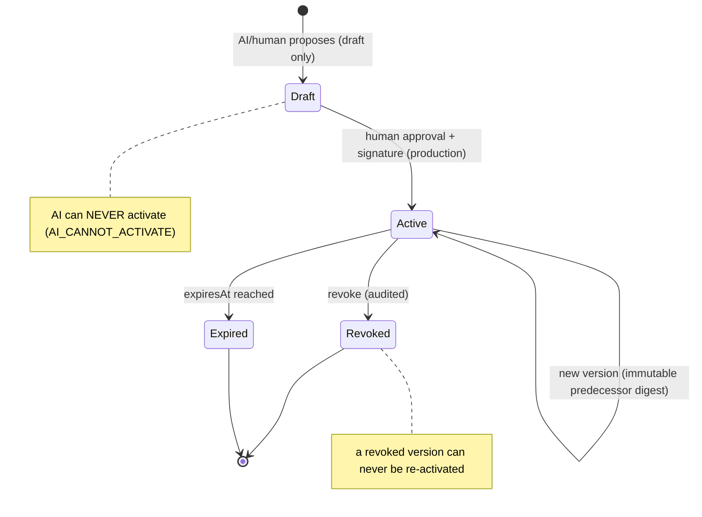

# Policy Engine Foundation

> Package: `packages/governance` (`policy.ts`) · Sprint P0.7, §4 · Constitution §2, §4.

## Model
Contract-first, technology-neutral, deny-by-default, fail-closed. Policies are
versioned and immutable; the DSL is a **bounded declarative AST** — there is no
`eval`, no `Function` constructor, and no dynamic code execution.

## Invariants
1. Deny-by-default; 2. fail-closed; 3. unsigned policy inert in production;
4. revoked policy cannot be reused; 5. expired policy inactive; 6. changes are
versioned; 7. history cannot be erased; 8. activation may require human approval;
9. conflicts are never silently resolved; 10. ambiguity yields `POLICY_CONFLICT`;
11. an unknown attribute can never produce ALLOW; 12. no cross-tenant leakage;
13. a policy cannot widen its own authority; 14. AI may only propose drafts.

## The DSL (safe, declarative)
`PolicyCondition` is a discriminated union: `always`, `attr_eq/ne/in/gte/lte`,
`and`, `or`, `not`. Evaluation is **tri-state** (`true` / `false` / `unknown`): a
referenced-but-absent attribute yields `unknown`, and an ALLOW rule can only fire
on a definite `true`. Depth is bounded by `MAX_CONDITION_DEPTH`; excessive depth
and prototype-pollution keys are rejected as `MALFORMED`.

## Policy lifecycle (diagram 2)

## Evaluation outcome
Explicit DENY wins; no applicable ALLOW → `NO_MATCH_DENY`; opposing effects at the
same priority → `POLICY_CONFLICT` (via `detectPolicyConflict`); cross-tenant policy
is skipped; unsigned/draft/expired/revoked policies are inert.

## Threat model → mitigation
| Threat | Mitigation |
| --- | --- |
| Default-allow | deny-by-default / `NO_MATCH_DENY` |
| Unsigned policy in prod | `UNSIGNED_INACTIVE` |
| Revoked/expired reuse | `REVOKED` / `EXPIRED` |
| Silent conflict resolution | `POLICY_CONFLICT` |
| Unknown attribute → allow | tri-state `unknown` never allows |
| Cross-tenant leak | tenant-scope check |
| AI self-activation | `AI_CANNOT_ACTIVATE` |
| Code execution via DSL | pure data AST, no `eval` |
| Prototype pollution / deep payload | `MALFORMED` / bounded depth |

## References
[GOVERNANCE_SPINE](../architecture/GOVERNANCE_SPINE.md) · Constitution `docs/000_OSFORGE_CONSTITUTION.md`.
