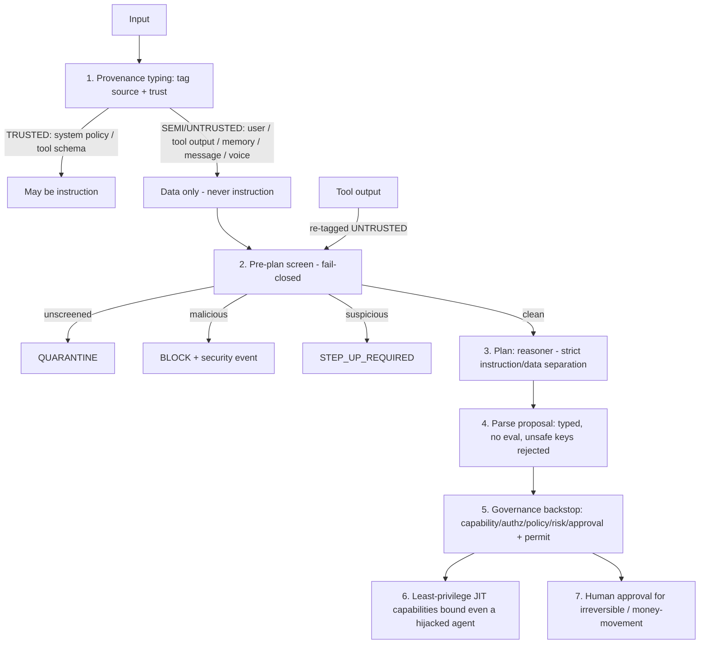

# Prompt-Injection Defense (P0.8 Phase A)

> Package: `packages/agent-runtime` (`provenance.ts`, `injection.ts`, `reasoner.ts`, `action.ts`) · Sprint P0.8 Phase A · [ADR 0018](../adr/0018-agent-runtime-untrusted-planner-under-governance.md).

## Principle
**Assume injection will sometimes succeed at the reasoner; ensure it cannot succeed
at the boundary.** Defense is layered, not a single classifier.

## Layers

1. **Provenance typing** (`provenance.ts`): every input carries a source + trust
   level. Only `TRUSTED` (system policy, tool schema) may be treated as instruction;
   everything else is data (`mayBeTreatedAsInstruction`).
2. **Pre-plan screen** (`injection.ts`, `evaluateInjectionScreen`): fail-closed — an
   unscreened untrusted input is `QUARANTINE`d; malicious → `BLOCK`; suspicious →
   `STEP_UP_REQUIRED`. A real classifier is an adapter; a conservative reference
   heuristic (`ReferenceInjectionClassifier`) exists for tests.
3. **Instruction/data separation** (`reasoner.ts`, `PromptFrame`): untrusted `data`
   is structurally separated from `instructions` and `toolSchemas`; it cannot
   redefine tools or roles.
4. **Typed parse, no eval** (`parseProposedAction`): proposals are data; unsafe keys
   and unknown kinds are rejected; nothing is executed as code.
5. **Governance backstop** (`action.ts`): even an injection-influenced plan must pass
   governance — it cannot mint a capability, approve itself, cross a tenant, or skip
   a stage. This is what makes injection **bounded, not catastrophic.**
6. **Least-privilege JIT**: a fully-hijacked agent is bounded by its current narrow,
   expiring capabilities.
7. **Human approval** for irreversible / money-movement actions regardless of how
   the plan arose (`requiresHumanApproval`).

## Second-order (indirect) injection
Tool output, memory and inter-agent messages are `UNTRUSTED` and re-screened before
they can influence the next plan — defending the confused-deputy / poisoned-tool-
output class.

## Residual risk
The classifier itself is an adapter (not built in Phase A); a novel injection may
pass the screen, but the governance backstop + least-privilege bound the blast
radius. A production classifier and adversarial red-team suite are required before
enabling agent execution in later phases.
