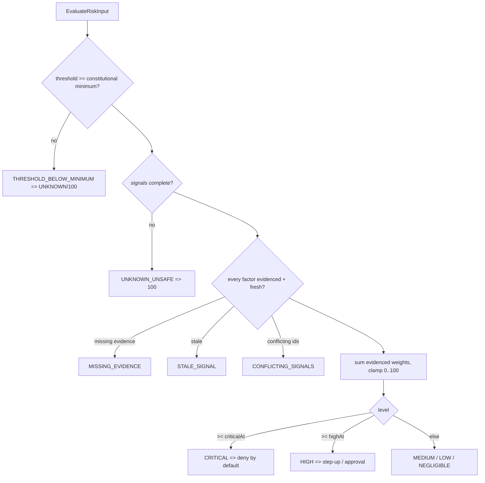

# Risk Evaluation Model

> Package: `packages/governance` (`risk.ts`) · Sprint P0.7, §8 · Constitution §2 (fail closed).

## Model
A separate, explainable risk contract. Risk informs the pipeline but can never
bypass authorization or policy. Levels: `NEGLIGIBLE, LOW, MEDIUM, HIGH, CRITICAL,
UNKNOWN`.

## Invariants
- UNKNOWN risk is never treated as safe (scored 100, forces fail-closed downstream).
- HIGH may require step-up or approval; CRITICAL denies by default.
- A risk score is never an unexplained number — every present factor carries a
  `source` and `evidenceRef`.
- Risk never bypasses authorization/policy.
- A tenant may make thresholds **stricter** but never looser than the
  constitutional minimum (`CONSTITUTIONAL_MIN_HIGH_AT`, `CONSTITUTIONAL_MAX_CRITICAL_AT`).
- AI may advise risk but is never the sole security decision-maker.

## Risk flow (diagram 6)

## Threat model → mitigation
| Threat | Mitigation |
| --- | --- |
| Unknown risk treated safe | `UNKNOWN_UNSAFE` (score 100) |
| Critical risk allowed | CRITICAL denies by default |
| Threshold manipulation | `THRESHOLD_BELOW_MINIMUM` |
| Missing evidence | `MISSING_EVIDENCE` |
| Stale signal | `STALE_SIGNAL` |
| Conflicting signals | `CONFLICTING_SIGNALS` |
| AI-only risk decision | `assertRiskNotDecidedByAiAlone` |

## References
[GOVERNANCE_SPINE](../architecture/GOVERNANCE_SPINE.md) · Constitution `docs/000_OSFORGE_CONSTITUTION.md`.
