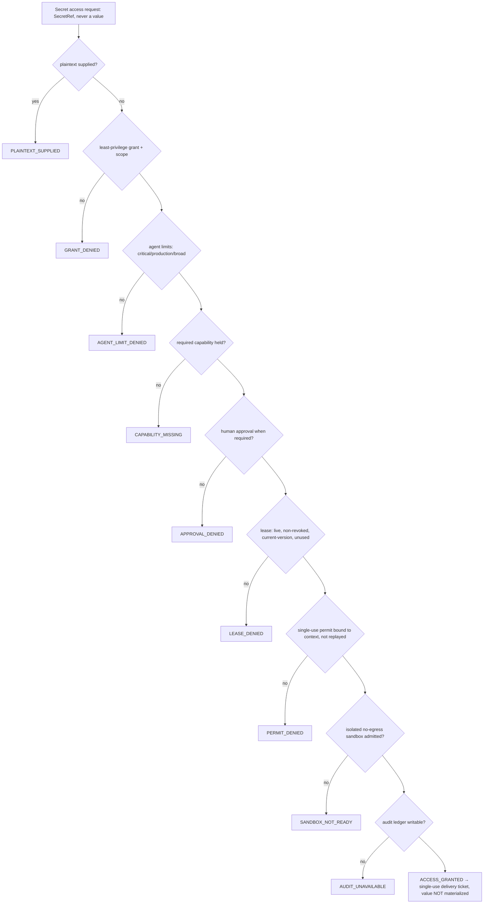

# Secret Access Boundary (P0.8 Sprint 12 / Roadmap Sprint 12)

> Package: `packages/secret-access` · Sprint P0.8 = canonical **Roadmap Sprint 12**, **ADR 0015 step 8** · Constitution §2/§4/§5 · [ADR 0015](../adr/0015-security-prerequisites-before-capability-expansion.md), [ADR 0016](../adr/0016-canonical-foundation-ownership.md), [ADR 0017](../adr/0017-governance-enforcement-integration-seam.md), [ADR 0020](../adr/0020-secret-access-boundary.md).

## Purpose
The trust boundary that decides **whether** a secret may be accessed and under what
constraints. A secret value is released **only** through a least-privilege grant,
agent limits, the required capability, human approval (when required), a live
short-lived lease, a consumed single-use context-bound permit, an admitted isolated
sandbox and a writable audit ledger — else fail-closed. Contract-first,
vendor-neutral, deny-by-default, tenant-isolated, explainable, replay-protected.

It **never handles a plaintext value**: the value is opaque (`SecretHandle`),
materialized only once, only inside a sandbox, only at the point of use, via an
**injected materializer port** (dependency inversion). It **composes** the frozen
`adapters` [Secret Broker Model](SECRET_BROKER_MODEL.md) and the
governance / agent-runtime contracts (ADR 0016) and binds **no** real KMS/Vault/HSM/
broker.

## Where Sprint 12 sits (canonical scope)
Per `docs/005_ROADMAP.md` + ADR 0015, this is **Sprint 12 (order step 8)** — it
follows Tool/MCP (Sprint 11) and is a prerequisite for **Prompt Injection &
Tool-Output Defense (Sprint 13 / step 9)**. It reuses, and does not redefine, the
canonical `SecretBroker` contract; it adds the decision + enforcement layer in front
of any broker.

## Compose, do not redefine (ADR 0016)
| Canonical concept | Owner | Sprint 12 relationship |
| --- | --- | --- |
| `SecretBroker`, `SecretLease`, `SecretHandle`, provider | `adapters` | Composed via an injected materializer **port**; never redefined |
| Single-use `ExecutionPermit` | `governance` | Mirrored as a secret-bound single-use permit |
| Human approval | `governance` / `agent-runtime` | Reused shape for critical-secret approval |
| Hash-chained audit | canonical audit | Per-`tenant::workspace` secret-access ledger |

## The fail-closed access gate
The gate evaluates in a strict order and denies at the **first** failing check:

On `ACCESS_GRANTED` the caller receives a **delivery ticket**, not a value. The value
is materialized only when the ticket is redeemed via `deliverIntoSandbox`, once, in an
admitted sandbox, wrapped in an opaque `SecretHandle`.

## Plaintext ban (type + runtime)
- `SecretHandle` exposes **no** value property; the value is reachable only inside
  `use(fn)` and `toString`/`toJSON` return `[REDACTED_SECRET]`.
- A `PlaintextSecret` nominal type is impossible to construct from an ordinary
  string, so raw secrets cannot be passed into the boundary at the type level.
- `assertNoPlaintextSecret` / `looksLikePlaintextSecret` are the runtime backstop:
  no value matching a secret pattern may enter a decision, log, audit or backup.

## Autonomous-actor limits
An agent / digital employee may not access a **CRITICAL** secret, a **production**
secret, or hold a **broad-scope** grant without a human co-signer. This layer only
narrows; it never widens a grant.

## Exfiltration & backup safety
- `scanForSecretLeak` blocks a secret value on the `PROMPT`, `MODEL_OUTPUT`,
  `TOOL_ARGUMENT`, `LOG`, `AUDIT` or `NETWORK` channel.
- `contentCannotAuthorizeSecretEgress`: instructions found in tool/content output can
  never authorize secret access or egress.
- `assertBackupContainsNoSecret`: a backup/snapshot/export/manifest containing a
  secret value is refused (fail-closed); backups carry references only.

## Fail-closed readiness
`evaluateSecretAccessReadiness` refuses to grant access without its critical
dependencies (`materializer_port`, `audit_ledger`, `approval_channel`,
`permit_verifier`, `sandbox_admission`, `trusted_clock`). `NODE_ENV` alone is never
proof of production; a test-only reference materializer is refused in production.

## What this package is NOT
It binds no real KMS/Vault/HSM/broker, adds no npm dependency, connects no network,
and stores no secret. It is the decision + enforcement contract; real materialization
is an injected port implemented by a deployment.
