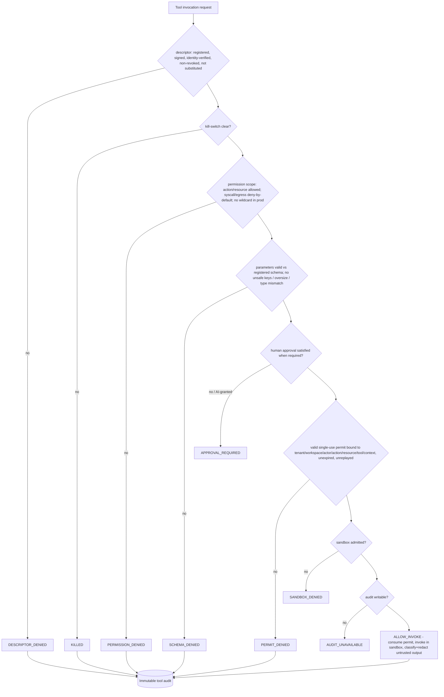

# Tool and MCP Security Boundary (P0.8 Phase D2 / Roadmap Sprint 11)

> Package: `packages/tool-firewall` · Sprint P0.8 Phase D2 = canonical **Roadmap Sprint 11**, **ADR 0015 step 7** · Constitution §2/§4/§5 · [ADR 0015](../adr/0015-security-prerequisites-before-capability-expansion.md), [ADR 0016](../adr/0016-canonical-foundation-ownership.md), [ADR 0017](../adr/0017-governance-enforcement-integration-seam.md).

## Purpose
The trust boundary for external tools, MCP connectors and tool output. A tool may be
invoked **only** through a registered, identity-verified, non-killed descriptor,
within its permission scope, with schema-validated parameters, human approval when
required, a **valid single-use tool-bound ExecutionPermit**, sandbox admission and a
writable audit sink — else fail-closed. Contract-first, deny-by-default,
tenant-isolated, explainable, replay-protected. It **composes** the frozen
agent-runtime / governance contracts (ADR 0016) and binds **no** real connector, MCP
server, schema engine, LLM or tool execution.

## Where D2 sits (canonical scope)
Per `docs/005_ROADMAP.md` + ADR 0015, this is **Sprint 11 (order step 7)** — a
prerequisite for the later **Prompt Injection & Tool-Output Defense (Sprint 13 / step
9)**, which is deliberately **deferred** (it depends on this boundary + Secret Access
/ Sprint 12). D2 covers only the **tool-output-injection / confused-deputy** facet of
injection (tag untrusted + classify + redact + block secret + hand to the existing
re-screen). Deep sandbox isolation (Sprint 5), Secret Access (Sprint 12), Model
Gateway and DLP (Sprint 15) are their own ordered sprints.

## The fail-closed tool invocation gate

## Invariants (all fail-closed)
Unknown/unregistered/revoked tool → DENY · unknown/substituted connector or MCP
identity → DENY · unsigned plugin/MCP in production → DENY · kill-switched tool/
connector → DENY · action/resource outside permission scope → DENY · **wildcard tool
permission in production → DENY** · **shell/network/filesystem/process/env
deny-by-default** · parameter schema mismatch / prototype-pollution / oversize / type
mismatch → DENY · **no valid single-use tool-bound permit → no execution** ·
replayed/expired/revoked/tenant/workspace/actor/action/resource/tool/context-mismatch
permit → DENY · critical/irreversible/money-movement tool requires human approval;
AI/self approval refused · tool output is UNTRUSTED, classified, redacted, never an
instruction (confused-deputy) · no secret in parameters/output/logs/audit ·
cross-tenant tool result/context → DENY · AI cannot register a tool, widen a
permission, self-issue a permit, or lift a kill-switch · every allow and denial is
immutably hash-chain audited · unwritable audit ⇒ no (critical) tool execution ·
test-only adapter refused in production; NODE_ENV is never proof; missing production
adapter ⇒ fail-closed.

## Reused frozen contracts (composed, not redefined — ADR 0016)
agent-runtime tool taxonomy (origin/risk) & permit seam · governance capability &
single-use ExecutionPermit model · agent-runtime injection re-screen (for released
output) · hardening revocation / emergency-lockdown (kill-switch) · the established
`tenant::workspace` audit partitioning.

## Production adapters required (fail-closed, none bound)
`ToolConnectorAdapter`, `ToolRegistryAdapter`, `MCPServerAdapter`,
`ToolSchemaValidatorAdapter`, `ToolEgressPolicyAdapter`. Reference components are
`testOnly` and refused in production.

## Explicitly deferred (later ordered sprints)
Full prompt-injection completion (Sprint 13), Secret Access Boundary (Sprint 12),
Model Gateway, deep sandbox-escape isolation (Sprint 5), DLP I/O redaction (Sprint
15). These must land in ADR-0015 order.

## 2035 extension points
Signed/attested tool provenance (VC), cross-org connector federation,
confidential-computing tool execution, zero-knowledge tool-result proofs,
post-quantum permit/audit signatures, robotic/IoT tool actuation — contracts only.
